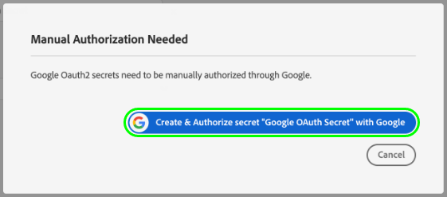
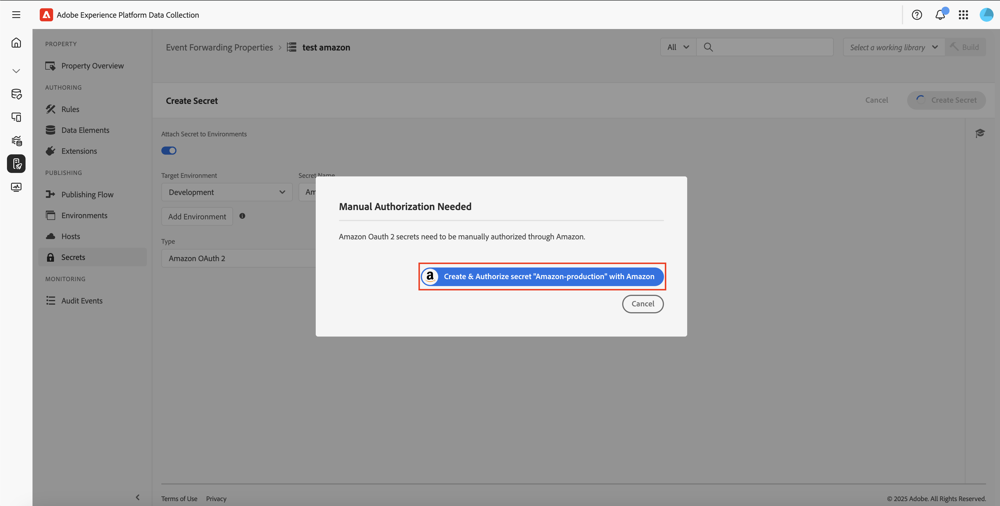

# Configuração de segredos no encaminhamento de eventos

No encaminhamento de eventos, um segredo é um recurso que representa uma credencial de autenticação para outro sistema, permitindo a troca segura de dados. Segredos só podem ser criados nas propriedades de encaminhamento de eventos.

Os seguintes tipos secretos são suportados no momento:

| Tipo secreto | Descrição |
| --- | --- |
| [!UICONTROL Amazon OAuth 2] | Habilita a autenticação segura com os serviços [!DNL Amazon]. O sistema armazena com segurança o token e lida com sua renovação em intervalos especificados. |
| [!UICONTROL Google OAuth 2] | Contém vários atributos para oferecer suporte à especificação de autenticação do [OAuth 2.0](https://datatracker.ietf.org/doc/html/rfc6749) para uso na [API do Google Ads](https://developers.google.com/google-ads/api/docs/oauth/overview) e na [API Pub/Sub](https://cloud.google.com/pubsub/docs/reference/service_apis_overview). O sistema solicita as informações necessárias e, em seguida, lida com a renovação desses tokens em um intervalo especificado. |
| [!UICONTROL HTTP] | Contém dois atributos de string para um nome de usuário e senha, respectivamente. |
| [!UICONTROL [!DNL LinkedIn] OAuth 2] | O sistema solicita as informações necessárias e, em seguida, lida com a renovação desses tokens em um intervalo especificado. |
| [!UICONTROL OAuth 2] | Contém vários atributos para dar suporte ao [tipo de concessão de credenciais do cliente](https://datatracker.ietf.org/doc/html/rfc6749#section-1.3.4) para a especificação de autenticação do [OAuth 2.0](https://datatracker.ietf.org/doc/html/rfc6749). O sistema solicita as informações necessárias e, em seguida, lida com a renovação desses tokens em um intervalo especificado. |
| [!UICONTROL OAuth 2 JWT] | Contém vários atributos para oferecer suporte ao Perfil JSON Web Token (JWT) para [autorizações OAuth 2.0](https://datatracker.ietf.org/doc/html/rfc7523#section-2.1). O sistema solicita as informações necessárias e, em seguida, lida com a renovação desses tokens em um intervalo especificado. |
| [!UICONTROL Token] | Uma única cadeia de caracteres que representa um valor de token de autenticação conhecido e compreendido por ambos os sistemas. |

{style="table-layout:auto"}

Este guia fornece uma visão geral de alto nível sobre como configurar segredos para uma propriedade de encaminhamento de eventos ([!UICONTROL Edge]) na interface do usuário do Experience Platform ou na interface da Coleção de dados.

>[!NOTE]
>
>Para obter orientação detalhada sobre como gerenciar segredos na API do Reator, incluindo o exemplo JSON da estrutura de um segredo, consulte o [guia de API de segredos](../../api/guides/secrets.md).

## Pré-requisitos

Este guia pressupõe que você já esteja familiarizado com a forma de gerenciar recursos para tags e encaminhamento de eventos na interface do usuário, incluindo como criar um elemento de dados e uma regra de encaminhamento de eventos. Consulte o guia sobre [gerenciamento de recursos](../managing-resources/overview.md) se você precisar de uma introdução.

Você também deve ter uma compreensão funcional do fluxo de publicação de tags e do encaminhamento de eventos, incluindo como adicionar recursos a uma biblioteca e instalar uma build no site para teste. Consulte a [visão geral da publicação](../publishing/overview.md) para obter mais detalhes.

## Criar um segredo {#create}

>[!CONTEXTUALHELP]
>id="platform_eventforwarding_secrets_environments"
>title="Ambientes para segredos"
>abstract="Para que um segredo possa ser usado pelo encaminhamento de eventos, ele deve ser atribuído a um ambiente existente. Se você não tiver nenhum ambiente criado para sua propriedade de encaminhamento de eventos, será necessário configurá-los antes de continuar."
>additional-url="https://experienceleague.adobe.com/docs/experience-platform/tags/publish/environments/environments.html?lang=pt-BR" text="Visão geral dos ambientes"

Para criar um segredo, selecione **[!UICONTROL Event Forwarding]** na navegação à esquerda e abra a propriedade de encaminhamento de eventos em que deseja adicionar o segredo. Em seguida, selecione **[!UICONTROL Secrets]** na navegação à esquerda, seguido por **[!UICONTROL Create New Secret]**.

A próxima tela permite configurar os detalhes do segredo. Para que um segredo possa ser usado pelo encaminhamento de eventos, ele deve ser atribuído a um ambiente existente. Se você não tiver nenhum ambiente criado para a propriedade de encaminhamento de eventos, consulte o manual em [ambientes](../publishing/environments.md) para obter orientação sobre como configurá-los antes de continuar.

>[!NOTE]
>
>Se você ainda quiser criar e salvar o segredo antes de adicioná-lo a um ambiente, desabilite o botão **[!UICONTROL Attach Secret to Environments]** antes de preencher o restante das informações. Observe que será necessário atribuí-lo a um ambiente posteriormente se desejar usar o segredo.
>
>

Em **[!UICONTROL Target Environment]**, use o menu suspenso para selecionar o ambiente ao qual deseja atribuir o segredo. Em **[!UICONTROL Secret Name]**, forneça um nome para o segredo no contexto do ambiente. Esse nome deve ser exclusivo em todos os segredos na propriedade de encaminhamento de eventos.

Um segredo só pode ser atribuído a um ambiente por vez, mas você pode atribuir as mesmas credenciais a vários segredos em ambientes diferentes, se desejar. Selecione **[!UICONTROL Add Environment]** para adicionar outra linha à lista.

Para cada ambiente adicionado, é necessário fornecer outro nome exclusivo para o segredo associado. Se você esgotar todos os ambientes disponíveis, o botão **[!UICONTROL Add Environment]** não estará disponível.

Aqui, as etapas para criar o segredo diferem dependendo do tipo de segredo que está sendo criado. Consulte as subseções abaixo para obter detalhes:

* [[!UICONTROL Token]](#token)
* [[!UICONTROL HTTP]](#http)
* [[!UICONTROL OAuth 2]](#oauth2)
* [[!UICONTROL OAuth 2 JWT]](#oauth2jwt)
* [[!UICONTROL Google OAuth 2]](#google-oauth2)
* [[!UICONTROL [!DNL LinkedIn] OAuth 2]](#linkedin-oauth2)
* [[!UICONTROL [!DNL Amazon] OAuth 2]](#amazon-oauth2)

### [!UICONTROL Token] {#token}

Para criar um segredo de token, selecione **[!UICONTROL Token]** na lista suspensa **[!UICONTROL Type]**. No campo **[!UICONTROL Token]** exibido, forneça a cadeia de caracteres de credencial reconhecida pelo sistema no qual você está autenticando. Selecione **[!UICONTROL Create Secret]** para salvar o segredo.

### [!UICONTROL HTTP] {#http}

Para criar um segredo HTTP, selecione **[!UICONTROL Simple HTTP]** na lista suspensa **[!UICONTROL Type]**. Nos campos que aparecem abaixo, forneça um nome de usuário e senha para a credencial antes de selecionar **[!UICONTROL Create Secret]** para salvar o segredo.

>[!NOTE]
>
>Após ser salva, a credencial é codificada usando o esquema de autenticação HTTP [&quot;Básico&quot;](https://www.rfc-editor.org/rfc/rfc7617.html).

### [!UICONTROL OAuth 2] {#oauth2}

Para criar um segredo do OAuth 2, selecione **[!UICONTROL OAuth 2]** na lista suspensa **[!UICONTROL Type]**. Nos campos que aparecem abaixo, forneça seu [[!UICONTROL Client ID] e [!UICONTROL Client Secret]](https://www.oauth.com/oauth2-servers/client-registration/client-id-secret/), bem como seu [[!UICONTROL Token URL]](https://www.oauth.com/oauth2-servers/access-tokens/client-credentials/) para sua integração com o OAuth. O campo [!UICONTROL Token URL] na interface é uma concatenação entre o host do servidor de autorização e o caminho do token.

Em **[!UICONTROL Credential Options]**, você pode fornecer outras opções de credencial, como `scope` e `audience`, na forma de pares de valores chave. Para adicionar mais pares de valor-chave, selecione **[!UICONTROL Add another]**.

Finalmente, você pode configurar o valor **[!UICONTROL Refresh Offset]** do segredo. Representa o número de segundos antes da expiração do token em que o sistema executará uma atualização automática. O tempo equivalente em horas e minutos é exibido à direita do campo e é atualizado automaticamente à medida que você digita.

Por exemplo, se o deslocamento de atualização estiver definido com o valor padrão de `14400` (quatro horas) e o token de acesso tiver um valor de `expires_in` de `86400` (24 horas), o sistema atualizará automaticamente o segredo em 20 horas.

>[!IMPORTANT]
>
>Um segredo OAuth requer pelo menos quatro horas entre as atualizações e também deve ser válido por no mínimo oito horas. Essa restrição oferece um mínimo de quatro horas para você intervir se surgirem problemas com o token gerado.
>
>Por exemplo, se o deslocamento estiver definido como `28800` (oito horas) e o token de acesso tiver um `expires_in` de `36000` (dez horas), a troca falhará devido à diferença resultante ser inferior a quatro horas.

Quando terminar, selecione **[!UICONTROL Create Secret]** para salvar o segredo.

### [!UICONTROL OAuth 2 JWT] {#oauth2jwt}

Para criar um segredo JWT do OAuth 2, selecione **[!UICONTROL OAuth 2 JWT]** na lista suspensa **[!UICONTROL Type]**.

![A guia [!UICONTROL Create Secret] com o segredo JWT do OAuth 2 realçado na lista suspensa [!UICONTROL Type].](../../images/ui/event-forwarding/secrets/oauth-jwt-secret.png)

>[!NOTE]
>
>O único [!UICONTROL Algorithm] atualmente com suporte para assinatura no JWT é RS256.

Nos campos que aparecem abaixo, forneça seu [!UICONTROL Issuer], [!UICONTROL Subject], [!UICONTROL Audience], [!UICONTROL Custom Claims], [!UICONTROL TTL] e selecione o [!UICONTROL Algorithm] na lista suspensa. Em seguida, insira o [!UICONTROL Private Key Id], bem como o [[!UICONTROL Token URL]](https://www.oauth.com/oauth2-servers/access-tokens/client-credentials/) para a integração OAuth. O campo [!UICONTROL Token URL] não é obrigatório. Se um valor for fornecido, o JWT será trocado com um token de acesso. O segredo será atualizado de acordo com o atributo `expires_in` da resposta e o valor [!UICONTROL Refresh Offset]. Se um valor não for fornecido, o segredo enviado para a borda será o JWT. O JWT será atualizado de acordo com os valores [!UICONTROL TTL] e [!UICONTROL Refresh Offset].

![A guia [!UICONTROL Create Secret] com uma seleção de campos de entrada realçados.](../../images/ui/event-forwarding/secrets/oauth-jwt-information.png)

Em **[!UICONTROL Credential Options]**, você pode fornecer outras opções de credencial, como `jwt_param`, na forma de pares de valores chave. Para adicionar mais pares de valor-chave, selecione **[!UICONTROL Add another]**.

![A guia [!UICONTROL Create Secret] destacando os campos [!UICONTROL Credential Options].](../../images/ui/event-forwarding/secrets/oauth-jwt-credential-options.png)

Finalmente, você pode configurar o valor **[!UICONTROL Refresh Offset]** do segredo. Representa o número de segundos antes da expiração do token em que o sistema executará uma atualização automática. O tempo equivalente em horas e minutos é exibido à direita do campo e é atualizado automaticamente à medida que você digita.

![A guia [!UICONTROL Create Secret] destacando o campo [!UICONTROL Refresh Offset].](../../images/ui/event-forwarding/secrets/oauth-jwt-refresh-offset.png)

Por exemplo, se o deslocamento de atualização estiver definido com o valor padrão de `1800` (30 minutos) e o token de acesso tiver um valor de `expires_in` de `3600` (uma hora), o sistema atualizará automaticamente o segredo em uma hora.

>[!IMPORTANT]
>
>Um segredo JWT do OAuth 2 requer pelo menos 30 minutos entre as atualizações e também deve ser válido por no mínimo uma hora. Essa restrição oferece um mínimo de 30 minutos para você intervir se surgirem problemas com o token gerado.
>
>Por exemplo, se o deslocamento estiver definido como `1800` (30 minutos) e o token de acesso tiver um `expires_in` de `2700` (45 minutos), a troca falhará devido à diferença resultante ser inferior a 30 minutos.

Quando terminar, selecione **[!UICONTROL Create Secret]** para salvar o segredo.

![A guia [!UICONTROL Create Secret] realçando [!UICONTROL Create Secret]](../../images/ui/event-forwarding/secrets/oauth-jwt-create-secret.png)

### [!UICONTROL Google OAuth 2] {#google-oauth2}

Para criar um segredo OAuth 2 do Google, selecione **[!UICONTROL Google OAuth 2]** na lista suspensa **[!UICONTROL Type]**. Em **[!UICONTROL Scopes]**, selecione as APIs do Google às quais você deseja usar este segredo para conceder acesso. Os seguintes produtos são suportados no momento:

* [API do Google Ads](https://developers.google.com/google-ads/api/docs/oauth/overview)
* [Pub/Sub API](https://cloud.google.com/pubsub/docs/reference/service_apis_overview)

Quando terminar, selecione **[!UICONTROL Create Secret]**.

Um popover é exibido informando que o segredo precisa ser autorizado manualmente por meio do Google. Selecione **[!UICONTROL Create & Authorize]** para continuar.

Uma caixa de diálogo é exibida, permitindo inserir as credenciais da conta da Google. Siga as instruções para conceder acesso ao encaminhamento de eventos para seus dados no escopo selecionado. Quando o processo de autorização estiver concluído, o segredo será criado.

>[!IMPORTANT]
>
>Se sua organização tiver uma política de reautenticação definida para aplicativos da Google Cloud, os segredos criados não serão atualizados com êxito após a autenticação expirar (entre 1 e 24 horas, dependendo da configuração da política).
>
>Para resolver esse problema, entre no Admin Console do Google e navegue até a página **[!DNL App access control]** para poder marcar o aplicativo de encaminhamento de eventos (Encaminhamento de Eventos do Adobe Real-Time CDP) como [!DNL Trusted]. Consulte a documentação do Google em [definindo a duração da sessão dos serviços da Google Cloud](https://support.google.com/a/answer/9368756) para obter mais informações.

### [!UICONTROL [!DNL LinkedIn] OAuth 2] {#linkedin-oauth2}

Para criar um segredo OAuth 2 [!DNL LinkedIn], selecione **[!UICONTROL [!DNL LinkedIn] OAuth 2]** na lista suspensa **[!UICONTROL Type]**. Em seguida, selecione **[!UICONTROL Create Secret]**.

![A guia [!UICONTROL Create Secret] com o campo [!UICONTROL Type] realçado.](../../images/ui/event-forwarding/secrets/linkedin-oauth.png)

Um popover é exibido informando que o segredo precisa ser autorizado manualmente por meio do [!DNL LinkedIn]. Selecione **[!UICONTROL Create & Authorize secret with [!DNL LinkedIn]]** para continuar.

Uma caixa de diálogo é exibida solicitando que você insira suas credenciais do [!DNL LinkedIn]. Siga as instruções para conceder acesso ao encaminhamento de eventos para seus dados.

Quando o processo de autorização for concluído, você retornará à guia **[!UICONTROL Secrets]**, onde poderá ver o segredo recém-criado. Aqui você pode ver o status do segredo e a data de expiração.

![A guia [!UICONTROL Secret] destacando o segredo recém-criado.](../../images/ui/event-forwarding/secrets/linkedin-new-secret.png)

#### Reautorizar um segredo de [!UICONTROL [!DNL LinkedIn] OAuth 2]

>IMPORTANTE
>
>Você precisa reautorizar usando suas credenciais do [!DNL LinkedIn] a cada 365 dias. Se você não reautorizar em tempo hábil, seu segredo não será atualizado e as solicitações de conversão do [!DNL LinkedIn] falharão.

Três meses antes do segredo que requer reautorização, um pop-up começará a ser exibido quando você estiver navegando em qualquer página da propriedade. Selecione **[!UICONTROL Click here to go to your secrets]**.

![A guia [!UICONTROL Property Overview] destacando o pop-up secreto de reautorização.](../../images/ui/event-forwarding/secrets/linkedin-reauthorization-popup.png)

Você será redirecionado para a guia [!UICONTROL Secrets]. Os segredos listados nesta página são filtrados para mostrar apenas os segredos que precisam ser reautorizados. Selecione **[!UICONTROL Auth Needed]** para o segredo que você precisa reautorizar.

![A guia [!UICONTROL Secret] destacando [!UICONTROL Auth Needed]o segredo [!DNL LinkedIn].](../../images/ui/event-forwarding/secrets/linkedin-reauthorization.png)

Uma caixa de diálogo é exibida solicitando que você insira suas credenciais do [!DNL LinkedIn]. Siga as instruções para reautorizar o segredo.

### [!UICONTROL [!DNL Amazon] OAuth 2] {#amazon-oauth2}

Para criar um segredo OAuth 2 [!DNL Amazon], selecione **[!UICONTROL [!DNL Amazon] OAuth 2]** na lista suspensa **[!UICONTROL Type]**. Em seguida, selecione **[!UICONTROL Create Secret]**.

![A guia [!UICONTROL Create Secret] com o campo [!UICONTROL Type] realçado.](../../images/ui/event-forwarding/secrets/amazon-oauth.png)

Um popover é exibido informando que o segredo precisa ser autorizado manualmente por meio do [!DNL Amazon]. Selecione **[!UICONTROL Create & Authorize secret with [!DNL Amazon]]** para continuar.

Uma caixa de diálogo é exibida solicitando que você insira suas credenciais do [!DNL Amazon]. Siga as instruções para conceder acesso ao encaminhamento de eventos para seus dados.

Quando o processo de autorização for concluído, você retornará à guia **[!UICONTROL Secrets]**, onde poderá ver o segredo recém-criado. Aqui você pode ver o status do segredo e a data de expiração.

![A guia [!UICONTROL Secret] destacando o segredo recém-criado.](../../images/ui/event-forwarding/secrets/amazon-new-secret.png)

## Editar um segredo

Após criar segredos para uma propriedade, você pode encontrá-los listados no espaço de trabalho **[!UICONTROL Secrets]**. Para editar os detalhes de um segredo existente, selecione o nome na lista.

A próxima tela permite alterar o nome e as credenciais do segredo.

>[!NOTE]
>
>Se o segredo estiver associado a um ambiente existente, não será possível reatribuir o segredo a outro ambiente. Se quiser usar as mesmas credenciais em um ambiente diferente, você deve [criar um novo segredo](#create). A única maneira de reatribuir o ambiente a partir dessa tela é se você nunca atribuiu o segredo a um ambiente antecipadamente ou se excluiu o ambiente ao qual o segredo estava anexado.

### Tentar novamente uma troca secreta

Você pode tentar novamente ou atualizar uma troca de segredo na tela de edição. Esse processo varia dependendo do tipo de segredo que está sendo editado:

| Tipo secreto | Tentar protocolo novamente |
| --- | --- |
| [!UICONTROL Token] | Selecione **[!UICONTROL Exchange Secret]** para repetir a troca secreta. Esse controle só está disponível quando há um ambiente anexado ao segredo. |
| [!UICONTROL HTTP] | Se não houver ambiente anexado ao segredo, selecione **[!UICONTROL Exchange Secret]** para trocar a credencial para base64. Se um ambiente estiver anexado, selecione **[!UICONTROL Exchange and Deploy Secret]** para trocar para base64 e implantar o segredo. |
| [!UICONTROL OAuth 2] | Selecione **[!UICONTROL Generate Token]** para trocar as credenciais e retornar um token de acesso do provedor de autenticação. |

## Excluir um segredo

Para excluir um segredo existente no espaço de trabalho **[!UICONTROL Secrets]**, marque a caixa de seleção ao lado de seu nome antes de selecionar **[!UICONTROL Delete]**.

## Uso de segredos no encaminhamento de eventos

Para usar um segredo no encaminhamento de eventos, primeiro você deve criar um [elemento de dados](../managing-resources/data-elements.md) que faça referência ao próprio segredo. Depois de salvar o elemento de dados, você pode incluí-lo no encaminhamento de eventos [regras](../managing-resources/rules.md) e adicionar essas regras a uma [biblioteca](../publishing/libraries.md), que, por sua vez, pode ser implantada nos servidores da Adobe como uma [compilação](../publishing/builds.md).

Ao criar o elemento de dados, selecione a extensão **[!UICONTROL Core]** e **[!UICONTROL Secret]** para o tipo de elemento de dados. O painel direito atualiza e fornece controles suspensos para atribuir até três segredos ao elemento de dados: um para [!UICONTROL Development], [!UICONTROL Staging] e [!UICONTROL Production], respectivamente.

>[!NOTE]
>
>Somente os segredos anexados aos ambientes de desenvolvimento, preparo e produção são exibidos para seus respectivos detalhamentos.

Atribuindo vários segredos a um único elemento de dados e incluindo uma regra, você pode fazer com que o valor do elemento de dados seja alterado, dependendo de onde a biblioteca que contém está no [fluxo de publicação](../publishing/publishing-flow.md).

>[!NOTE]
>
>Ao criar o elemento de dados, um ambiente de desenvolvimento deve ser atribuído. Segredos para os ambientes de preparo e produção não são necessários, mas compilações que tentarem fazer a transição para esses ambientes falharão se seus elementos de dados do tipo secreto não tiverem um segredo selecionado para o ambiente em questão.

## Próximas etapas

Este guia aborda como gerenciar segredos na interface do usuário do. Para obter informações sobre como interagir com segredos usando a API do Reator, consulte o [manual de endpoint de segredos](../../api/endpoints/secrets.md).
