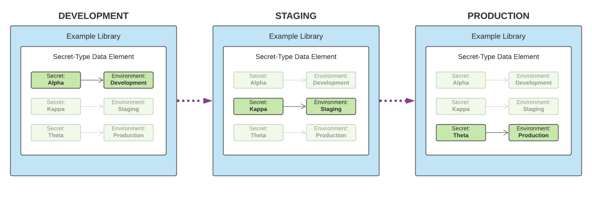

# Configuração de segredos no encaminhamento de eventos

No encaminhamento de eventos, um segredo é um recurso que representa uma credencial de autenticação para outro sistema, permitindo a troca segura de dados. Segredos só podem ser criados nas propriedades de encaminhamento de eventos.

Os seguintes tipos secretos são suportados no momento:

| Tipo secreto | Descrição |
| --- | --- |
| [!UICONTROL Google OAuth 2] | Contém vários atributos para suportar [OAuth 2.0](https://datatracker.ietf.org/doc/html/rfc6749) especificação de autenticação para uso no [API do Google Ads](https://developers.google.com/google-ads/api/docs/oauth/overview) e [Pub/Sub API](https://cloud.google.com/pubsub/docs/reference/service_apis_overview). O sistema solicita as informações necessárias e, em seguida, lida com a renovação desses tokens em um intervalo especificado. |
| [!UICONTROL HTTP] | Contém dois atributos de string para um nome de usuário e senha, respectivamente. |
| [!UICONTROL [!DNL LinkedIn] OAuth 2] | O sistema solicita as informações necessárias e, em seguida, lida com a renovação desses tokens em um intervalo especificado. |
| [!UICONTROL OAuth 2] | Contém vários atributos para suportar [tipo de concessão de credenciais do cliente](https://datatracker.ietf.org/doc/html/rfc6749#section-1.3.4) para o [OAuth 2.0](https://datatracker.ietf.org/doc/html/rfc6749) especificação de autenticação. O sistema solicita as informações necessárias e, em seguida, lida com a renovação desses tokens em um intervalo especificado. |
| [!UICONTROL JWT do OAuth 2] | Contém vários atributos para o suporte ao perfil JSON Web Token (JWT) para [Autorização OAuth 2.0](https://datatracker.ietf.org/doc/html/rfc7523#section-2.1) subvenções. O sistema solicita as informações necessárias e, em seguida, lida com a renovação desses tokens em um intervalo especificado. |
| [!UICONTROL Token] | Uma única cadeia de caracteres que representa um valor de token de autenticação conhecido e compreendido por ambos os sistemas. |

{style="table-layout:auto"}

Este guia fornece uma visão geral de alto nível sobre como configurar segredos para um encaminhamento de eventos ([!UICONTROL Edge]) na interface do Experience Platform ou na interface da Coleção de dados.

>[!NOTE]
>
>Para obter orientação detalhada sobre como gerenciar segredos na API do Reator, incluindo o exemplo JSON da estrutura de um segredo, consulte o [guia da API de segredos](../../api/guides/secrets.md).

## Pré-requisitos

Este guia pressupõe que você já esteja familiarizado com a forma de gerenciar recursos para tags e encaminhamento de eventos na interface do usuário, incluindo como criar um elemento de dados e uma regra de encaminhamento de eventos. Consulte o guia sobre [gerenciamento de recursos](../managing-resources/overview.md) se você precisar de uma introdução.

Você também deve ter uma compreensão funcional do fluxo de publicação de tags e do encaminhamento de eventos, incluindo como adicionar recursos a uma biblioteca e instalar uma build no site para teste. Consulte a [visão geral da publicação](../publishing/overview.md) para obter mais detalhes.

## Criar um segredo {#create}

>[!CONTEXTUALHELP]
>id="platform_eventforwarding_secrets_environments"
>title="Ambientes para segredos"
>abstract="Para que um segredo possa ser usado pelo encaminhamento de eventos, ele deve ser atribuído a um ambiente existente. Se você não tiver nenhum ambiente criado para sua propriedade de encaminhamento de eventos, será necessário configurá-los antes de continuar."
>additional-url="https://experienceleague.adobe.com/docs/experience-platform/tags/publish/environments/environments.html" text="Visão geral dos ambientes"

Para criar um segredo, selecione **[!UICONTROL Encaminhamento de evento]** na navegação à esquerda, abra a propriedade de encaminhamento de eventos em que deseja adicionar o segredo. Em seguida, selecione **[!UICONTROL Segredos]** na navegação à esquerda, seguido por **[!UICONTROL Criar novo segredo]**.

A próxima tela permite configurar os detalhes do segredo. Para que um segredo possa ser usado pelo encaminhamento de eventos, ele deve ser atribuído a um ambiente existente. Se você não tiver ambientes criados para sua propriedade de encaminhamento de eventos, consulte o guia em [ambientes](../publishing/environments.md) para obter orientação sobre como configurá-los antes de continuar.

>[!NOTE]
>
>Se você ainda quiser criar e salvar o segredo antes de adicioná-lo a um ambiente, desative a opção **[!UICONTROL Anexar segredo a ambientes]** alterne antes de preencher o restante das informações. Observe que será necessário atribuí-lo a um ambiente posteriormente se desejar usar o segredo.
>
>

Em **[!UICONTROL Ambiente de destino]**, use o menu suspenso para selecionar o ambiente ao qual deseja atribuir o segredo. Em **[!UICONTROL Nome do segredo]**, forneça um nome para o segredo no contexto do ambiente. Esse nome deve ser exclusivo em todos os segredos na propriedade de encaminhamento de eventos.

Um segredo só pode ser atribuído a um ambiente por vez, mas você pode atribuir as mesmas credenciais a vários segredos em ambientes diferentes, se desejar. Selecionar **[!UICONTROL Adicionar ambiente]** para adicionar outra linha à lista.

Para cada ambiente adicionado, é necessário fornecer outro nome exclusivo para o segredo associado. Se você esgotar todos os ambientes disponíveis, a variável **[!UICONTROL Adicionar ambiente]** O botão estará indisponível.

Aqui, as etapas para criar o segredo diferem dependendo do tipo de segredo que está sendo criado. Consulte as subseções abaixo para obter detalhes:

* [[!UICONTROL Token]](#token)
* [[!UICONTROL HTTP]](#http)
* [[!UICONTROL OAuth 2]](#oauth2)
* [[!UICONTROL JWT do OAuth 2]](#oauth2jwt)
* [[!UICONTROL Google OAuth 2]](#google-oauth2)
* [[!UICONTROL [!DNL LinkedIn] OAuth 2]](#linkedin-oauth2)

### [!UICONTROL Token] {#token}

Para criar um segredo de token, selecione **[!UICONTROL Token]** do **[!UICONTROL Tipo]** lista suspensa. No **[!UICONTROL Token]** que for exibido, forneça a cadeia de caracteres de credencial reconhecida pelo sistema no qual você está autenticando. Selecionar **[!UICONTROL Criar Segredo]** para salvar o segredo.

### [!UICONTROL HTTP] {#http}

Para criar um segredo HTTP, selecione **[!UICONTROL HTTP simples]** do **[!UICONTROL Tipo]** lista suspensa. Nos campos que aparecem abaixo, forneça um nome de usuário e senha para a credencial antes de selecionar **[!UICONTROL Criar Segredo]** para salvar o segredo.

>[!NOTE]
>
>Ao ser salva, a credencial é codificada usando o [Esquema de autenticação HTTP &quot;básico&quot;](https://www.rfc-editor.org/rfc/rfc7617.html).

### [!UICONTROL OAuth 2] {#oauth2}

Para criar um segredo do OAuth 2, selecione **[!UICONTROL OAuth 2]** do **[!UICONTROL Tipo]** lista suspensa. Nos campos exibidos abaixo, forneça as [[!UICONTROL ID do cliente] e [!UICONTROL Segredo do cliente]](https://www.oauth.com/oauth2-servers/client-registration/client-id-secret/), bem como o seu [[!UICONTROL URL do token]](https://www.oauth.com/oauth2-servers/access-tokens/client-credentials/) para a integração OAuth. A variável [!UICONTROL URL do token] O campo na interface é uma concatenação entre o host do servidor de autorização e o caminho do token.

Em **[!UICONTROL Opções de credencial]**, você pode fornecer outras opções de credencial, como `scope` e `audience` na forma de pares de valores chave. Para adicionar mais pares de valor-chave, selecione **[!UICONTROL Adicionar outro]**.

Por fim, você pode configurar as opções **[!UICONTROL Atualizar Deslocamento]** para o segredo. Representa o número de segundos antes da expiração do token em que o sistema executará uma atualização automática. O tempo equivalente em horas e minutos é exibido à direita do campo e é atualizado automaticamente à medida que você digita.

Por exemplo, se o deslocamento de atualização estiver definido como o valor padrão de `14400` (quatro horas) e o token de acesso tiver um `expires_in` valor de `86400` (24 horas), o sistema atualizará automaticamente o segredo em 20 horas.

>[!IMPORTANT]
>
>Um segredo OAuth requer pelo menos quatro horas entre as atualizações e também deve ser válido por no mínimo oito horas. Essa restrição oferece um mínimo de quatro horas para você intervir se surgirem problemas com o token gerado.
>
>Por exemplo, se o deslocamento estiver definido como `28800` (oito horas) e o token de acesso tiver um `expires_in` de `36000` (dez horas), a troca falharia devido à diferença resultante ser inferior a quatro horas.

Quando terminar, selecione **[!UICONTROL Criar Segredo]** para salvar o segredo.

### [!UICONTROL JWT do OAuth 2] {#oauth2jwt}

Para criar um segredo JWT do OAuth 2, selecione **[!UICONTROL JWT do OAuth 2]** do **[!UICONTROL Tipo]** lista suspensa.

![A variável [!UICONTROL Criar Segredo] com o segredo JWT do OAuth 2 destacado na guia [!UICONTROL Tipo] lista suspensa.](../../images/ui/event-forwarding/secrets/oauth-jwt-secret.png)

>[!NOTE]
>
>O único [!UICONTROL Algoritmo] atualmente compatível com a assinatura do JWT é RS256.

Nos campos exibidos abaixo, forneça as [!UICONTROL Emissor], [!UICONTROL Assunto], [!UICONTROL Público], [!UICONTROL Reivindicações Personalizadas], [!UICONTROL TTL], em seguida, selecione a [!UICONTROL Algoritmo] na lista suspensa. Em seguida, insira o [!UICONTROL ID da chave de privacidade], bem como o seu [[!UICONTROL URL do token]](https://www.oauth.com/oauth2-servers/access-tokens/client-credentials/) para a integração OAuth. A variável [!UICONTROL URL do token] o campo não é obrigatório. Se um valor for fornecido, o JWT será trocado com um token de acesso. O segredo será atualizado de acordo com a `expires_in` atributo da resposta e do [!UICONTROL Atualizar Deslocamento] valor. Se um valor não for fornecido, o segredo enviado para a borda será o JWT. O JWT será atualizado de acordo com as [!UICONTROL TTL] e [!UICONTROL Atualizar Deslocamento] valores.

![A variável [!UICONTROL Criar Segredo] com uma seleção de campos de entrada realçados.](../../images/ui/event-forwarding/secrets/oauth-jwt-information.png)

Em **[!UICONTROL Opções de credencial]**, você pode fornecer outras opções de credencial, como `jwt_param` na forma de pares de valores chave. Para adicionar mais pares de valor-chave, selecione **[!UICONTROL Adicionar outro]**.

![A variável [!UICONTROL Criar Segredo] guia destacando o [!UICONTROL Opções de credencial] campos.](../../images/ui/event-forwarding/secrets/oauth-jwt-credential-options.png)

Por fim, você pode configurar as opções **[!UICONTROL Atualizar Deslocamento]** para o segredo. Representa o número de segundos antes da expiração do token em que o sistema executará uma atualização automática. O tempo equivalente em horas e minutos é exibido à direita do campo e é atualizado automaticamente à medida que você digita.

![A variável [!UICONTROL Criar Segredo] guia destacando o [!UICONTROL Atualizar Deslocamento] campo.](../../images/ui/event-forwarding/secrets/oauth-jwt-refresh-offset.png)

Por exemplo, se o deslocamento de atualização estiver definido como o valor padrão de `1800` (30 minutos) e o token de acesso tiver uma `expires_in` valor de `3600` (uma hora), o sistema atualizará automaticamente o segredo em uma hora.

>[!IMPORTANT]
>
>Um segredo JWT do OAuth 2 requer pelo menos 30 minutos entre as atualizações e também deve ser válido por no mínimo uma hora. Essa restrição oferece um mínimo de 30 minutos para você intervir se surgirem problemas com o token gerado.
>
>Por exemplo, se o deslocamento estiver definido como `1800` (30 minutos) e o token de acesso tiver uma `expires_in` de `2700` (45 minutos), a troca falharia devido à diferença resultante ser inferior a 30 minutos.

Quando terminar, selecione **[!UICONTROL Criar Segredo]** para salvar o segredo.

![A variável [!UICONTROL Criar Segredo] realce da guia [!UICONTROL Criar Segredo]](../../images/ui/event-forwarding/secrets/oauth-jwt-create-secret.png)

### [!UICONTROL Google OAuth 2] {#google-oauth2}

Para criar um segredo do Google OAuth 2, selecione **[!UICONTROL Google OAuth 2]** do **[!UICONTROL Tipo]** lista suspensa. Em **[!UICONTROL Escopos]**, selecione as APIs do Google às quais você deseja usar esse segredo para conceder acesso. Os seguintes produtos são suportados no momento:

* [API do Google Ads](https://developers.google.com/google-ads/api/docs/oauth/overview)
* [Pub/Sub API](https://cloud.google.com/pubsub/docs/reference/service_apis_overview)

Quando terminar, selecione **[!UICONTROL Criar Segredo]**.

Um popover é exibido informando que o segredo precisa ser autorizado manualmente por meio do Google. Selecionar **[!UICONTROL Criar e autorizar]** para continuar.

Uma caixa de diálogo é exibida, permitindo inserir as credenciais da conta da Google. Siga as instruções para conceder acesso ao encaminhamento de eventos para seus dados no escopo selecionado. Quando o processo de autorização estiver concluído, o segredo será criado.

>[!IMPORTANT]
>
>Se sua organização tiver uma política de reautenticação definida para aplicativos da Google Cloud, os segredos criados não serão atualizados com êxito após a autenticação expirar (entre 1 e 24 horas, dependendo da configuração da política).
>
>Para resolver esse problema, faça logon no Admin Console da Google e navegue até o **[!DNL App access control]** para poder marcar o aplicativo de encaminhamento de eventos (Encaminhamento de eventos Adobe Real-Time CDP) como [!DNL Trusted]. Consulte a documentação do Google em [definição da duração da sessão para os serviços em nuvem do Google](https://support.google.com/a/answer/9368756) para obter mais informações.

### [!UICONTROL [!DNL LinkedIn] OAuth 2] {#linkedin-oauth2}

Para criar um [!DNL LinkedIn] Segredo do OAuth 2, selecione **[!UICONTROL [!DNL LinkedIn]OAuth 2]** do **[!UICONTROL Tipo]** lista suspensa. Em seguida, selecione **[!UICONTROL Criar Segredo]**.

![A variável [!UICONTROL Criar Segredo] com a guia [!UICONTROL Tipo] realçado.](../../images/ui/event-forwarding/secrets/linkedin-oauth.png)

Um popover é exibido informando que o segredo precisa ser autorizado manualmente por meio do [!DNL LinkedIn]. Selecionar **[!UICONTROL Criar e autorizar segredo com[!DNL LinkedIn]]** para continuar.

![[!DNL LinkedIn] realce do popover de autorização [!UICONTROL Criar e autorizar segredo com [!DNL LinkedIn]].](../../images/ui/event-forwarding/secrets/linkedin-authorization.png)

Uma caixa de diálogo é exibida solicitando que você insira suas [!DNL LinkedIn] credenciais. Siga as instruções para conceder acesso ao encaminhamento de eventos para seus dados.

Quando o processo de autorização for concluído, você retornará ao **[!UICONTROL Segredos]** , onde você pode ver o segredo recém-criado. Aqui você pode ver o status do segredo e a data de expiração.

![A variável [!UICONTROL Segredo] guia destacando o segredo recém-criado.](../../images/ui/event-forwarding/secrets/linkedin-new-secret.png)

#### Reautorizar um [!UICONTROL [!DNL LinkedIn] OAuth 2] segredo

>IMPORTANTE
>
>É necessário reautorizar usando sua [!DNL LinkedIn] a cada 365 dias. Se você não reautorizar no prazo, seu segredo não será atualizado e a variável [!DNL LinkedIn] as solicitações de conversão falharão.

Três meses antes do segredo que requer reautorização, um pop-up começará a ser exibido quando você estiver navegando em qualquer página da propriedade. Selecionar **[!UICONTROL Clique aqui para obter seus segredos]**.

![A variável [!UICONTROL Visão geral da propriedade] guia que destaca o pop-up secreto de reautorização.](../../images/ui/event-forwarding/secrets/linkedin-reauthorization-popup.png)

Você será redirecionado para a [!UICONTROL Segredos] guia. Os segredos listados nesta página são filtrados para mostrar apenas os segredos que precisam ser reautorizados. Selecionar **[!UICONTROL Autenticação necessária]** para o segredo que você precisa reautorizar.

![A variável [!UICONTROL Segredo] realce da guia [!UICONTROL Autenticação necessária]para o [!DNL LinkedIn] segredo.](../../images/ui/event-forwarding/secrets/linkedin-reauthorization.png)

Uma caixa de diálogo é exibida solicitando que você insira suas [!DNL LinkedIn] credenciais. Siga as instruções para reautorizar o segredo.

## Editar um segredo

Depois de criar segredos para uma propriedade, você pode encontrá-los listados na **[!UICONTROL Segredos]** espaço de trabalho. Para editar os detalhes de um segredo existente, selecione o nome na lista.

A próxima tela permite alterar o nome e as credenciais do segredo.

>[!NOTE]
>
>Se o segredo estiver associado a um ambiente existente, não será possível reatribuir o segredo a outro ambiente. Se quiser usar as mesmas credenciais em um ambiente diferente, você deverá [criar um novo segredo](#create) em vez disso. A única maneira de reatribuir o ambiente a partir dessa tela é se você nunca atribuiu o segredo a um ambiente antecipadamente ou se excluiu o ambiente ao qual o segredo estava anexado.

### Tentar novamente uma troca secreta

Você pode tentar novamente ou atualizar uma troca de segredo na tela de edição. Esse processo varia dependendo do tipo de segredo que está sendo editado:

| Tipo secreto | Tentar protocolo novamente |
| --- | --- |
| [!UICONTROL Token] | Selecionar **[!UICONTROL Trocar segredo]** para tentar a troca secreta novamente. Esse controle só está disponível quando há um ambiente anexado ao segredo. |
| [!UICONTROL HTTP] | Se não houver ambiente anexado ao segredo, selecione **[!UICONTROL Trocar segredo]** para trocar a credencial para base64. Se um ambiente estiver anexado, selecione Selecionar **[!UICONTROL Trocar e implantar segredo]** para trocar para base64 e implantar o segredo. |
| [!UICONTROL OAuth 2] | Selecionar **[!UICONTROL Gerar token]** para trocar as credenciais e retornar um token de acesso do provedor de autenticação. |

## Excluir um segredo

Para excluir um segredo existente na  **[!UICONTROL Segredos]** espaço de trabalho, marque a caixa de seleção ao lado do seu nome antes de **[!UICONTROL Excluir]**.

## Uso de segredos no encaminhamento de eventos

Para usar um segredo no encaminhamento de eventos, primeiro crie um [elemento de dados](../managing-resources/data-elements.md) que faz referência ao próprio segredo. Depois de salvar o elemento de dados, você pode incluí-lo no encaminhamento de eventos [regras](../managing-resources/rules.md) e adicione essas regras a uma [biblioteca](../publishing/libraries.md), que por sua vez pode ser implantado em servidores Adobe como um [build](../publishing/builds.md).

Ao criar o elemento de dados, selecione a variável **[!UICONTROL Núcleo]** e selecione **[!UICONTROL Segredo]** para o tipo de elemento de dados. O painel direito é atualizado e fornece controles suspensos para atribuir até três segredos ao elemento de dados: um para [!UICONTROL Desenvolvimento], [!UICONTROL Estágios], e [!UICONTROL Produção] respectivamente.

>[!NOTE]
>
>Somente os segredos anexados aos ambientes de desenvolvimento, preparo e produção são exibidos para seus respectivos detalhamentos.

Atribuindo vários segredos a um único elemento de dados e incluindo uma regra, você pode fazer com que o valor do elemento de dados seja alterado, dependendo de onde a biblioteca que contém o está no [fluxo de publicação](../publishing/publishing-flow.md).

>[!NOTE]
>
>Ao criar o elemento de dados, um ambiente de desenvolvimento deve ser atribuído. Segredos para os ambientes de preparo e produção não são necessários, mas compilações que tentarem fazer a transição para esses ambientes falharão se seus elementos de dados do tipo secreto não tiverem um segredo selecionado para o ambiente em questão.

## Próximas etapas

Este guia aborda como gerenciar segredos na interface do usuário do. Para obter informações sobre como interagir com segredos usando a API do Reator, consulte a [manual de endpoint de segredos](../../api/endpoints/secrets.md).
