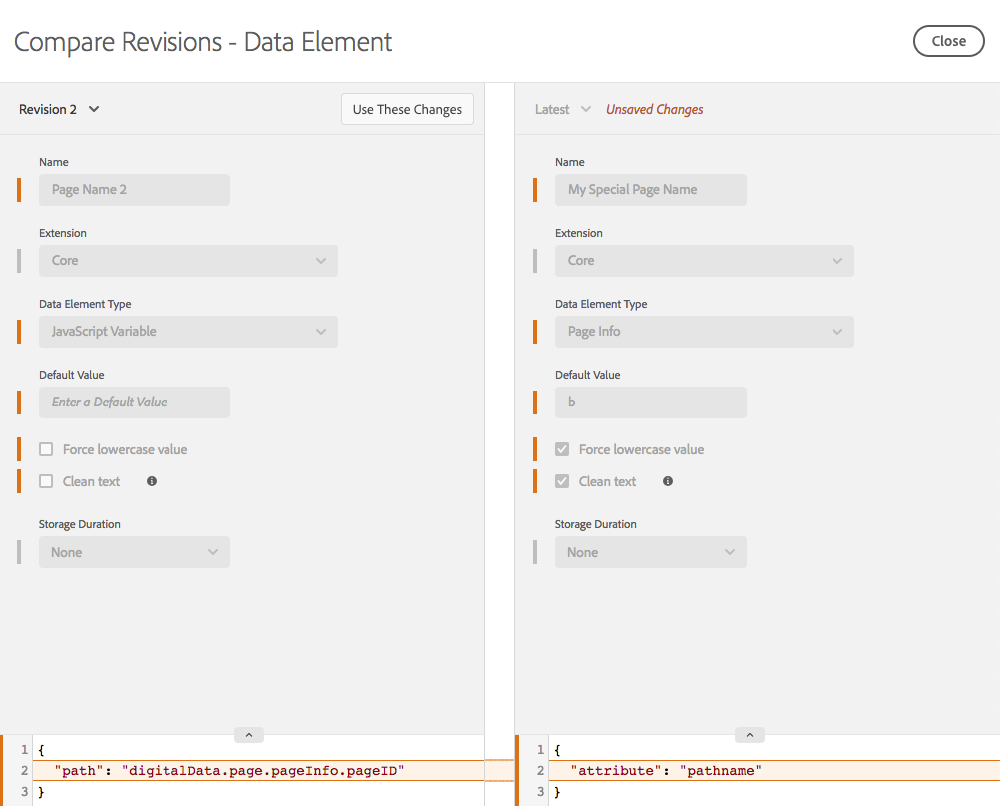
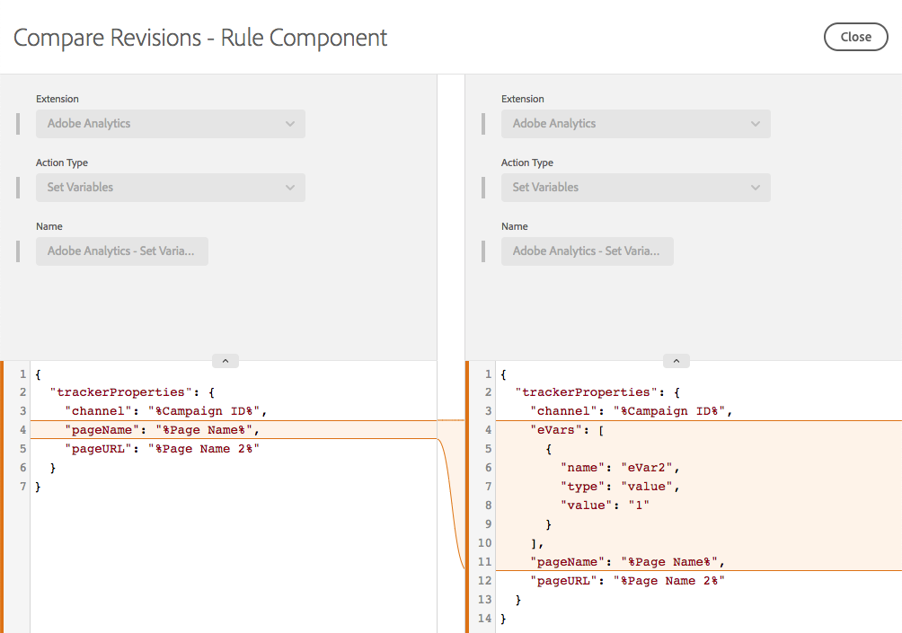

# Comparar revisões de recursos

>[!NOTE]
>
>A Adobe Experience Platform Launch foi reformulada como um conjunto de tecnologias de coleta de dados no Adobe Experience Platform. Como resultado, várias alterações de terminologia foram implementadas na documentação do produto. Consulte o seguinte [documento](../../term-updates.md) para obter uma referência consolidada das alterações de terminologia.

Compare as revisões de recursos para ver o histórico de um recurso individual. Você pode comparar o estado atual do recurso com versões anteriores ou comparar a versão publicada atualmente de um recurso no conjunto mais recente de alterações que foram salvas.

## Iniciar uma comparação

Uma comparação é iniciada da mesma forma para todos os tipos de recursos. Abra a exibição Editar para um recurso individual e, em seguida, localize o ícone de três pontos ao lado do botão **[!UICONTROL Salvar]** para ver as ações disponíveis para esse recurso. Selecione **[!UICONTROL Comparar revisões]** na lista.

Para extensões, acesse a visualização de detalhes clicando no botão **[!UICONTROL Configurar]** ao visualizar a lista de extensões instaladas. Para elementos e regras de dados, selecione um na lista.

## Uso da Visualização de comparação

Quando você inicia uma comparação, a exibição padrão mostra a versão mais recente à direita. Essa versão inclui todas as alterações não salvas que você tenha feito no recurso na exibição Editar. (Observe o rótulo “Alterações não salvas” na imagem abaixo.)

À esquerda, você pode escolher de qualquer revisão existente para comparar com &quot;A mais recente&quot;.

Selecione **[!UICONTROL Usar essas alterações]** para copiar as configurações da revisão selecionada (esquerda) para a versão mais recente (direita). Isso copiará as configurações da revisão antiga para as alterações não salvas mais recentes. Se quiser que as alterações sejam mantidas, não deixe de **[!UICONTROL Salvar]** quando sair da Visualização de comparação.

>[!TIP]
>Os recursos individuais podem ter atributos e configurações. Essas configurações são armazenadas como um bloco JSON, que é uma maneira estruturada para armazenar dados, mas flexível o suficiente para que os desenvolvedores de extensão possam colocar o que precisarem para que suas extensões façam o que desejam.
>A versão inicial da Visualização de comparação exibe as configurações em seu formato bruto, como JSON. Os aprimoramentos futuros permitirão exibir versões de maneiras diferentes, incluindo comparações de código detalhadas e uso das exibições de extensão fornecidas pelos desenvolvedores de extensão.

## Comparação de extensões

As extensões têm uma única tela para mostrar as diferenças entre as versões.

Na Visualização de comparação, as diferenças entre as versões de configurações são destacadas. Adições e remoções para configurações individuais são indicadas por uma expansão de uma linha em qualquer direção.

Acima, você pode ver as seguintes alterações:

* A extensão [!DNL Adobe Analytics] é atualizada para uma nova versão, indicada pelos números de versão laranja na parte superior.
* O `orgID` e o `currencyCode` são alterados para as configurações indicadas pela expansão da seção laranja nas configurações.

## Comparação de elementos de dados

Os elementos de dados têm uma única tela para mostrar diferenças, mas como os elementos de dados têm atributos extras além de suas configurações, são mostradas informações adicionais. Os atributos que foram alterados são realçados em laranja.

Acima, você pode ver as seguintes alterações:

* O nome foi alterado de &quot;Nome da página 2&quot; para &quot;Meu nome de página especial&quot;, conforme indicado pela barra laranja.
* O tipo foi alterado de Variável JavaScript para Informações da página.
* O valor padrão de &quot;b&quot; foi adicionado.
* “Forçar valor de minúsculas” foi selecionado.
* “Texto limpo” foi selecionado.
* As configurações foram alteradas. (As configurações do tipo de variável JavaScript são diferentes do tipo Informações da página.)

Em casos em que o bloco de configurações é grande, é possível expandir a seção de configurações para que você possa visualizá-la melhor.

## Comparação de regras

As regras consistem em vários componentes de regra. Para entender as alterações em uma regra, você precisa saber sobre a adição e remoção de componentes, bem como sobre as modificações em um componente individual. Assim, ao comparar versões de uma regra, existem, na verdade, duas telas.

A primeira tela mostra uma exibição de alto nível, que destaca as alterações na disposição dos componentes da regra dentro da regra. As alterações são destacadas. Vários tipos diferentes de alterações são mostrados.

Acima, você pode ver as seguintes alterações:

* O nome da regra foi alterado de &quot;Analytics&quot; para &quot;Analytics linha de base&quot;, indicado pela barra laranja por Nome.
* A condição “Núcleo - Domínio” foi adicionada, indicado pelo ícone “+” laranja e a adição do componente no lado direito.
* A ação &quot;[!DNL Adobe Analytics] - Limpar variáveis&quot; foi removida, indicado pelo ícone &quot;-&quot; laranja e a ausência do componente no lado direito.
* A ação &quot;[!DNL Adobe Analytics] - Definir variáveis&quot; foi modificada, indicado pela linha laranja entre as versões do componente nos lados esquerdo e direito. Essa linha é reta se a ordem dos componentes não tiver sido alterada.
* A ação &quot;[!DNL Adobe Analytics] - Definir variáveis&quot; e a ordem de ação &quot;[!DNL Adobe Analytics] - Enviar beacon&quot; foram alteradas, indicado pelas linhas curvas que conectam as diferentes versões dos componentes nos lados esquerdo e direito

Para exibir as modificações específicas em um dos componentes da regra, selecione o componente específico que deseja visualizar. A linha muda para azul ao passar o mouse em cima.

A comparação de um componente de regra individual comporta-se da mesma forma que a comparação de um elemento de dados.

Acima, você pode ver a seguinte alteração:

* O componente da regra foi alterado para adicionar eVar2 com um valor de &quot;1&quot;.

Em casos em que o bloco de configurações é grande, é possível expandir a seção de configurações para que você possa visualizá-la melhor.
