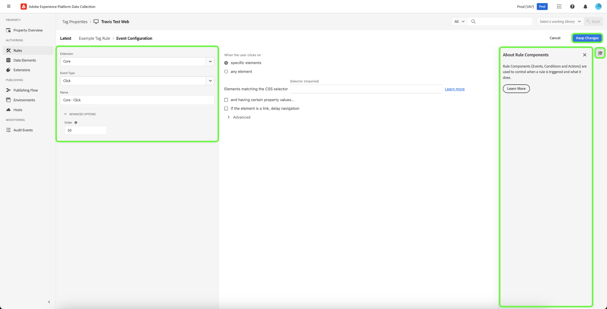

# Regras

>[!NOTE]
>
>O Adobe Experience Platform Launch está sendo reformulado como um conjunto de tecnologias de coleção de dados na Experience Platform. Como resultado, várias alterações de terminologia foram implementadas na documentação do produto. Consulte o seguinte [documento](../../term-updates.md) para obter uma referência consolidada das alterações de terminologia.

As tags no Adobe Experience Platform seguem um sistema baseado em regras. Eles procuram a interação do usuário e dados associados. Quando os critérios definidos nas regras são cumpridos, a regra aciona a extensão, o script ou o código do lado do cliente identificado.

Crie regras para integrar os dados e a funcionalidade de tecnologia de marketing e de anúncios que unifique produtos diferentes em uma única solução.

Para assistir a um vídeo de introdução, consulte [Construtor de regras](../../quick-start/videos.md).

## Estrutura da regra

**Eventos (If):** O evento é o que você deseja que a regra procure. Isso é definido escolhendo um evento, quaisquer condições aplicáveis e quaisquer exceções.

**Ações (Then):** Os acionadores ocorrem depois que os eventos de uma regra ocorrem e todas as condições são satisfeitas. Uma regra de tag pode acionar quantas ações distintas você desejar e você pode controlar a ordem em que essas ações ocorrem. Por exemplo, uma única regra para uma página de agradecimento de comércio eletrônico pode acionar ferramentas de análise e tags de terceiros a partir de uma única regra. Não há necessidade de criar regras diferentes para cada extensão ou tag.

Você pode adicionar mais tipos de eventos. Vários eventos são unidos com um OR, portanto, as condições da regra serão avaliadas se qualquer um dos eventos for atendido.

>[!IMPORTANT]
>
>As alterações não entrarão em vigor até serem [publicadas](../publishing/overview.md).

### Eventos e condições (if)

Eventos com qualquer condição são a parte *If* de uma regra.

Se um evento especificado ocorrer, as condições serão avaliadas e, em seguida, as ações especificadas ocorrerão, se necessário.

* **Eventos**: Especifique um ou mais eventos que devem ocorrer para acionar a regra. Vários eventos são unidos por um OR. Qualquer um dos eventos especificados acionará a regra.

* **Condições**: Restrinja o evento configurando quaisquer condições que devem ser verdadeiras para um evento acionar a regra. Uma exceção é definida como uma condição NOT. Várias condições são unidas por um AND.

Os eventos disponíveis dependem das extensões instaladas. Para obter informações sobre os eventos na extensão principal, consulte [Tipos de evento da extensão principal](../../extensions/web/core/overview.md#core-extension-event-types).

### Ações (then)

As ações são a parte *Then* de uma regra. Elas definem o que você quer que aconteça quando a regra for executada. Quando um evento é acionado, se as condições forem avaliadas como true e as exceções avaliadas como false, as ações serão executadas. Você pode arrastar e soltar ações para ordená-las conforme desejado.

## Criar uma regra

Crie uma regra especificando quais ações ocorrem se uma condição for atendida.

1. Abra a guia [!UICONTROL Regras] e selecione **[!UICONTROL Criar nova regra]**.

   

1. Atribua um nome à regra.
1. Selecione o ícone de eventos **[!UICONTROL Adicionar]**.
1. Escolha sua extensão e um dos tipos de evento disponíveis para essa extensão e configure as definições do evento.

   

   Os tipos de evento disponíveis dependem da extensão selecionada. As configurações do evento serão diferentes de acordo com o tipo de evento. Alguns eventos não têm configurações que precisam ser definidas.

   >[!IMPORTANT]
   >
   >Em uma regra do lado do cliente, os elementos de dados são tokenizados com um `%` no início e no fim do nome do elemento de dados. Por exemplo, `%viewportHeight%`. Em uma regra de encaminhamento de eventos, os elementos de dados são tokenizados com `{{` no início e `}}` no final do nome do elemento de dados. Por exemplo, `{{viewportHeight}}`.

   Para referenciar dados da rede de borda, o caminho do elemento de dados deve ser `arc.event._<element>_`.

   `arc` significa Contexto de resposta da Adobe.

   Por exemplo: `arc.event.xdm.web.webPageDetails.URL`

   >[!IMPORTANT]
   >
   >Se esse caminho for especificado incorretamente, os dados não serão coletados.

1. Defina o parâmetro Pedido e selecione **[!UICONTROL Manter alterações]**.

   A ordem padrão para todos os componentes da regra é 50. Se quiser que um componente seja executado antes, dê a ele um número menor que 50.

   * A ordem de execução é a ordem dos números. 1 vem antes de 3. 3 vem antes de 10. 10 vem antes de 100, etc.
   * Regras que têm a mesma ordem são executadas sem ordem específica.
   * As regras são acionadas em ordem, mas não são necessariamente encerradas na mesma ordem. Se a Regra A e a Regra B compartilharem um evento e você atribuir uma ordem para que a Regra A venha primeiro, caso a Regra A faça algo de maneira assíncrona, não há garantia de que a Regra A seja concluída antes que a Regra B seja iniciada.

      Se quiser que um componente seja executado depois, dê a ele um número maior que 50. Para obter mais informações sobre a ordenação, consulte [Ordenação de regra](rules.md#rule-ordering).

1. Selecione o ícone de condições **[!UICONTROL Adicionar]**, escolha um tipo de lógica, extensão, tipo de condição e defina as configurações para sua condição. Em seguida, selecione **[!UICONTROL Manter alterações]**.

   

   Os tipos de condição disponíveis dependem da extensão selecionada. As configurações de condição serão diferentes de acordo com o tipo de condição.

   Tipo lógico:

   * O tipo lógico regular permite que ações sejam executadas se a condição for atendida
   * O tipo lógico de exceção impede que ações sejam executadas, se a condição for atendida

   (Avançado) Tempo limite: essa opção está disponível quando a sequência de componentes da regra está ativada em sua propriedade. Esse atributo define a quantidade máxima de tempo permitida para a condição ser executada. Se o tempo limite for atingido, a condição falhará e o restante das condições e ações da regra serão removidas da fila de processamento. O padrão é 2000 ms.

   Você pode adicionar quantas condições desejar. Várias condições dentro da mesma regra são unidas por AND.

1. Selecione o ícone de ações **[!UICONTROL Adicionar]**, escolha sua extensão e um dos tipos de ação disponíveis para essa extensão, defina as configurações para a ação e selecione **[!UICONTROL Manter alterações]**.

   

   Os tipos de ação disponíveis dependem da extensão selecionada. As configurações de ação serão diferentes de acordo com o tipo de ação.

   (Avançado) Aguarde para executar a próxima ação: essa opção está disponível quando a sequência de componentes da regra está ativada em sua propriedade. Quando marcado, as tags não chamarão a próxima ação até que esta seja concluída. Quando desmarcada, a próxima ação começa a ser executada imediatamente. O padrão é **[!UICONTROL Marcado]**.

   (Avançado) Tempo limite: essa opção está disponível quando a sequência de componentes da regra está ativada em sua propriedade. Define o tempo máximo permitido para a ação ser concluída. Se o tempo limite for atingido, a ação falhará e qualquer ação subsequente para essa regra será removida da fila de processamento. O padrão é 2000 ms.

1. Examine a regra e selecione **[!UICONTROL Salvar regra]**.

   Posteriormente, ao [publicar](../publishing/overview.md), você adicionará essa regra a uma biblioteca e a implantará.

Ao criar ou editar regras, você pode salvar e incorporar em sua [biblioteca ativa](../publishing/libraries.md#active-library). Isso salva imediatamente sua alteração na biblioteca e executa uma build. O status da build será exibido.

## Ordem de regra {#rule-ordering}

A ordenação de regras permite controlar a ordem de execução das regras que compartilham um evento.

Geralmente, é importante ter as regras acionadas em uma ordem específica. Exemplos: (1) você tem várias regras que definem condicionalmente [!DNL Analytics] variáveis e você deve se certificar de que a regra com Enviar Beacon vai por último. (2) você tem uma regra que é acionada [!DNL Target] e outra regra que é acionada [!DNL Analytics] e deseja que [!DNL Target] a regra seja executada primeiro.

Em última análise, a responsabilidade de executar ações em ordem é do desenvolvedor de extensão do tipo de evento que está usando. Os desenvolvedores de extensão do Adobe garantem que suas extensões funcionem conforme o esperado. Para extensões de terceiros, o Adobe fornece orientação aos desenvolvedores de extensão para implementarem isso corretamente, mas cabe a eles fazê-lo.

O Adobe recomenda que você ordene suas regras com números positivos entre 1 e 100 (o padrão é 50). Quanto mais simples, melhor. Lembre-se de que é necessário manter sua ordem. No entanto, o Adobe reconhece que pode haver casos que podem ser limitantes, de modo que outros números são permitidos. As tags suportam números entre +/- 2.147.483.648. Você também pode usar cerca de uma dúzia de casas decimais, mas se estiver em uma situação na qual acha que precisa fazer isso, repense algumas das decisões tomadas para chegar onde você está agora.

>[!IMPORTANT]
>
>Na seção Ação de uma regra, as regras do lado do servidor são executadas sequencialmente. Verifique se a ordem está correta ao criar a regra.

### Cenários

* Cinco regras compartilham um evento. Todas têm prioridade padrão. Quero que uma delas seja executada por último. Só preciso editar um componente de regra e atribuir a ele um número maior que 50 (60 por exemplo).
* Cinco regras compartilham um evento. Todas têm prioridade padrão. Quero que uma delas seja executada primeiro. Só preciso editar esse um componente de regra e atribuir a ele um número menor que 50 (40 por exemplo).

### Manuseio de regras no lado do cliente

A ordem de carregamento das regras depende de a ação da regra estar configurada com JavaScript, HTML ou outro código do lado do cliente e se as regras usam um evento de fim de página ou de início de página ou um tipo diferente de evento.

Você pode usar `document.write` nos scripts personalizados, independentemente dos eventos configurados para a regra.

É possível ordenar tipos de código personalizados diferentes entre si. Por exemplo, agora você pode ter uma ação de código personalizado JavaScript e, em seguida, uma ação de código personalizado HTML, depois uma ação de código personalizado JavaScript. As tags garantem que sejam executadas nessa ordem.

## Pacote de regras

Os eventos e as condições da regra são sempre agrupados na biblioteca principal de tags. As ações podem ser agrupadas na biblioteca principal ou carregadas depois como subrecursos, conforme necessário. Se as ações são agrupadas ou não é determinado pelo tipo de evento da regra.

### Regras com eventos &quot;Core - Library Loaded&quot; ou &quot;Core - Page Top&quot;

Esses eventos precisam ser executados quase sempre (a menos que as condições avaliem como falso), de modo que, para ter eficiência, eles são agrupados na biblioteca principal, o arquivo referenciado pelo código incorporado.

* **Javascript:** O JavaScript é incorporado na biblioteca principal de tags. O script personalizado é colocado em uma tag de script e gravado no documento usando `document.write`. Se a regra tiver vários scripts personalizados, eles serão escritos em ordem.

   >[!NOTE]
   >
   >As tags usam ES5 JavaScript. O encaminhamento de eventos usa o ES6.

* **HTML:** O HTML é incorporado na biblioteca principal de tags. O `document.write` é usado para gravar o HTML no documento. Se a regra tiver vários scripts personalizados, eles serão escritos em ordem.

### Regras com qualquer outro evento

A Adobe não pode garantir que qualquer outra regra será acionada e que o código de ação será necessário. Por esse motivo, as ações para todos os tipos de evento que não estão listados acima não são armazenadas na biblioteca principal. Em vez disso, elas são armazenados como subrecursos e referenciadas pela biblioteca principal, conforme necessário.

* **JavaScript:** O JavaScript é carregado do servidor como texto regular, envolvido em uma tag de script e adicionado ao documento usando Postscribe. Se a regra tiver vários scripts personalizados JavaScript, eles serão carregados simultaneamente a partir do servidor, mas executados na mesma ordem em que foram configurados na regra.
* **HTML:** O HTML é carregado do servidor e adicionado ao documento usando Postscribe. Se a regra tiver vários scripts personalizados HTML, eles serão carregados simultaneamente a partir do servidor, mas executados na mesma ordem em que foram configurados na regra.

## Sequência de componentes da regra

O comportamento do ambiente de tempo de execução da tag depende se **[!UICONTROL Executar componentes de regra na sequência]** está ativado ou desativado para a propriedade.

### Ativado

Se estiver ativado, quando um evento é acionado no tempo de execução, as condições e ações da regra são adicionadas a uma fila de processamento, com base na ordem definida, e processadas uma de cada vez de acordo com a metodologia FIFO. A tag aguarda a conclusão do componente antes de passar para o próximo.

Se uma condição for avaliada como falsa ou atingir o tempo limite definido, as condições e ações subsequentes da regra serão removidas da fila.

Se uma ação falhar ou atingir o tempo limite definido, as ações subsequentes dessa regra serão removidas da fila.

>[!NOTE]
>
>Com essa configuração ativada, todas as condições e ações são executadas de forma assíncrona, mesmo que você tenha carregado a biblioteca de tags de forma síncrona.

### Desativado

Se estiver desativado, quando um evento é acionado no tempo de execução, as condições da regra são avaliadas imediatamente. Várias condições são avaliadas em paralelo.

Se todas as condições retornarem o resultado true (e as exceções retornarem false), as ações da regra serão executadas imediatamente. As ações são chamadas em ordem, mas as tags não esperam que uma seja concluída antes de chamar a próxima. Se as ações forem síncronas, elas ainda serão executadas em ordem. Se uma ou mais ações forem assíncronas, algumas ações serão executadas em paralelo.
