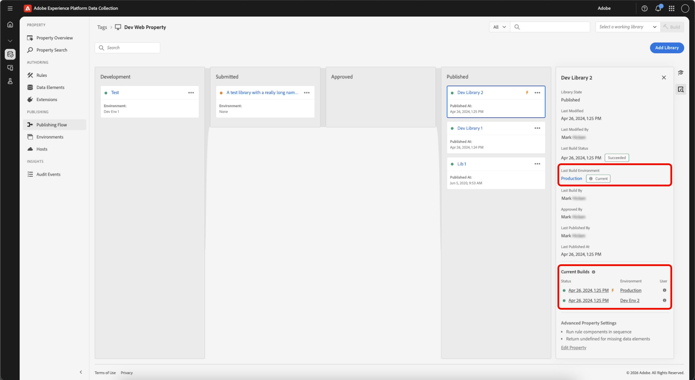
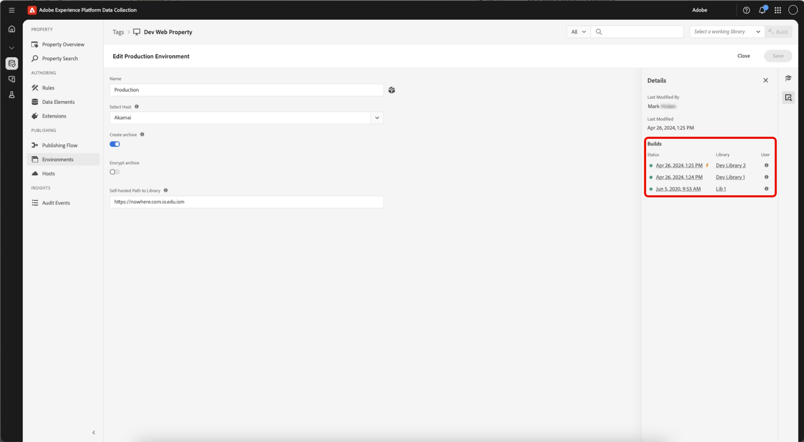

# Builds

Uma build é o conjunto de arquivos que contém todo o código executado no dispositivo cliente.

É composto pelas alterações especificadas na biblioteca, bem como por tudo o que foi enviado, aprovado ou publicado anteriormente.

A build consiste em arquivos de código do lado do cliente que fazem referência um ao outro. Esses arquivos são entregues no local da hospedagem usando o ambiente e o host escolhidos para a biblioteca. O código implantado no site aponta para esse mesmo local, para que os arquivos possam carregar quando um usuário acessa seu site ou aplicativo.

## Conteúdo do arquivo {#file-contents}

Uma biblioteca define um conjunto distinto de recursos de tag (extensões, regras e elementos de dados) que devem ser incluídos nela.

Um build contém todo o código do módulo (fornecido pelos desenvolvedores da extensão) e a configuração (inserida por você) necessária para habilitar os recursos contidos na biblioteca. Por exemplo, se uma extensão fornecer ações que não são usadas em suas regras, o código para executar essas ações não estará contido no build.

As builds são divididas no arquivo da biblioteca principal e, possivelmente, em muitos arquivos menores. O arquivo da biblioteca principal é referido no código incorporado e carregado na página no tempo de execução. Ele contém:

* O mecanismo de regras
* Toda a configuração da extensão
* Todo o código e configuração do elemento de dados
* Todo o código e configuração do evento de regra
* Todo o código e configuração da condição
* Código e configuração de evento para quaisquer regras com biblioteca carregada ou final de página como o evento (já que sabemos que será necessário imediatamente).

Os arquivos menores contêm código e configuração para ações individuais que são carregadas na página, conforme necessário. Quando uma regra é acionada e suas condições são avaliadas de forma que as ações precisem ser executadas, o código e a configuração necessários para a ação específica são recuperados de um dos arquivos menores. Isso significa que apenas o código necessário para realizar as ações necessárias é carregado na página, tornando a biblioteca principal o menor possível.

## Formato de arquivo {#file-format}

O formato de arquivo padrão para builds é um pacote de arquivos que contém todo o código necessário para suas extensões, elementos de dados e regras para executar da maneira que você desejar.

No entanto, em alguns casos, você pode preferir um arquivo .zip dos arquivos, em vez do arquivo de código executável do lado do cliente. Por exemplo, pode ser necessário criar um arquivo, se hospedar sua própria build e quiser usar a build em outra implantação. Se você fornecer qualquer item no caminho auto-hospedado para o campo da biblioteca, poderá salvar seu ambiente. Juntamente com o novo código, um link para o download arquivado ficará disponível. Depois que a biblioteca for criada, você terá a opção de implantar um arquivo zip no Akamai e baixá-lo de `assets.adobedtm.com/...`.

>[!NOTE]
>
>Nada existe nesse local, até que você faça uma build.

Independentemente do formato de arquivo, a build é sempre fornecida no local especificado pelo host.

Para concluir um build, selecione uma biblioteca e clique na opção Build disponível no nível do processo de publicação (Build para desenvolvimento, Build para preparação e assim por diante).

## Minificação {#minification}

A minificação diminui os custos da largura de banda e melhora a velocidade, removendo os dados que não são necessários para a execução de um arquivo.

Para aumentar o desempenho, o Experience Platform minifica tudo, inclusive:

* A biblioteca de tags principal
* O código do módulo fornecido pelos desenvolvedores de extensão como parte de uma extensão
* O código personalizado fornecido pelos usuários do Experience Platform

>[!NOTE]
>
>Se o código do módulo e o código personalizado já estiverem minificados, o Experience Platform os minificará novamente. Essa segunda minificação não oferece benefícios adicionais, mas não causa nenhum dano e torna o Experience Platform menos complexo e mais fácil de manter.

Qualquer código fornecido do lado do cliente aponta para a versão minificada do código. Isso é visto nos nomes de arquivos que seguem a convenção de nomenclatura padrão para arquivos minificados:

`launch-%environment_id%.min.js`

Se quiser ver o código não minificado, remova .min do nome do arquivo:

`launch-%environment_id%.js`

Se um desenvolvedor de extensão fornecer códigos minificados com sua extensão, a Experience Platform não fornecerá código não minificado na compilação não reduzida. Da mesma forma, se um usuário do Experience Platform colocar código minificado em uma caixa de código personalizada, esse código ainda será minificado em builds não minificados. A Experience Platform não cancela a minificação.

Para obter mais informações sobre a minificação, consulte [este artigo do StackPath](https://blog.stackpath.com/glossary/minification/).

Ao ser realizado um build, primeiro a biblioteca não minificada será construída e, depois, toda a biblioteca será minificada de uma só vez.

## Exibir detalhes da compilação {#build-details}

>[!IMPORTANT]
>
>Uma biblioteca armazena revisões dos seus recursos de marca, mas um **Build** é um instantâneo point-in-time dessa biblioteca que contém os arquivos entregues ao seu site.

As compilações e os detalhes da compilação podem ser acessados de uma **biblioteca** ou de um **ambiente** para exibir as compilações dinâmicas atuais e inspecionar o que uma compilação contém (extensões, elementos de dados e regras).

### Exibir detalhes da criação de uma biblioteca

Na propriedade das tags, abra o **[!UICONTROL Publishing Flow]** e selecione uma biblioteca.

No painel de detalhes, é possível revisar o seguinte:

* **[!UICONTROL Last Build Environment]** — Link para o ambiente que recebeu a última compilação. Indica se esta biblioteca é a compilação atual para esse ambiente (**Atual** ou **Não atual**).
* **[!UICONTROL Current Builds]** — Compilações que estão atualmente ativas em seus ambientes. Para bibliotecas publicadas, a build de produção ativa é indicada pelo ícone de raio nesta seção.
* Para cada build listado, você pode visualizar:
   * **[!UICONTROL Status]** - Quando a compilação foi criada.
   * **[!UICONTROL Environment]** - O ambiente em que a compilação foi implantada.
   * **[!UICONTROL User]** - Usuário que criou a compilação.

### Exibir builds de um ambiente

Uma build está associada a um ambiente e à biblioteca que foi criada para esse ambiente. A build é o que realmente contém os recursos compilados.

Selecione o **[!UICONTROL Environment]** no painel de detalhes. O painel Detalhes do ambiente mostra uma lista de builds recentes, a build ativa atual e as bibliotecas relacionadas.

Em seguida, selecione uma build para abrir seus detalhes. Os detalhes da compilação mostram as **Extensões**, **Elementos de Dados** e **Regras** incluídas nessa compilação.

>[!NOTE]
>
>Um build pode incluir mais do que os recursos listados somente na biblioteca. As **Extensões**, **Elementos de Dados** e **Regras** empacotadas na compilação incluem o conteúdo da biblioteca e o conteúdo upstream. É o instantâneo completo que é publicado no site ou aplicativo.

Use o painel de detalhes para voltar para a **[!UICONTROL Environment]** ou **[!UICONTROL Library]**.
