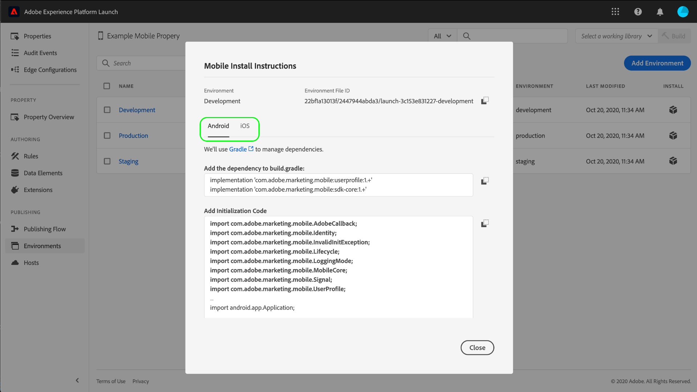
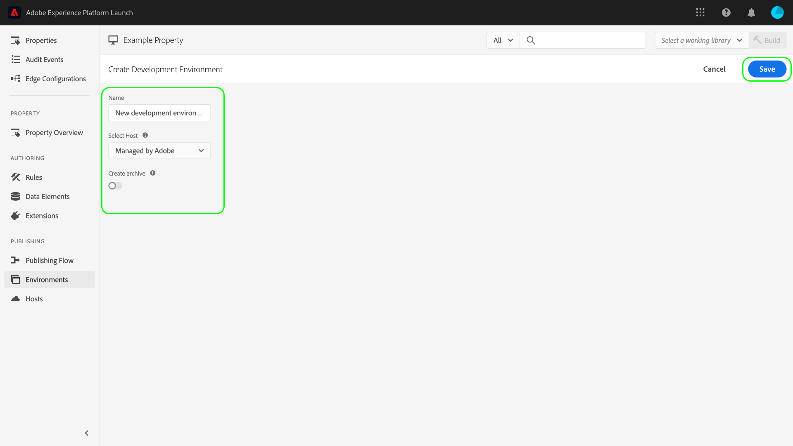

# Ambientes

>[!NOTE]
>
>A Adobe Experience Platform Launch foi reformulada como um conjunto de tecnologias de coleta de dados no Adobe Experience Platform. Como resultado, várias alterações de terminologia foram implementadas na documentação do produto. Consulte o seguinte [documento](../../term-updates.md) para obter uma referência consolidada das alterações de terminologia.

Os ambientes de tag definem vários aspectos principais das criações da biblioteca que são implantadas em seu site ou aplicativo:

* O nome do arquivo da build.
* O domínio e o caminho da build, dependendo do host atribuído pelo ambiente.
* O formato de arquivo da build, dependendo da opção de arquivamento escolhida.

Ao criar um build de biblioteca, você deve atribuí-lo a um ambiente. As extensões, regras e elementos de dados da build são compilados e colocados no ambiente atribuído. Cada ambiente fornece um código integrado exclusivo que permite integrar a build atribuída ao site.

Diferentes artefatos do podem existir em cada ambiente. Esses artefatos permitem testar diferentes bibliotecas em ambientes diferentes, conforme você as envia por meio do fluxo de trabalho.

Este documento fornece etapas sobre como instalar, configurar e criar diferentes ambientes na interface do usuário da Coleção de dados.

## Tipos de ambientes

As tags aceitam três tipos de ambientes diferentes, cada um correspondente a um estado diferente no [fluxo de trabalho de publicação](./publishing-flow.md):

| Tipo de ambiente | Descrição |
| --- | --- |
| Desenvolvimento | Esse ambiente corresponde à coluna **Desenvolvimento** no fluxo de trabalho de publicação. |
| Armazenamento temporário | Esse ambiente corresponde às colunas **Enviado** e **Aprovado** no fluxo de trabalho de publicação. |
| Produção | Esse ambiente corresponde à coluna **Publicado** no fluxo de trabalho de publicação. |

Diferentes artefatos do podem existir em cada ambiente. Dessa forma, você pode testar diferentes bibliotecas em ambientes diferentes, conforme você as envia por meio do fluxo de trabalho.

>[!NOTE]
>
>Cada ambiente só pode receber uma build de biblioteca por vez. No entanto, espera-se que um único ambiente contenha muitas builds diferentes ao longo do tempo, conforme você as move pelo fluxo de trabalho de publicação, reatribuindo as builds entre ambientes, conforme necessário.

## Instalação {#installation}

Cada ambiente tem um conjunto de instruções usadas para conectá-lo ao seu aplicativo. Para propriedades da Web, essas instruções fornecem códigos integrados. Para propriedades móveis, essas instruções fornecem o código necessário para instanciar as bibliotecas que você está usando e recuperar a configuração no tempo de execução.

>[!IMPORTANT]
>
>Cada tipo de ambiente tem suas próprias instruções de instalação correspondentes. Dependendo do ambiente que estiver usando, você deve garantir que esteja utilizando os códigos integrados e/ou dependências correspondentes corretos.
>
>Por exemplo, o código de integração de produção para uma propriedade da Web oferece suporte ao armazenamento em cache do navegador, enquanto os códigos integrados de desenvolvimento e armazenamento temporário não. Dessa forma, você não deve usar códigos integrados de desenvolvimento ou armazenamento temporário em contextos de alto tráfego ou produção.

Para acessar as instruções de instalação de um ambiente, navegue até a guia **[!UICONTROL Ambientes]** da propriedade e clique no ícone **[!UICONTROL Instalar]** do ambiente.

Se estiver usando uma propriedade da Web, você receberá um código integrado para ser usado na tag `<head>` do seu documento. Você também tem a opção de implantar arquivos de biblioteca de forma síncrona ou assíncrona no tempo de execução. Dependendo da configuração escolhida, as instruções de instalação exibidas serão diferentes. Os códigos integrados são explicados com mais detalhes posteriormente neste documento.

Se estiver usando uma propriedade móvel, você receberá instruções separadas para instalar dependências para Android (via [Gradle](https://gradle.org/)) e iOS (via [CocoaPods](https://cocoapods.org/)).

## Configuração móvel

Para propriedades móveis, você pode visualizar as opções de configuração de um ambiente selecionando-o na lista. Aqui, você pode mudar o nome do ambiente. Atualmente, os ambientes móveis só podem usar hosts gerenciados pela Adobe.

Consulte a visão geral dos [hosts](./hosts/hosts-overview.md) para obter mais informações.

## Configuração da Web

As configurações do ambiente atribuído determinam o seguinte para propriedades da Web:

* **Host**: o local do servidor em que você deseja que a build seja implantada.
* **Configuração de arquivamento**: se o sistema deve produzir um conjunto implantável de arquivos ou compactá-los em um formato de arquivo.
* **Código integrado**: o código do `<script>` que será incorporado no HTML das páginas do site, usado para implantar a build da biblioteca no tempo de execução.

Na guia [!UICONTROL Ambientes], selecione um ambiente listado para exibir seus controles de configuração.

### Host {#host}

Selecione **[!UICONTROL Host]** para escolher um host pré-configurado para o ambiente no menu suspenso

Quando um build é concluído, é enviado ao local especificado para o host atribuído. Para obter informações sobre como criar e configurar hosts na interface da Coleção de dados, consulte a [visão geral de hosts](./hosts/hosts-overview.md).

### Configuração de arquivamento {#archive}

A maioria das builds consiste em vários arquivos. As builds de vários arquivos contêm um arquivo da biblioteca principal (vinculado ao código integrado) que contém referências internas aos outros arquivos que são chamados quando necessário.

O botão **[!UICONTROL Criar arquivo]** permite alternar a configuração de arquivamento do ambiente. Por padrão, a opção de arquivamento é desligada e a build é entregue em um formato que é executado como está (JavaScript para propriedades da Web e JSON para propriedades móveis).

Se você optar por ativar a configuração de arquivamento, configurações adicionais aparecerão na interface do usuário, permitindo que você criptografe opcionalmente o arquivo de arquivamento e defina um caminho para a biblioteca se estiver usando a hospedagem própria.

O caminho pode ser um URL completo ou um caminho relativo que pode ser usado em vários domínios. Isso é importante porque a maioria das builds tem vários arquivos que contêm referências internas umas às outras.

Se você usar a opção de arquivamento, todos os arquivos de build serão entregues como um arquivo ZIP. Isso pode ser útil se:

1. Você estiver hospedando a biblioteca automaticamente mas não quiser configurar um host SFTP para entrega.
1. É necessário executar a análise do código na build antes da implantação.
1. Você só quiser ver o conteúdo da build para ver o que há nela.

### Integrar código {#embed-code}

Um código integrado é uma tag `<script>` que deve ser colocada nas seções `<head>` das páginas do site para carregar e executar o código que foi criado. Cada configuração de ambiente gera automaticamente seu próprio código integrado. Basta copiá-lo e colá-lo nas páginas do site nas quais você deseja executar as tags.

Ao visualizar as instruções de instalação, é possível optar por fazer com que o script carregue os arquivos da biblioteca de forma síncrona ou assíncrona. Essa configuração não é persistente e não reflete a forma como as tags foram implementadas no site. Em vez disso, apenas mostra a maneira apropriada de instalar o ambiente.

>[!WARNING]
>
>Dependendo do conteúdo da biblioteca de tags, o comportamento das regras e outros elementos podem mudar entre a implantação síncrona e assíncrona. Portanto, é importante testar detalhadamente qualquer alteração feita.

#### Implantação assíncrona

A implantação assíncrona permite que o navegador continue carregando o restante da página enquanto a biblioteca está sendo recuperada. Há apenas um código integrado ao usar essa configuração, que deve ser colocado no documento `<head>`.

Para obter mais informações sobre essa configuração, consulte o guia sobre [implantação assíncrona](../client-side/asynchronous-deployment.md).

#### Implantação síncrona

Quando o navegador lê um código integrado usando a implantação síncrona, ele recupera a biblioteca de tags e a executa antes de continuar carregando a página.

Os códigos integrados síncronos consistem em duas tags `<script>` que devem ser colocadas dentro do HTML do seu site. Uma tag `<script>` deve ser colocada no documento `<head>`, enquanto a outra deve ser colocada antes da tag `</body>` de fechamento.

#### Integrar atualizações de código

Como os códigos integrados são gerados com base nas configurações do ambiente, algumas alterações de configuração atualizarão automaticamente o código integrado do ambiente em questão. Essas alterações incluem:

* Mudar de um host gerenciado pela Adobe para um host SFTP ou vice-versa.
* Alteração da configuração de arquivamento.
* Atualizar o campo de caminho se a configuração de arquivamento estiver ativada.

>[!WARNING]
>
>Quando um código integrado de um ambiente de tags é alterado, é necessário atualizar manualmente os códigos integrados no HTML. Para evitar uma manutenção dispendiosa, atualize os códigos integrados quando for absolutamente necessário.

## Criar um ambiente

Três ambientes são automaticamente atribuídos a uma propriedade quando ela é criada pela primeira vez: desenvolvimento, armazenamento temporário e produção. Isso é suficiente para executar o fluxo de trabalho de publicação. No entanto, você pode adicionar outros ambientes de desenvolvimento, se desejar, pois isso pode ser útil em equipes maiores onde vários desenvolvedores estão trabalhando em projetos diferentes ao mesmo tempo.

Na guia [!UICONTROL Ambientes] da propriedade, selecione **[!UICONTROL Adicionar ambiente]**.

Na tela seguinte, selecione a opção **[!UICONTROL Desenvolvimento]**.

A próxima tela permite nomear o novo ambiente, selecionar um host e escolher uma configuração de arquivamento. Quando terminar, clique em **[!UICONTROL Salvar]** para criar o ambiente.

A guia [!UICONTROL Ambientes] será exibida novamente, com as instruções de instalação do novo ambiente exibidas.

## Próximas etapas

Ao ler este documento, você deve ter um entendimento prático para configurar ambientes na interface do usuário e instalá-los em seu site ou aplicativo. Agora você está pronto para começar a publicar as builds de biblioteca.

Conforme você publica iterações da biblioteca, pode ser necessário rastrear e arquivar builds anteriores para fins de solução de problemas e reversão. Consulte o guia sobre [republicação de bibliotecas mais antigas](./republish.md) para obter mais informações.
