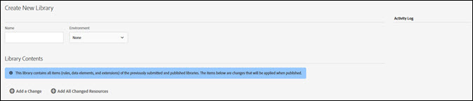

# Bibliotecas

>[!NOTE]
>
>A Adobe Experience Platform Launch foi reformulada como um conjunto de tecnologias de coleta de dados no Adobe Experience Platform. Como resultado, várias alterações de terminologia foram implementadas na documentação do produto. Consulte o seguinte [documento](../../term-updates.md) para obter uma referência consolidada das alterações de terminologia.

Uma biblioteca é um conjunto de instruções sobre como as extensões, os elementos de dados e as regras interagem entre si após a implantação. Ao criar uma biblioteca, especifique as alterações que você deseja fazer na biblioteca. No momento da criação, essas alterações são combinadas com tudo o que foi enviado, aprovado ou publicado nas bibliotecas anteriores.

As bibliotecas contêm a adição ou remoção de:

* Regras
* Elementos
* Configuração de extensão

As bibliotecas devem ser atribuídas a um ambiente antes de serem compiladas em uma criação. As bibliotecas são aprovadas ou rejeitadas como um todo. Não é possível aprovar ou rejeitar itens individuais em uma biblioteca. Uma biblioteca passa por vários ambientes durante o fluxo de trabalho de publicação.

## Criar uma biblioteca {#create-a-library}

Para criar uma biblioteca, conclua as etapas a seguir.

1. Abra a guia [!UICONTROL Publicação].

   A página [!UICONTROL Publicação] lista as bibliotecas de Desenvolvimento e fornece os meios de enviá-las para aprovação, movê-las para o armazenamento temporário ou publicá-las para produção.

1. Selecione **[!UICONTROL Adicionar nova biblioteca]**.

   

1. Dê um nome para a biblioteca.
1. Atribua a biblioteca a um ambiente de Desenvolvimento.
1. Adicione uma alteração à biblioteca.
Para adicionar um item, selecione **[!UICONTROL Adicionar uma alteração]** e escolha os itens que deseja adicionar. Qualquer item editado ou excluído está disponível para ser adicionado à biblioteca escolhida.

   

   Você pode adicionar o seguinte à biblioteca:

   * Regras
   * Elementos de dados
   * Configurações de extensão

1. Para adicionar recursos que foram alterados, selecione **[!UICONTROL Adicionar todos os recursos alterados]**.
1. Selecione **[!UICONTROL Salvar]** ou **[!UICONTROL Salvar e criar para desenvolvimento]**.

   A implantação compila uma criação e a implanta no ambiente atribuído.

Após criar uma biblioteca, use o menu suspenso dessa biblioteca para selecionar uma das seguintes opções:

* **Editar**: Essa opção permite alterar a configuração da biblioteca.

* **Criar para desenvolvimento**: Essa opção compila uma criação e a implanta no ambiente atribuído.

* **Enviar para aprovação**: Essa opção disponibiliza a biblioteca para que um Aprovador a mova para a próxima etapa do processo de publicação.

* **Excluir**: Essa opção remove a biblioteca selecionada no momento do processo de publicação.

## Adicionar a uma biblioteca {#add-to-a-library}

Para adicionar a uma biblioteca, conclua as etapas a seguir.

1. Instale as [extensões](../managing-resources/extensions/overview.md) que deseja adicionar.
1. Crie os [elementos de dados](../managing-resources/data-elements.md) e as regras que deseja adicionar.
1. Abra a guia **[!UICONTROL Publicação]**.
1. Selecione a [biblioteca](libraries.md) que você deseja alterar e selecione **[!UICONTROL Editar]**.
1. Use as regras, os elementos de dados e os botões de extensões para selecionar os itens que deseja adicionar à biblioteca.
1. Salve as alterações.

As alterações na biblioteca são mostradas no log de alterações do Conteúdo da biblioteca.

>[!NOTE]
>
>Os elementos de dados podem depender das extensões. As regras podem depender dos elementos de dados e das extensões. Se você não incluir todos os componentes necessários na biblioteca, ocorrerá uma falha no momento da criação e será preciso adicionar os componentes necessários antes de concluir uma criação com sucesso. Uma versão futura verificará as dependências ao fazer alterações em uma biblioteca.

## Remover de uma biblioteca

Para remover um item de uma biblioteca, você deve desativá-lo e publicar o estado desativado.

1. Desative as extensões que deseja remover, juntamente com os elementos de dados e as regras que dependem dessas extensões.
1. Desative os elementos de dados e as regras que deseja remover.
1. Abra a guia **[!UICONTROL Publicação]**.
1. Selecione a biblioteca que deseja alterar.
1. Use as regras, os elementos de dados e os botões de extensões para selecionar os itens desativados que deseja remover da biblioteca.
1. Salve as alterações.

## Gerenciar alterações na biblioteca

Para editar as opções da biblioteca, conclua as etapas a seguir.

1. Escolha uma biblioteca e selecione **[!UICONTROL Editar]** para ver as alterações da biblioteca. Todas as alterações são mostradas na lista [!UICONTROL Conteúdo da biblioteca].

   

1. Selecione uma alteração para exibir e selecionar uma revisão.

   

1. Selecione se deseja mostrar os itens **All** ou **Changed**.
1. Selecione a revisão e clique em **[!UICONTROL Selecionar revisão]**.
1. Selecione **[!UICONTROL Adicionar uma alteração]** ou **[!UICONTROL Adicionar todos os recursos alterados]**.

## Biblioteca ativa {#active-library}

As bibliotecas encapsulam um conjunto de alterações que você gostaria de fazer no código implantado. A Biblioteca ativa facilita isso, permitindo que você repita rapidamente as alterações e veja o impacto.

Extensões, regras e elementos de dados agora podem ser salvos diretamente na biblioteca em que você está trabalhando. Se necessário, uma nova build também pode ser criada ou até mesmo uma nova biblioteca na lista suspensa [!UICONTROL Biblioteca ativa].

A lista a seguir fornece mais informações sobre o gerenciamento de uma biblioteca ativa.

1. [Crie uma nova biblioteca](libraries.md#create-a-library).
1. Vá para [Regras](../managing-resources/rules.md), [Elementos de dados](../managing-resources/data-elements.md) ou [Extensões](../managing-resources/extensions/overview.md).
1. Selecione a Biblioteca ativa.
1. Faça as alterações, então salve e crie a biblioteca.
1. Teste as alterações e repita essas etapas conforme necessário.
