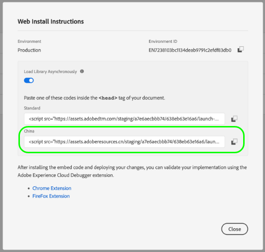

# Suporte Premium CDN para tags (Beta)

>[!IMPORTANT]
>
>O recurso premium de CDN para tags está atualmente na versão beta e sua organização pode ainda não ter acesso a ele. Esta documentação está sujeita a alterações.

Ao usar um [Host gerenciado pelo Adobe](./hosts/managed-by-adobe-host.md) para fornecer seus ativos de tags da Adobe Experience Platform em seu site, esses ativos são distribuídos entre várias redes de entrega de conteúdo (CDNs) em todo o mundo para fornecer a velocidade de download mais rápida. No entanto, há certas regiões que exigem que todos os ativos do site sejam replicados e hospedados em um servidor dentro dessa região.

Para levar isso em conta, as tags no Experience Platform fornecem um recurso premium de CDN que permite fornecer conteúdo a essas regiões especiais.

O suporte à CDN Premium é um recurso pago e deve ser adquirido pela organização para habilitá-lo e usá-lo. Este guia aborda como configurar e usar esse recurso na interface do usuário da coleta de dados depois de comprá-la.

## Habilitar CDN premium para sua organização

A CDN Premium é ativada no nível da empresa. Depois que sua organização comprar o recurso premium CDN, um administrador do Adobe será habilitado para sua empresa na interface do usuário para coleta de dados.

## Recriar e instalar bibliotecas de tags com códigos incorporados atualizados

Quando a CDN premium estiver ativada, isso não significa que seus ativos de tag sejam replicados imediatamente e prontos para uso nas novas regiões. Isso significa apenas que agora você pode escolher quando aceitar essa funcionalidade.

>[!IMPORTANT]
>
>As bibliotecas criadas antes de habilitar o CDN premium continuarão funcionando como estão exatamente como hoje. Isso também se aplica às bibliotecas não gerenciadas pelo Adobe, já que [ambientes arquivados](./environments.md#archive) use apenas URLs relativos para seus caminhos de ativos. Observe que, após habilitar o CDN premium, qualquer biblioteca criada por você que não seja gerenciada pelo Adobe se comportará como se o recurso premium CDN não estivesse habilitado.

Depois de ativar o CDN premium e recriar as bibliotecas que deseja usar das novas regiões de hospedagem, é possível recuperar os novos códigos incorporados da região de hospedagem para adicionar aos seus sites.

>[!NOTE]
>
>O código de inserção da biblioteca listado na variável [!UICONTROL Padrão] a região de hospedagem continuará a funcionar como está, bem como qualquer código incorporado de Topo ou de Base da página já existente nos sites.

Visite o **[!UICONTROL Ambientes]** ou exiba as instruções de instalação do ambiente na tela de edição da biblioteca para encontrar os novos códigos incorporados. Cada nova região de hospedagem compatível é exibida após a [!UICONTROL Padrão] região de hospedagem (usada para áreas no mundo que são compatíveis sem CDN premium). A captura de tela abaixo mostra um código incorporado para a região da China, que usa `.cn` como seu domínio de nível superior (TLD).

Escolha o código incorporado apropriado para a página da Web e o cole no `<head>` do seu documento. Para obter mais informações sobre como usar códigos incorporados para instalar bibliotecas de tags, consulte o [guia da interface do usuário do ambientes](./environments.md#installation).

## Próximas etapas

Este guia cobriu como ativar e instalar o recurso premium CDN para sua implementação de tags. Para obter mais informações sobre como instalar e testar bibliotecas de tags em suas propriedades da Web e móveis, consulte o [visão geral da publicação](./overview.md).
