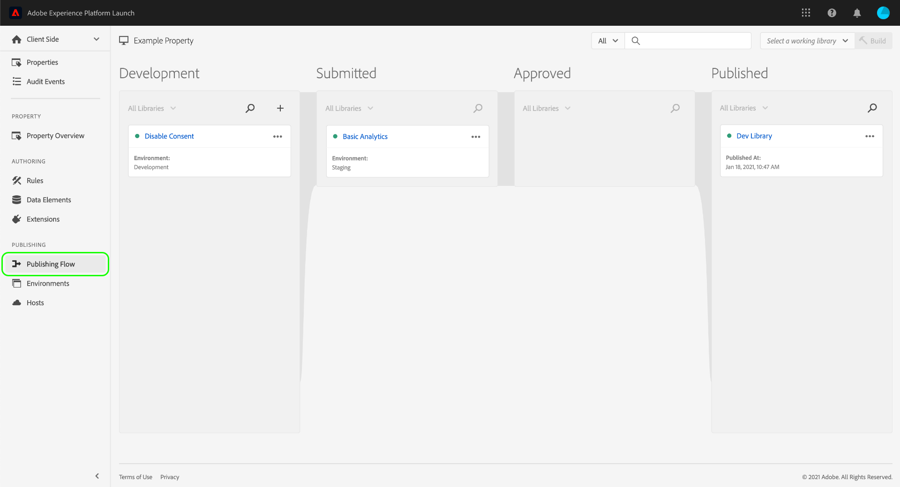

# Fluxo de publicação

>[!NOTE]
>
>A Adobe Experience Platform Launch foi reformulada como um conjunto de tecnologias de coleta de dados no Adobe Experience Platform. Como resultado, várias alterações de terminologia foram implementadas na documentação do produto. Consulte o seguinte [documento](../../term-updates.md) para obter uma referência consolidada das alterações de terminologia.

O fluxo de publicação de tags no Adobe Experience Platform refere-se ao processo de criação de bibliotecas, teste builds e aprovação para produção.

As ações disponíveis que você pode realizar em uma biblioteca dependem do estado da biblioteca e do nível de permissão que você possui. Além disso, o estado de uma biblioteca também afeta os recursos que ela contém (regras, elementos de dados e extensões) dependendo do que está upstream no fluxo de publicação.

As seções abaixo abordam os detalhes sobre as permissões, o estado da biblioteca e o upstream, pois fazem parte do fluxo de publicação.

## Permissões {#permissions}

Existem diferentes níveis de permissões de usuário que são importantes para o fluxo de publicação; especificamente, os direitos de propriedade [!UICONTROL Desenvolver], [!UICONTROL Aprovar] e [!UICONTROL Publicar]:

* **[!UICONTROL Desenvolver]**: inclui a capacidade de criação de bibliotecas, de criação de builds para a fase de desenvolvimento e de envio para aprovação.
* **[!UICONTROL Aprovar]**: inclui a capacidade de criação de builds para a fase de preparo e aprovação de builds preparados.
* **[!UICONTROL Publicar]**: inclui a capacidade de publicar uma biblioteca aprovada.

Os direitos não são inclusivos. Para uma única pessoa executar o fluxo de trabalho desde o início até o fim, essa pessoa deve receber os três direitos em uma propriedade específica.

Consulte o [guia de permissões do usuário](../administration/user-permissions.md) para obter mais informações sobre o gerenciamento de permissões para tags.

## Estado da biblioteca {#state}

Quando se trata do fluxo de publicação, uma biblioteca pode estar em quatro estados básicos:

* [[!UICONTROL Desenvolvimento]](#development)
* [[!UICONTROL Enviada]](#submitted)
* [[!UICONTROL Aprovada]](#approved)
* [[!UICONTROL Publicada]](#published)

Esses quatro estados são representados como colunas na guia **[!UICONTROL Fluxo de publicação]** na interface do usuário da coleta de dados.

É necessário realizar ações específicas para mover uma biblioteca entre esses estados. O diagrama a seguir descreve cada ação que faz uma biblioteca variar de estado:

### [!UICONTROL Desenvolvimento] {#development}

Quando novas bibliotecas são criadas, elas começam no estado [!UICONTROL Desenvolvimento]. Qualquer alteração em uma biblioteca deve ser feita enquanto ela está em [!UICONTROL Desenvolvimento]. Quando as fases de desenvolvimento e teste forem concluídas, a biblioteca poderá ser enviada para aprovação.

A tabela a seguir descreve as ações disponíveis para uma biblioteca no estado [!UICONTROL Desenvolvimento]:

| Ação | Descrição |
| --- | --- |
| [!UICONTROL Editar] | Use a tela [!UICONTROL Editar biblioteca] para adicionar ou remover componentes da biblioteca. |
| [!UICONTROL Criação para desenvolvimento] | Crie uma build para a biblioteca. A build será compilada e implantada no ambiente ao qual a biblioteca está atribuída. Essa etapa falhará se a biblioteca não tiver sido atribuída a um ambiente ou se contiver uma alteração que já esteja definida no upstream. |
| [!UICONTROL Enviar para aprovação] | Cancele a atribuição da biblioteca para o ambiente de desenvolvimento e mova-a para a coluna [!UICONTROL Enviado] para um usuário com permissões de aprovação poder trabalhar nela. A última criação da biblioteca deve ter sido bem-sucedida para que essa opção seja ativada. |
| [!UICONTROL Enviar e criar para preparo] | Isso só pode ser executado por um usuário com os direitos de Desenvolver e Aprovar. Essa ação desmarca a biblioteca do ambiente de desenvolvimento, move a biblioteca para o estado [!UICONTROL Enviado] e cria a bibilioteca para o ambiente de preparo. A última criação da biblioteca deve ter sido bem-sucedida para que essa opção seja ativada. |
| [!UICONTROL Aprovar para publicação] | Isso só pode ser executado por um usuário com os direitos de Desenvolver e Aprovar. Essa ação desatribui a biblioteca do ambiente de desenvolvimento e a move para o estado [!UICONTROL Aprovado], ignorando completamente o ambiente de preparo e o estado [!UICONTROL Enviado]. A última criação da biblioteca deve ter sido bem-sucedida para que essa opção seja ativada. |
| [!UICONTROL Aprovar e publicar para a produção] | Isso só pode ser executado por um usuário com os direitos de Desenvolver, Aprovar e Publicar. Essa ação desatribui a biblioteca do ambiente de desenvolvimento, move a mesma para o estado [!UICONTROL Aprovado] e publica para a produção. Após a conclusão do build de produção, a biblioteca será movida para o estado [!UICONTROL Publicado]. A última criação da biblioteca deve ter sido bem-sucedida para que essa opção seja ativada. |
| [!UICONTROL Excluir] | Remova a biblioteca do sistema. Essa ação não removerá a build do ambiente. |

### [!UICONTROL Enviada] {#submitted}

Quando a biblioteca está no estado [!UICONTROL Enviado], um usuário com permissões de aprovação pode testar a biblioteca no ambiente de preparo. Quando o teste for concluído, a biblioteca será aprovada ou rejeitada. Os builds rejeitados retornam ao [!UICONTROL Desenvolvimento] para que alterações adicionais possam ser feitas antes de o fluxo de publicação ser reiniciado.

A tabela a seguir descreve as ações disponíveis para uma biblioteca no estado [!UICONTROL Enviado]:

| Ação | Descrição |
| --- | --- |
| [!UICONTROL Abrir] | Visualize o conteúdo da biblioteca. Alterações não são permitidas em bibliotecas fora da coluna [!UICONTROL Desenvolvimento]. Se forem necessárias alterações, a biblioteca deverá ser rejeitada para que as alterações possam ser feitas no [!UICONTROL Desenvolvimento]. |
| [!UICONTROL Criar para preparo] | Crie a biblioteca no ambiente de preparo para implantação. |
| [!UICONTROL Aprovar para publicação] | Mova a biblioteca para a coluna [!UICONTROL Aprovado] para que um usuário com permissões de publicação trabalhe nela. |
| [!UICONTROL Aprovar e publicar para a produção] | Isso só pode ser executado por um usuário com direitos de Aprovar e Publicar. Essa ação desatribui a biblioteca do ambiente de preparo, move a mesma para o estado [!UICONTROL Aprovado] e publica para a produção. Após a conclusão da build de produção, a biblioteca será movida para o estado [!UICONTROL Publicado]. Isso pode ser executado com ou sem um build bem-sucedido no ambiente de preparo. |
| [!UICONTROL Rejeitar] | Cancele a atribuição da biblioteca para o ambiente de preparo e mova-a de volta para a coluna [!UICONTROL Desenvolvimento] para fazer mais alterações. |

### [!UICONTROL Aprovada] {#approved}

Depois que uma biblioteca é aprovada, um usuário com permissões de publicação pode publicar ou rejeitar a biblioteca. Os builds rejeitadas retornam ao [!UICONTROL Desenvolvimento] para que mais alterações possam ser feitas antes de o fluxo de publicação recomeçar.

A tabela a seguir descreve as ações disponíveis para uma biblioteca no estado [!UICONTROL Aprovado]:

| Ação | Descrição |
| --- | --- |
| [!UICONTROL Abrir] | Visualize o conteúdo da biblioteca. Alterações não são permitidas em bibliotecas fora da coluna [!UICONTROL Desenvolvimento]. Se forem necessárias alterações, a biblioteca deverá ser rejeitada para que as alterações possam ser feitas no estado [!UICONTROL Desenvolvimento]. |
| [!UICONTROL Criar e publicar para produção] | Desfaça a atribuição da biblioteca para o ambiente de preparo, atribua a biblioteca ao ambiente de produção e implante-a.  **Importante**: quando essa opção é selecionada, sua biblioteca fica ativa no ambiente de produção. Verifique se a biblioteca contém as alterações desejadas antes de selecionar essa opção. |
| [!UICONTROL Rejeitar] | Cancele a atribuição da biblioteca para o ambiente de preparo e mova-a para a coluna [!UICONTROL Desenvolvimento] para fazer mais alterações. |

### [!UICONTROL Publicado] {#published}

A coluna [!UICONTROL Publicado] mostra quais bibliotecas foram publicadas e quais foram as datas de publicação. No momento da publicação, a biblioteca será exibida ao lado de um ponto verde. A menos que você tenha realizado uma republicação em uma biblioteca anterior, essa sempre será a biblioteca na parte superior da coluna.

| Ação | Descrição |
| --- | --- |
| [!UICONTROL Abrir] | Visualize o conteúdo da biblioteca. Alterações não são permitidas em bibliotecas fora da coluna [!UICONTROL Desenvolvimento]. Se você quiser alterar o que está em seu ambiente de produção, crie uma nova biblioteca e a faça passar pelo processo de publicação completo. |
| [!UICONTROL Republicar] | Essa ação só estará disponível nas cinco bibliotecas publicadas mais recentemente e somente se o ambiente de produção for (A) configurado com a opção Arquivar desativada e (B) usar um host [!UICONTROL Gerenciado pela Adobe] no momento da criação. |
| [!UICONTROL Baixar] | Essa ação só estará disponível nas cinco bibliotecas publicadas mais recentemente e somente se o ambiente de produção for (A) configurado com a opção Arquivar ativada e (B) usar um host [!UICONTROL Gerenciado pela Adobe] no momento da criação. |

## Upstream {#upstream}

Depois de publicar sua primeira biblioteca, é importante entender a função do upstream à medida que você faz as bibliotecas mais recentes passarem pelo fluxo de publicação.

Se uma biblioteca estiver atualmente nos estágios [!UICONTROL Desenvolvimento], [!UICONTROL Enviado] ou [!UICONTROL Aprovado], ela herdará as regras, os elementos de dados e as extensões de qualquer biblioteca que esteja upstream. Esses recursos herdados são uma “linha de base” para as bibliotecas à medida que passam pelo fluxo de publicação. Basicamente, você pode pensar em cada nova biblioteca como uma série de alterações na linha de base estabelecida pelo upstream. Isso garante que nada seja substituído inesperadamente de uma biblioteca anterior quando uma nova iteração for publicada.

O que está incluído no upstream depende do estágio atual da biblioteca. Por exemplo, as bibliotecas na coluna [!UICONTROL Aprovado] herdarão apenas os recursos da biblioteca [!UICONTROL Publicado], enquanto a biblioteca em [!UICONTROL Desenvolvimento] herdará recursos de todas as outras colunas.

Ao editar uma biblioteca na interface do usuário da coleta de dados, todos os recursos herdados do upstream são representados na seção **[!UICONTROL Recursos upstream]**. Para visualizar esses recursos, selecione a guia de expansão abaixo do cabeçalho da seção.

A seção é expandida para mostrar os recursos individuais herdados do upstream. Você pode usar o painel esquerdo para filtrar entre [!UICONTROL Regras], [!UICONTROL Elementos de dados] e [!UICONTROL Extensões] ou usar a barra de pesquisa para pesquisar um recurso específico por nome.

## Próximas etapas

Este guia forneceu uma visão geral de alto nível do fluxo de publicação para bibliotecas no Adobe Experience Platform. Para saber mais sobre como publicar suas bibliotecas, consulte a [visão geral de publicação](./overview.md).
