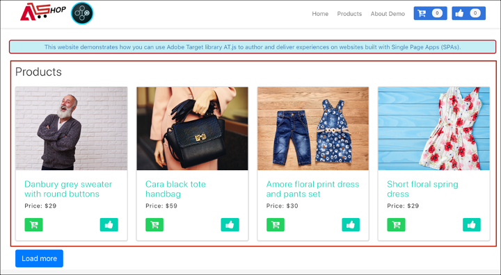

# Implementação de aplicativos de página única

O SDK da Web da Adobe Experience Platform fornece recursos avançados que fazem com que sua empresa execute personalização em tecnologias de próxima geração no lado do cliente, como aplicativos de página única (SPA).

Os sites tradicionais funcionavam em modelos de navegação &quot;página para página&quot;, conhecidos como Aplicativos de várias páginas, em que os designs de site eram totalmente combinados com URLs e as transições de uma página da Web para outra exigiam um carregamento de página.

Aplicativos da Web modernos, como aplicativos de página única, adotaram um modelo que impulsiona o uso rápido da renderização da interface do usuário do navegador, que geralmente é independente dos recarregamentos de página. Essas experiências podem ser acionadas por interações do cliente, como rolagens, cliques e movimentos de cursor. À medida que os paradigmas da Web moderna evoluíram, a relevância dos eventos genéricos tradicionais, como um carregamento de página, para implantar a personalização e a experimentação não funciona mais.


## Benefícios do SDK da Web da plataforma para SPA

Estes são alguns benefícios de usar o SDK da Web da Adobe Experience Platform para seus aplicativos de página única:

* Capacidade de armazenar em cache todas as ofertas no carregamento da página para reduzir várias chamadas do servidor a uma única chamada de servidor.
* Melhore bastante a experiência do usuário no site, pois as ofertas são exibidas imediatamente pelo cache, sem o tempo de atraso introduzido pelas chamadas do servidor tradicional.
* Uma única linha de código e uma configuração de desenvolvedor única permitem que os profissionais de marketing criem e executem atividades A/B e Direcionamento de experiência (XT) por meio do Visual Experience Composer (VEC) no seu SPA.

## Exibições XDM e aplicativos de página única

O VEC do Adobe Target para SPA aproveita um conceito chamado Exibições: um grupo lógico de elementos visuais que juntos constituem uma experiência com o SPA. Um aplicativo de página única pode, portanto, ser considerado como uma transição entre Exibições, em vez de URLs, com base nas interações do usuário. Uma Exibição geralmente pode representar um site inteiro ou elementos visuais agrupados em um site.

Para explicar melhor o que são Exibições, o exemplo a seguir usa um site de comércio eletrônico online hipotético implementado no React para explorar Exibições de exemplo.

Depois de navegar para o site inicial, uma imagem principal promove uma venda de Páscoa e os produtos mais recentes disponíveis no site. Nesse caso, uma Exibição pode ser definida para toda a tela inicial. Essa Exibição pode simplesmente ser chamada de &quot;inicial&quot;.


À medida que o cliente se torna mais interessado nos produtos que a empresa está vendendo, ele decide clicar no link **Produtos**. Assim como o site inicial, a totalidade do site de produtos pode ser definida como uma Exibição. Essa Exibição pode se chamar &quot;products-all&quot;.


Como uma Exibição pode ser definida como um site inteiro ou um grupo de elementos visuais em um site, os quatro produtos mostrados no site de produtos podem ser agrupados e considerados como uma Exibição. Essa exibição pode se chamar &quot;produtos&quot;.



Quando o cliente decide clicar no botão **Carregar Mais** para explorar mais produtos no site, a URL do site não muda nesse caso, mas uma Exibição pode ser criada aqui para representar apenas a segunda linha de produtos mostrados. O nome da exibição pode ser &quot;products-page-2&quot;.


O cliente decide comprar alguns produtos do site e prossegue para a tela de finalização. No site de finalização da compra, o cliente recebe as opções de escolher a entrega normal ou a expressa. Uma Exibição pode ser qualquer grupo de elementos visuais em um site, portanto, uma Exibição pode ser criada para preferências de entrega e ser chamada de &quot;Preferências de Entrega&quot;.


O conceito de Exibições pode ser estendido muito além disso. Estes são apenas alguns exemplos de Exibições que podem ser definidas em um site.

## Implementação de exibições XDM

As Exibições XDM podem ser aproveitadas no Adobe Target para capacitar os profissionais de marketing a executar testes A/B e XT no SPA por meio do Visual Experience Composer. Isso requer a execução das seguintes etapas para concluir uma configuração de desenvolvedor única:

1. Instalar o [Adobe Experience Platform Web SDK](/help/web-sdk/install/overview.md)
2. Determine todas as Exibições XDM no aplicativo de página única que deseja personalizar.
3. Após definir as Exibições XDM, para fornecer atividades AB ou XT do VEC, implemente a função `sendEvent()` com `renderDecisions` definida como `true` e a Exibição XDM correspondente no Aplicativo de página única. A Exibição XDM deve ser passada em `xdm.web.webPageDetails.viewName`. Essa etapa permite que os profissionais de marketing aproveitem o Visual Experience Composer para iniciar testes A/B e XT para esses XDMs.

   ```javascript
   alloy("sendEvent", { 
     "renderDecisions": true, 
     "xdm": { 
       "web": { 
         "webPageDetails": { 
         "viewName":"home" 
         }
       } 
     } 
   });
   ```

>[!NOTE]
>
>Na primeira chamada `sendEvent()`, todas as Exibições XDM que devem ser renderizadas para o usuário final serão buscadas e armazenadas em cache. As chamadas `sendEvent()` subsequentes com Exibições XDM passadas serão lidas do cache e renderizadas sem uma chamada de servidor.

## Exemplos de função `sendEvent()`

Esta seção descreve três exemplos mostrando como invocar a função `sendEvent()` no React para um SPA hipotético de comércio eletrônico.

### Exemplo 1: página inicial de teste A/B

A equipe de marketing deseja executar testes A/B em toda a página inicial.


Para executar testes A/B em todo o site inicial, `sendEvent()` deve ser chamado com o XDM `viewName` definido como `home`:

```jsx
function onViewChange() { 
  
  var viewName = window.location.hash; // or use window.location.pathName if router works on path and not hash 

  viewName = viewName || 'home'; // view name cannot be empty 

  // Sanitize viewName to get rid of any trailing symbols derived from URL 

  if (viewName.startsWith('#') || viewName.startsWith('/')) { 
    viewName = viewName.substr(1); 
  }
   
  alloy("sendEvent", { 
    "renderDecisions": true, 
    "xdm": { 
      "web": { 
        "webPageDetails": { 
          "viewName":"home" 
        } 
      } 
    }
  }); 
} 

// react router v4 

const history = syncHistoryWithStore(createBrowserHistory(), store); 

history.listen(onViewChange); 

// react router v3 

<Router history={hashHistory} onUpdate={onViewChange} > 
```

### Exemplo 2: produtos personalizados

A equipe de marketing deseja personalizar a segunda linha de produtos alterando a cor do rótulo de preço para vermelho depois que um usuário clicar em **Carregar mais**.


```jsx
function onViewChange(viewName) { 

  alloy("sendEvent", { 
    "renderDecisions": true, 
    "xdm": { 
      "web": { 
        "webPageDetails": { 
          "viewName": viewName
        }
      } 
    } 
  }); 
} 

class Products extends Component { 
  
  render() { 
    return ( 
      <button type="button" onClick={this.handleLoadMoreClicked}>Load more</button> 
    ); 
  } 

  handleLoadMoreClicked() { 
    var page = this.state.page + 1; // assuming page number is derived from component's state 
    this.setState({page: page}); 
    onViewChange('PRODUCTS-PAGE-' + page); 
  } 

} 
```

### Exemplo 3: preferências de delivery do teste A/B

A equipe de marketing deseja executar um teste A/B para ver se a alteração da cor do botão de azul para vermelho quando a **Entrega expressa** é selecionada pode aumentar as conversões (em vez de manter a cor do botão azul para ambas as opções de entrega).


Para personalizar o conteúdo no site, dependendo da preferência de entrega selecionada, uma Exibição pode ser criada para cada preferência de entrega. Quando **Entrega normal** é selecionada, a Exibição pode se chamar &quot;check-out-normal&quot;. Se a **Entrega expressa** estiver selecionada, a Exibição pode se chamar &quot;checkout-express&quot;.

```jsx
function onViewChange(viewName) { 
  alloy("sendEvent", { 
    "renderDecisions": true, 
    "xdm": { 
      "web": { 
        "webPageDetails": { 
          "viewName": viewName 
        }
      }
    }
  }); 
} 

class Checkout extends Component { 

  render() { 
    return ( 
      <div onChange={this.onDeliveryPreferenceChanged}> 
        <label> 
          <input type="radio" id="normal" name="deliveryPreference" value={"Normal Delivery"} defaultChecked={true}/> 
          <span> Normal Delivery (7-10 business days)</span> 
        </label> 
        <label> 
          <input type="radio" id="express" name="deliveryPreference" value={"Express Delivery"}/> 
          <span> Express Delivery* (2-3 business days)</span> 
        </label> 
      </div> 
    ); 
  } 

  onDeliveryPreferenceChanged(evt) { 
    var selectedPreferenceValue = evt.target.value; 
    onViewChange(selectedPreferenceValue); 
  } 

} 
```

## Uso do Visual Experience Composer para SPA

Quando você terminar de definir suas Exibições XDM e implementar o `sendEvent()` com essas Exibições XDM transmitidas, o VEC poderá detectar essas Exibições e permitir que os usuários criem ações e modificações para atividades A/B ou XT.

>[!NOTE]
>
>Para usar o VEC para SPA, você deve instalar e ativar o [Firefox](https://addons.mozilla.org/en-US/firefox/addon/adobe-target-vec-helper/) ou a Extensão auxiliar do VEC do [Chrome](https://chrome.google.com/webstore/detail/adobe-target-vec-helper/ggjpideecfnbipkacplkhhaflkdjagak).

### Painel de modificações

O painel Modificações captura as ações criadas para uma Exibição específica. Todas as ações para uma Exibição são agrupadas nessa Exibição.


### Ações

Clicar em uma ação destaca o elemento no site onde esta ação será aplicada. Cada ação do VEC criada em uma Exibição tem os seguintes ícones: **Informações**, **Editar**, **Clonar**, **Mover** e **Excluir**. Esses ícones são explicados com mais detalhes na tabela a seguir.


| Ícone | Descrição |
|---|---|
| Informações | Exibe os detalhes da ação. |
| Editar | Permite editar as propriedades da ação diretamente. |
| Clonar | Clona a ação a uma ou mais Exibições que existem no painel Modificações ou a uma ou mais Exibições que você buscou e nas quais navegou no VEC. A ação não precisa existir necessariamente no painel Modificações.<br/><br/>**Observação:** após a realização de uma operação de clonagem, você deve navegar para o Modo de Exibição no VEC via Procurar para verificar se a ação clonada foi uma operação válida. Se a ação não puder ser aplicada à Exibição, você verá um erro. |
| Mover | Move a ação para um Evento de carregamento de página ou qualquer outra Exibição que já existe no painel de modificações.<br/><br/>**Evento de carregamento de página:** qualquer ação correspondente ao evento de carregamento de página é aplicada no carregamento inicial da página no aplicativo da Web. <br/><br/>**Observação:** após a realização de uma operação de mover, você deve navegar para o Modo de Exibição no VEC via Procurar para ver se a movimentação foi uma operação válida. Se a ação não puder ser aplicada à Exibição, você verá um erro. |
| Excluir | Exclui a ação. |

## Uso do VEC para exemplos de SPA

Esta seção descreve três exemplos para usar o Visual Experience Composer para criar ações e modificações para atividades A/B ou XT.

### Exemplo 1: atualizar a visualização &quot;inicial&quot;

Anteriormente neste documento, uma Exibição chamada &quot;página inicial&quot; foi definida para todo o site inicial. Agora, a equipe de marketing quer atualizar a visualização &quot;inicial&quot; das seguintes maneiras:

* Altere os botões **Adicionar ao carrinho** e **Curtir** para um compartilhamento mais claro de azul. Isso deve ocorrer durante o carregamento da página, pois envolve a alteração de componentes do cabeçalho.
* Altere o rótulo **Produtos mais recentes de 2019** para **Produtos de teste simples para 2019** e altere a cor do texto para violeta.

Para fazer essas atualizações no VEC, selecione **Compor** e aplique essas alterações à exibição &quot;inicial&quot;.


### Exemplo 2: alterar rótulos de produto

Para a Exibição &quot;products-page-2&quot;, a equipe de marketing gostaria de alterar o rótulo **Price** para **Sale Price** e alterar a cor do rótulo para vermelho.

Para fazer essas atualizações no VEC, as seguintes etapas são necessárias:

1. Selecione **Procurar** no VEC.
2. Selecione **Produtos** na navegação superior do site.
3. Selecione **Carregar Mais** uma vez para exibir a segunda linha de produtos.
4. Selecione **Compor** no VEC.
5. Aplique ações para alterar o rótulo do texto para **Preço de Venda** e a cor para vermelho.


### Exemplo 3: personalizar o estilo de preferência do delivery

As exibições podem ser definidas em nível granular, como um estado ou uma opção por meio de um botão de opção. Anteriormente neste documento, as Exibições eram definidas para preferências de entrega, &quot;checkout-normal&quot; e &quot;checkout-express&quot;. A equipe de marketing deseja alterar a cor do botão para a exibição &quot;checkout-express&quot;.

Para fazer essas atualizações no VEC, as seguintes etapas são necessárias:

1. Selecione **Procurar** no VEC.
2. Adicione produtos ao carrinho no site.
3. Selecione o ícone do carrinho no canto superior direito do site.
4. Selecione **Checkout do pedido**.
5. Selecione o botão de opção **Entrega expressa** em **Preferências de entrega**.
6. Selecione **Compor** no VEC.
7. Altere a cor do botão **Pagar** para vermelho.

>[!NOTE]
>
>A Exibição &quot;checkout-express&quot; não aparece no painel Modificações até que o botão de opção **Entrega expressa** seja selecionado. Isso ocorre porque a função `sendEvent()` é executada quando o botão de opção **Entrega expressa** é selecionado. Portanto, o VEC não está ciente da Exibição &quot;checkout-express&quot; até que o botão de opção seja selecionado.


