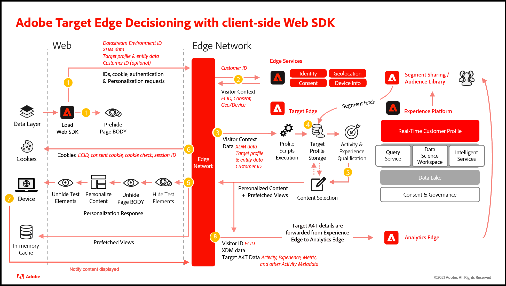

# Usar [!DNL Adobe Target] e [!DNL Web SDK] para personalização

O [!DNL Adobe Experience Platform] [!DNL Web SDK] pode entregar e renderizar experiências personalizadas gerenciadas no [!DNL Adobe Target] para o canal da Web. Você pode usar um editor WYSIWYG, chamado de [Visual Experience Composer](https://experienceleague.adobe.com/docs/target/using/experiences/vec/visual-experience-composer.html) (VEC), ou uma interface não visual, o [Experience Composer baseado em formulário](https://experienceleague.adobe.com/docs/target/using/experiences/form-experience-composer.html), para criar, ativar e entregar atividades e experiências de personalização.

>[!IMPORTANT]
>
>Saiba como migrar sua implementação do Target para o SDK da Web da Platform com o [tutorial Migrar o Target da at.js 2.x para o SDK da Web da Platform](https://experienceleague.adobe.com/docs/platform-learn/migrate-target-to-websdk/introduction.html).
>
>Saiba como implementar o Target pela primeira vez com o [tutorial Implementar o Adobe Experience Cloud com SDK da Web](https://experienceleague.adobe.com/docs/platform-learn/implement-web-sdk/overview.html?lang=pt-BR). Para obter informações específicas do Target, consulte a seção tutorial intitulada [Configurar o Target com o SDK da Web da plataforma](https://experienceleague.adobe.com/docs/platform-learn/implement-web-sdk/applications-setup/setup-target.html).


Os seguintes recursos foram testados e atualmente têm suporte no [!DNL Target]:

* [Testes A/B](https://experienceleague.adobe.com/docs/target/using/activities/abtest/test-ab.html)
* [Relatórios de impressão e conversão do A4T](https://experienceleague.adobe.com/docs/target/using/integrate/a4t/a4t.html)
* [Atividades do Automated Personalization](https://experienceleague.adobe.com/docs/target/using/activities/automated-personalization/automated-personalization.html)
* [Atividades de Direcionamento de experiência](https://experienceleague.adobe.com/docs/target/using/activities/automated-personalization/automated-personalization.html)
* [Testes multivariados (MVT)](https://experienceleague.adobe.com/docs/target/using/activities/multivariate-test/multivariate-testing.html)
* [Atividades do Recommendations](https://experienceleague.adobe.com/docs/target/using/recommendations/recommendations.html)
* [Relatórios de impressão e conversão do Target nativo](https://experienceleague.adobe.com/docs/target/using/reports/reports.html)
* [Suporte do VEC](https://experienceleague.adobe.com/docs/target/using/experiences/vec/visual-experience-composer.html)

## Diagrama do sistema [!DNL Web SDK]

O diagrama a seguir ajuda você a entender o fluxo de trabalho da decisão de borda do [!DNL Target] e do [!DNL Web SDK].



| Chame | Detalhes |
| --- | --- |
| 1 | O dispositivo carrega o [!DNL Web SDK]. O [!DNL Web SDK] envia uma solicitação ao Edge Network com dados XDM, a ID de ambiente dos fluxos de dados, os parâmetros de entrada e a ID do cliente (opcional). A página (ou containers) é pré-oculta. |
| 2 | O Edge Network envia a solicitação aos serviços de borda para enriquecê-la com a ID do visitante, o consentimento e outras informações de contexto do visitante, como geolocalização e nomes amigáveis ao dispositivo. |
| 3 | O Edge Network envia a solicitação de personalização enriquecida para a borda [!DNL Target] com a ID do visitante e os parâmetros de entrada. |
| 4 | Os scripts de perfil executam e, em seguida, fazem o feed em [!DNL Target] armazenamento de perfil. O armazenamento de perfil busca segmentos da [!UICONTROL Biblioteca de público-alvo] (por exemplo, segmentos compartilhados de [!DNL Adobe Analytics], [!DNL Adobe Audience Manager], [!DNL Adobe Experience Platform]). |
| 5 | Com base nos parâmetros de solicitação de URL e dados de perfil, [!DNL Target] determina quais atividades e experiências serão exibidas para o visitante na exibição de página atual e para exibições futuras buscadas previamente. [!DNL Target] então envia isto de volta para o Edge Network. |
| 6 | a. O Edge Network envia a resposta de personalização de volta para a página, incluindo, opcionalmente, valores de perfil para personalização adicional. O conteúdo personalizado na página atual é revelado o mais rápido possível sem cintilação do conteúdo padrão.<br>b. O conteúdo personalizado de exibições que são mostradas como resultado das ações do usuário em um Aplicativo de página única (SPA) é armazenado em cache para que possa ser aplicado instantaneamente, sem uma chamada de servidor adicional, quando as exibições forem acionadas. <br>c O Edge Network envia a ID do visitante e outros valores em cookies, como consentimento, ID da sessão, identidade, verificação de cookie e personalização. |
| 7 | O SDK da Web envia a notificação do dispositivo para o Edge Network. |
| 8 | O Edge Network encaminha os detalhes do [!UICONTROL Analytics for Target] (A4T) (metadados de atividade, experiência e conversão) para a borda do [!DNL Analytics]. |

## Habilitando [!DNL Adobe Target]

Para habilitar [!DNL Target], faça o seguinte:

1. Habilite [!DNL Target] na sua [sequência de dados](../../../datastreams/overview.md) com o código de cliente apropriado.
1. Adicione a opção `renderDecisions` aos seus eventos.

Em seguida, opcionalmente, você também pode adicionar as seguintes opções:

* **`decisionScopes`**: recupere atividades específicas (úteis para atividades criadas com o compositor baseado em formulário) adicionando esta opção aos seus eventos.
* **[Ocultar previamente o trecho](../manage-flicker.md)**: oculta apenas determinadas partes da página.

## Uso do VEC do Adobe Target

Para usar o VEC com uma implementação do [!DNL Web SDK], instale e ative o [Firefox](https://addons.mozilla.org/en-US/firefox/addon/adobe-target-vec-helper/) ou a Extensão auxiliar do VEC do [Chrome](https://chrome.google.com/webstore/detail/adobe-target-vec-helper/ggjpideecfnbipkacplkhhaflkdjagak).

Para obter mais informações, consulte a [extensão auxiliar do Visual Experience Composer](https://experienceleague.adobe.com/docs/target/using/experiences/vec/troubleshoot-composer/vec-helper-browser-extension.html) no *guia do Adobe Target*.

## Renderização de conteúdo personalizado

Consulte [Renderização do conteúdo de personalização](../rendering-personalization-content.md) para obter mais informações.

## Públicos-alvo no XDM

Ao definir públicos para suas atividades do [!DNL Target] que são entregues por meio do [!DNL Web SDK], o [XDM](https://experienceleague.adobe.com/docs/experience-platform/xdm/home.html?lang=pt-BR) deve ser definido e usado. Depois de definir esquemas XDM, classes e grupos de campos de esquema, você pode criar uma regra de público-alvo [!DNL Target] definida pelos dados XDM para direcionamento. No [!DNL Target], os dados XDM são exibidos no [!UICONTROL Construtor de público-alvo] como um parâmetro personalizado. O XDM é serializado usando a notação de pontos (por exemplo, `web.webPageDetails.name`).

Se você tiver [!DNL Target] atividades com públicos-alvo predefinidos que usam parâmetros personalizados ou um perfil de usuário, elas não serão entregues corretamente pelo SDK. Em vez de usar parâmetros personalizados ou o perfil do usuário, você deve usar o XDM. No entanto, há campos de direcionamento de público prontos para uso com suporte pelo [!DNL Web SDK] que não exigem o XDM. Estes campos estão disponíveis na interface do usuário do [!DNL Target] e não exigem XDM:

* Biblioteca do Target
* Geo
* Rede
* Sistema operacional
* Páginas do site
* Navegador
* Fontes de tráfego
* Intervalo de tempo

Para obter mais informações, consulte [Categorias para públicos-alvo](https://experienceleague.adobe.com/docs/target/using/audiences/create-audiences/categories-audiences/target-rules.html) no *guia do Adobe Target*.

### Tokens de resposta

Os tokens de resposta são usados para enviar metadados a terceiros, como Google ou Facebook. Os tokens de resposta são retornados
no campo `meta` em `propositions` -> `items`. Aqui está uma amostra:

```json
{
  "id": "AT:eyJhY3Rpdml0eUlkIjoiMTI2NzM2IiwiZXhwZXJpZW5jZUlkIjoiMCJ9",
  "scope": "__view__",
  "scopeDetails": ...,
  "renderAttempted": true,
  "items": [
    {
      "id": "0",
      "schema": "https://ns.adobe.com/personalization/dom-action",
      "meta": {
        "experience.id": "0",
        "activity.id": "126736",
        "offer.name": "Default Content",
        "offer.id": "0"
      }
    }
  ]
}
```

Para coletar os tokens de resposta, você deve assinar a promessa `alloy.sendEvent`, iterar por meio de `propositions` e extrair os detalhes de `items` -> `meta`.

Cada `proposition` tem um campo booleano `renderAttempted` indicando se `proposition` foi renderizado ou não. Consulte a amostra abaixo:

```js
alloy("sendEvent",
  {
    "renderDecisions": true,
    "decisionScopes": [
      "hero-container"
    ]
  }).then(result => {
    const { propositions } = result;

    // filter rendered propositions
    const renderedPropositions = propositions.filter(proposition => proposition.renderAttempted === true);

    // collect the item metadata that represents the response tokens
    const collectMetaData = (items) => {
      return items.filter(item => item.meta !== undefined).map(item => item.meta);
    }

    const pageLoadResponseTokens = renderedPropositions
      .map(proposition => collectMetaData(proposition.items))
      .filter(e => e.length > 0)
      .flatMap(e => e);
  });
  
```

Quando a renderização automática está ativada, a matriz de apresentações contém:

#### No carregamento da página:

* `propositions` baseado no Form-Based Composer com o sinalizador `renderAttempted` definido como `false`
* Proposições baseadas no Visual Experience Composer com sinalizador `renderAttempted` definido como `true`
* Proposições baseadas no Visual Experience Composer para uma exibição de Aplicativo de página única com sinalizador `renderAttempted` definido como `true`

#### Em Exibição - alterar (para exibições em cache):

* Proposições baseadas no Visual Experience Composer para uma exibição de Aplicativo de página única com sinalizador `renderAttempted` definido como `true`

Quando a renderização automática está desativada, a matriz de apresentações contém:

#### No carregamento da página:

* [!DNL Form-based Composer] baseado em `propositions` com o sinalizador `renderAttempted` definido como `false`
* Proposições baseadas em [!DNL Visual Experience Composer] com sinalizador `renderAttempted` definido como `false`
* Proposições baseadas em [!DNL Visual Experience Composer] para uma exibição de Aplicativo de Página Única com sinalizador `renderAttempted` definido como `false`

#### Em Exibição - alterar (para exibições em cache):

* Proposições baseadas no Visual Experience Composer para uma exibição de Aplicativo de página única com sinalizador `renderAttempted` definido como `false`

### Atualização de perfil único

O [!DNL Web SDK] permite atualizar o perfil para o perfil [!DNL Target] e para o [!DNL Web SDK] como um evento de experiência.

Para atualizar um perfil [!DNL Target], verifique se os dados do perfil foram passados com o seguinte:

* Em `"data {"`
* Em `"__adobe.target"`
* Prefixo `"profile."`

| Chave | Tipo | Descrição |
| --- | --- | --- |
| `renderDecisions` | Booleano | Instrui o componente de personalização sobre se ele deve interpretar ações DOM |
| `decisionScopes` | Matriz `<String>` | Uma lista de escopos para os quais recuperar decisões |
| `xdm` | Objeto | Dados formatados no XDM que chega ao SDK da Web como um evento de experiência |
| `data` | Objeto | Pares de valor/chave arbitrários enviados para [!DNL Target] soluções na classe de destino. |

<!--Typical [!DNL Web SDK] code using this command looks like the following:-->

**Atrasar o salvamento dos parâmetros de Perfil ou entidade até que o conteúdo seja exibido para o usuário final**

Para atrasar a gravação de atributos no perfil até que o conteúdo seja exibido, defina `data.adobe.target._save=false` na sua solicitação.

Por exemplo, seu site contém três escopos de decisão correspondentes a três links de categoria no site (Homens, Mulheres e Crianças) e você deseja rastrear a categoria que o usuário eventualmente visitou. Envie essas solicitações com o sinalizador `__save` definido como `false` para evitar a persistência da categoria no momento em que o conteúdo é solicitado. Depois que o conteúdo for visualizado, envie a carga adequada (incluindo `eventToken` e `stateToken`) para os atributos correspondentes a serem registrados.

<!--Save profile or entity attributes by default with:

```js
alloy ( "sendEvent" , {
  renderDecisions : true,
  data : {
    __adobe : {
      target : {
        "__save" : true // Optional. __save=true is the default 
        "profile.gender" : "female",
        "profile.age" : 30,
        "entity.name" : "T-shirt",
        "entity.id" : "1234",
      }
    }
  }
} ) ; 
```
-->

O exemplo abaixo envia uma mensagem de estilo trackEvent, executa scripts de perfil, salva atributos e registra imediatamente o evento.

```js
alloy ( "sendEvent" , {
  renderDecisions : true,
  data : {
    __adobe : {
      target : {
        "profile.gender" : "female",
        "profile.age" : 30,
        "entity.name" : "T-shirt" ,
        "entity.id" : "1234" ,
        "track": {
          "scopes": [ "mbox1", "mbox2"],
          "type": "display|click|..."
        }
      }
    }
  }
} ) ;
```

>[!NOTE]
>
>Se a diretiva `__save` for omitida, o salvamento dos atributos de perfil e entidade ocorrerá imediatamente, como se a solicitação tivesse sido executada, mesmo que o restante da solicitação seja uma pré-busca de personalização. A diretiva `__save` só é relevante para atributos de perfil e entidade. Se o objeto de faixa estiver presente, a diretiva `__save` será ignorada. Os dados são salvos imediatamente e a notificação é registrada.

**`sendEvent`com dados de perfil**

```js
alloy("sendEvent", {
   renderDecisions: true|false,
   xdm: { // Experience Event XDM data },
   data: { // Freeform data }
});
```

**Como enviar atributos de perfil para o Adobe Target:**

```js
alloy("sendEvent", {
  "renderDecisions": true,
  "data": {
    "__adobe": {
      "target": {
        "profile.gender": "female",
        "profile.age": 30
      }
    }
  }
});
```

## Solicitar recomendações

A tabela a seguir lista os atributos [!DNL Recommendations] e se cada um deles é suportado por meio do [!DNL Web SDK]:

| Categoria | Atributo | Status do suporte |
| --- | --- | --- |
| Recommendations - Atributos de entidade padrão | entity.id | Suportado |
|  | entity.name | Suportado |
|  | entity.categoryId | Suportado |
|  | entity.pageUrl | Suportado |
|  | entity.thumbnailUrl | Suportado |
|  | entity.message | Suportado |
|  | entity.value | Suportado |
|  | entity.inventory | Suportado |
|  | entity.brand | Suportado |
|  | entity.margin | Suportado |
|  | entity.event.detailsOnly | Suportado |
| Recommendations - Atributos de entidade personalizados | entity.yourCustomAttributeName | Suportado |
| Recommendations - Parâmetros de mbox/página reservados | excludedIds | Suportado |
|  | cartIds | Suportado |
|  | productPurchasedId | Suportado |
| Página ou categoria de item para afinidade de categorias | user.categoryId | Suportado |

**Como enviar atributos do Recommendations para o Adobe Target:**

```js
alloy("sendEvent", {
  "renderDecisions": true,
  "data": {
    "__adobe": {
      "target": {
        "entity.id": "123",
        "entity.genre": "Drama"
      }
    }
  }
});
```

## Depuração

mboxTrace e mboxDebug foram descontinuados. Em vez disso, use um método de [depuração do SDK da Web](/help/web-sdk/use-cases/debugging.md).

## Terminologia

__Proposições:__ Em [!DNL Adobe Target], as propostas estão correlacionadas à experiência selecionada em uma Atividade.

__Esquema:__ O esquema de uma decisão é o tipo de oferta em [!DNL Adobe Target].

__Escopo:__ O escopo da decisão. Em [!DNL Adobe Target], o escopo é a mBox. A mBox global é o escopo `__view__`.

__XDM:__ O XDM é serializado em notação de pontos e, em seguida, colocado em [!DNL Adobe Target] como parâmetros mBox.
