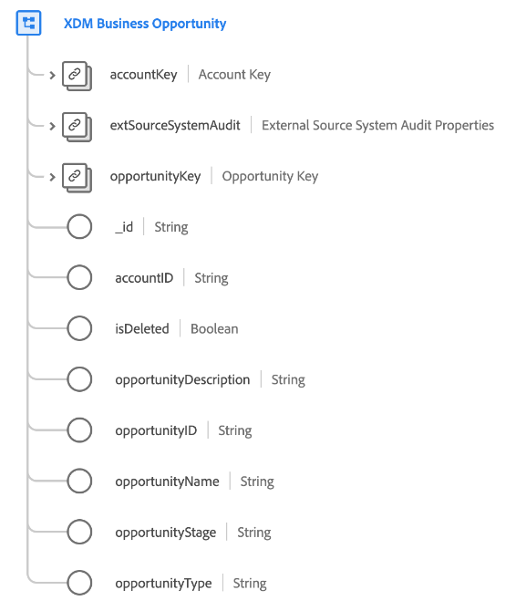

# [!UICONTROL Oportunidade de negócios XDM] classe

[!UICONTROL Oportunidade de negócios XDM] é uma classe padrão do Experience Data Model (XDM) que captura as propriedades mínimas necessárias de uma oportunidade de negócios.

| Propriedade | Tipo de dados | Descrição |
| --- | --- | --- |
| `accountKey` | [[!UICONTROL Origem B2B]](../../data-types/b2b-source.md) | Um identificador composto para a conta à qual esta oportunidade está associada. |
| `extSourceSystemAudit` | [[!UICONTROL Atributos de Auditoria do Sistema de Origem Externa]](../../data-types/external-source-system-audit-attributes.md) | Se a oportunidade vem de um sistema de origem externo, esse objeto captura atributos de auditoria para esse sistema. |
| `opportunityKey` | [[!UICONTROL Origem B2B]](../../data-types/b2b-source.md) | Um identificador composto para a entidade de oportunidade. |
| `_id` | String | Um identificador exclusivo para o registro. Esse é um valor gerado pelo sistema separado da variável `opportunityID`. |
| `accountID` | String | Uma ID exclusiva para a conta à qual esta oportunidade está associada. |
| `opportunityDescription` | String | Uma descrição para a oportunidade. |
| `opportunityID` | String | Uma ID exclusiva para a entidade de oportunidade. |
| `opportunityName` | String | O nome da oportunidade. |
| `opportunityStage` | String | O estágio de vendas da oportunidade. |
| `opportunityType` | String | O tipo de oportunidade. |

{style=&quot;table-layout:auto&quot;}

Consulte o guia sobre [relações de esquema na Real-time CDP B2B Edition](../../tutorials/relationship-b2b.md) para saber como essa classe se relaciona conceitualmente com as outras classes B2B e como você pode estabelecer esses relacionamentos na interface do usuário do Adobe Experience Platform.
