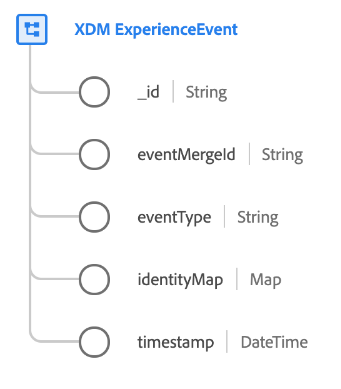

# [!DNL XDM ExperienceEvent] classe

[!DNL XDM ExperienceEvent] é uma classe padrão do Experience Data Model (XDM) que permite criar um instantâneo com carimbo de data e hora do sistema quando um evento específico ocorre ou um determinado conjunto de condições foi atingido.

Um Evento de experiência é um registro de fatos do que ocorreu, incluindo o ponto no tempo e a identidade do indivíduo envolvido. Os eventos podem ser explícitos (ações humanas diretamente observáveis) ou implícitos (criados sem uma ação humana direta) e são registrados sem agregação ou interpretação. Para obter mais informações de alto nível sobre o uso dessa classe no ecossistema da plataforma, consulte [Visão geral do XDM](../home.md#data-behaviors).

O [!DNL XDM ExperienceEvent] A própria classe fornece vários campos relacionados à série de tempo para um esquema. Os valores de alguns desses campos são automaticamente preenchidos quando os dados são assimilados:

| Propriedade | Descrição |
| --- | --- |
| `_id` | Um identificador de string exclusivo para o evento. Este campo é usado para rastrear a exclusividade de um evento individual, evitar a duplicação de dados e buscar esse evento em serviços downstream. Em alguns casos, `_id` pode ser um [Identificador universal exclusivo (UUID)](https://tools.ietf.org/html/rfc4122) ou [Identificador único global (GUID)](https://docs.microsoft.com/en-us/dotnet/api/system.guid?view=net-5.0).  Se você estiver fazendo streaming de dados de uma conexão de origem ou assimilando diretamente de um arquivo Parquet, deverá gerar esse valor concatenando uma determinada combinação de campos que tornam o evento exclusivo, como uma ID primária, carimbo de data e hora, tipo de evento e assim por diante. O valor concatenado deve ser um `uri-reference` sequência de caracteres formatada, ou seja, qualquer caractere de dois pontos deve ser removido. Depois disso, o valor concatenado deve ser colocado em hash usando SHA-256 ou outro algoritmo de sua escolha.  É importante distinguir que **este campo não representa uma identidade relacionada a uma pessoa**, mas o registro dos dados em si. Os dados de identidade relativos a uma pessoa devem ser relegados para [campos de identidade](../schema/composition.md#identity) fornecido por grupos de campos compatíveis. |
| `eventMergeId` | Se estiver usando a variável [Adobe Experience Platform Web SDK](../../edge/home.md) para assimilar dados, isso representa a ID do lote assimilado que fez com que o registro fosse criado. Esse campo é preenchido automaticamente pelo sistema após a assimilação de dados. Não há suporte para o uso desse campo fora do contexto de uma implementação do SDK da Web. |
| `eventType` | Uma string que indica o tipo ou a categoria do evento. Esse campo pode ser usado se você quiser distinguir tipos de evento diferentes no mesmo esquema e conjunto de dados, como distinguir um evento de exibição de produto de um evento de carrinho de compras de complemento para uma empresa de varejo.  Os valores padrão para essa propriedade são fornecidos na variável [seção apêndice](#eventType), incluindo descrições do caso de uso pretendido. Este campo é um enum extensível, o que significa que você também pode usar suas próprias strings de tipo de evento para categorizar os eventos que você está rastreando.  `eventType` O limita o uso de um único evento por ocorrência no aplicativo e, portanto, você deve usar campos calculados para informar ao sistema qual evento é mais importante. Para obter mais informações, consulte a seção em [práticas recomendadas para campos calculados](#calculated). |
| `producedBy` | Um valor de string que descreve o produtor ou a origem do evento. Esse campo pode ser usado para filtrar determinados produtores de eventos, se necessário para fins de segmentação.  Alguns valores sugeridos para essa propriedade são fornecidos na variável [seção apêndice](#producedBy). Este campo é um enum extensível, o que significa que você também pode usar suas próprias strings para representar produtores de eventos diferentes. |
| `identityMap` | Campo de mapa que contém um conjunto de identidades namespacadas para o indivíduo ao qual o evento se aplica. Este campo é atualizado automaticamente pelo sistema conforme os dados de identidade são assimilados. Para utilizar adequadamente esse campo para [Perfil do cliente em tempo real](../../profile/home.md), não tente atualizar manualmente o conteúdo do campo em suas operações de dados.  Consulte a seção sobre mapas de identidade na [noções básicas da composição do schema](../schema/composition.md#identityMap) para obter mais informações sobre o caso de uso. |
| `timestamp` | Um carimbo de data e hora ISO 8601 de quando o evento ocorreu, formatado conforme [RFC 3339 Seção 5.6](https://tools.ietf.org/html/rfc3339#section-5.6). Esse carimbo de data e hora deve ocorrer no passado. Consulte a seção abaixo em [carimbos de data e hora](#timestamps) para obter as práticas recomendadas sobre o uso desse campo. |

{style=&quot;table-layout:auto&quot;}

## Práticas recomendadas para modelagem de eventos

As seções a seguir abordam as práticas recomendadas para projetar seus esquemas do Experience Data Model (XDM) baseados em eventos no Adobe Experience Platform.

### Carimbos de data e hora {#timestamps}

A raiz `timestamp` campo de um schema de evento pode **only** representa a observação do evento em si e deve ocorrer no passado. Se os casos de uso de segmentação exigirem o uso de carimbos de data e hora que podem ocorrer no futuro, esses valores devem ser restritos em outro lugar do esquema Evento de experiência .

Por exemplo, se uma empresa do setor de viagens e hospitalidade modelar um evento de reserva de voo, o nível da classe `timestamp` representa a hora em que o evento de reserva foi observado. Outros carimbos de data e hora relacionados ao evento, como a data de início da reserva de viagem, devem ser capturados em campos separados fornecidos por grupos de campos padrão ou personalizados.

Mantendo o carimbo de data e hora em nível de classe separado de outros valores de data e hora relacionados em seus esquemas de evento, é possível implementar casos de uso de segmentação flexível, preservando uma conta com carimbo de data e hora das jornadas do cliente em seu aplicativo de experiência.

### Uso de campos calculados {#calculated}

Determinadas interações nos aplicativos de experiência podem resultar em vários eventos relacionados que compartilham tecnicamente o mesmo carimbo de data e hora do evento e, portanto, podem ser representados como um único registro de evento. Por exemplo, se um cliente visualizar um produto em seu site, isso pode resultar em um registro de evento que tenha dois produtos potenciais `eventType` valores: um evento de &quot;exibição de produto&quot; (`commerce.productViews`) ou um evento genérico de &quot;exibição de página&quot; (`web.webpagedetails.pageViews`). Nesses casos, você pode usar campos calculados para capturar os atributos mais importantes quando vários eventos são capturados em uma única ocorrência.

[Preparação de dados do Adobe Experience Platform](../../data-prep/home.md) O permite mapear, transformar e validar dados de e para o XDM. Uso da variável disponível [funções de mapeamento](../../data-prep/functions.md) fornecido pelo serviço, você pode chamar operadores lógicos para priorizar, transformar e/ou consolidar dados de registros de vários eventos ao ser assimilados no Experience Platform. No exemplo acima, é possível designar `eventType` como um campo calculado que priorizaria uma &quot;visualização do produto&quot; sobre uma &quot;visualização de página&quot; sempre que ambos ocorressem.

Se você estiver assimilando dados manualmente na plataforma por meio da interface do usuário do , consulte o guia sobre [campos calculados](../../data-prep/calculated-fields.md) para obter etapas específicas sobre como criar campos calculados.

Se você estiver transmitindo dados para a Platform usando uma conexão de origem, poderá configurar a fonte para utilizar campos calculados. Consulte a [documentação para sua fonte específica](../../sources/home.md) para obter instruções sobre como implementar campos calculados ao configurar a conexão.

## Grupos de campos de esquema compatíveis {#field-groups}

>[!NOTE]
>
>Os nomes de vários grupos de campos foram alterados. Consulte o documento em [atualizações de nome do grupo de campos](../field-groups/name-updates.md) para obter mais informações.

O Adobe fornece vários grupos de campos padrão para uso com a variável [!DNL XDM ExperienceEvent] classe . Esta é uma lista de alguns grupos de campos comumente usados para a classe :

* [[!UICONTROL Detalhes de marketing da campanha]](../field-groups/event/campaign-marketing-details.md)
* [[!UICONTROL Detalhes do canal]](../field-groups/event/channel-details.md)
* [[!UICONTROL Detalhes de comércio]](../field-groups/event/commerce-details.md)
* [[!UICONTROL Detalhes de troca de dispositivo]](../field-groups/event/device-trade-in-details.md)
* [[!UICONTROL Reserva de Jantar]](../field-groups/event/dining-reservation.md)
* [[!UICONTROL Detalhes da ID de usuário final]](../field-groups/event/enduserids.md)
* [[!UICONTROL Detalhes do ambiente]](../field-groups/event/environment-details.md)
* [[!UICONTROL Reserva de Voo]](../field-groups/event/flight-reservation.md)
* [[!UICONTROL Consentimento do IAB TCF 2.0]](../field-groups/event/iab.md)
* [[!UICONTROL Reserva de Loja]](../field-groups/event/lodging-reservation.md)
* [[!UICONTROL Detalhes da Reserva]](../field-groups/event/reservation-details.md)
* [[!UICONTROL Detalhes da Web]](../field-groups/event/web-details.md)

## Apêndice

A seção a seguir contém informações adicionais sobre o [!UICONTROL ExperiênciaEvento XDM] classe .

### Valores aceitos para `eventType` {#eventType}

A tabela a seguir descreve os valores aceitos para `eventType`, juntamente com as suas definições:

| Valor | Definição |
| --- | --- |
| `advertising.clicks` | Clique em ações em um anúncio. |
| `advertising.completes` | Um ativo de mídia cronometrada foi observado até a conclusão. Isso não significa necessariamente que o visualizador assistiu a todo o vídeo, pois o visualizador poderia ter avançado. |
| `advertising.conversions` | Ações predefinidas executadas por um cliente que aciona um evento para avaliação de desempenho. |
| `advertising.federated` | Indica se um evento de experiência foi criado por meio da federação de dados (compartilhamento de dados entre clientes). |
| `advertising.firstQuartiles` | Um anúncio de vídeo digital executou 25% de sua duração em velocidade normal. |
| `advertising.impressions` | Impressão(ões) de um anúncio para um cliente com o potencial de ser visualizado. |
| `advertising.midpoints` | Um anúncio de vídeo digital tem 50% de sua duração em velocidade normal. |
| `advertising.starts` | Um anúncio de vídeo digital começou a ser reproduzido. |
| `advertising.thirdQuartiles` | Um anúncio de vídeo digital foi reproduzido por 75% de sua duração em velocidade normal. |
| `advertising.timePlayed` | Descreve a quantidade de tempo gasto por um usuário em um ativo de mídia programado específico. |
| `application.close` | Um aplicativo foi fechado ou enviado para o plano de fundo. |
| `application.launch` | Um aplicativo foi iniciado ou trazido para o primeiro plano. |
| `commerce.checkouts` | Ocorreu um evento de finalização para uma lista de produtos. Pode haver mais de um evento de check-out se houver várias etapas em um processo de check-out. Se houver várias etapas, o carimbo de data e hora e a página/experiência referenciada para cada evento serão usados para identificar cada evento individual (etapa), representado em ordem. |
| `commerce.productListAdds` | Um produto foi adicionado à lista de produtos ou ao carrinho de compras. |
| `commerce.productListOpens` | Uma nova lista de produtos (carrinho de compras) foi inicializada ou criada. |
| `commerce.productListRemovals` | Uma ou mais entradas de produto foram removidas de uma lista de produtos ou carrinho de compras. |
| `commerce.productListReopens` | Uma lista de produtos (carrinho de compras) que não estava mais acessível (abandonada) foi reativada por um cliente, por exemplo, por meio de uma atividade de re-marketing. |
| `commerce.productListViews` | Uma lista de produtos ou carrinho de compras recebeu uma ou mais visualizações. |
| `commerce.productViews` | Um produto recebeu uma ou mais visualizações. |
| `commerce.purchases` | Um pedido foi aceito. Essa é a única ação necessária em uma conversão de comércio. Um evento de compra deve ter uma lista de produtos referenciada. |
| `commerce.saveForLaters` | Uma lista de produtos foi salva para uso futuro, como uma lista de desejos de produtos. |
| `decisioning.propositionDisplay` | Uma proposta de decisão foi exibida para uma pessoa. |
| `decisioning.propositionInteract` | Uma pessoa interagiu com uma proposta de decisão. |
| `delivery.feedback` | Eventos de feedback para um delivery, como um delivery de email. |
| `directMarketing.emailBounced` | Um email para uma pessoa retornou. |
| `directMarketing.emailBouncedSoft` | Um e-mail para uma pessoa que retornou por soft. |
| `directMarketing.emailClicked` | Uma pessoa clicou em um link em um email de marketing. |
| `directMarketing.emailDelivered` | Um email foi entregue com êxito ao serviço de email da pessoa |
| `directMarketing.emailOpened` | Uma pessoa abriu um email de marketing. |
| `directMarketing.emailUnsubscribed` | Uma pessoa cancelou a assinatura de um email de marketing. |
| `leadOperation.convertLead` | Um lead foi convertido. |
| `leadOperation.interestingMoment` | Um momento interessante foi gravado para uma pessoa. |
| `leadOperation.newLead` | Um lead foi criado. |
| `leadOperation.scoreChanged` | O valor do atributo de pontuação do lead foi alterado. |
| `leadOperation.statusInCampaignProgressionChanged` | O status de um cliente potencial em uma campanha foi alterado. |
| `listOperation.addToList` | Uma pessoa foi adicionada a uma lista de marketing. |
| `listOperation.removeFromList` | Uma pessoa foi removida de uma lista de marketing. |
| `message.feedback` | Eventos de feedback como enviado/rejeição/erro para mensagens enviadas a um cliente. |
| `message.tracking` | Rastreamento de eventos como ações abertas/click/personalizadas em mensagens enviadas a um cliente. |
| `opportunityEvent.addToOpportunity` | Uma pessoa foi adicionada a uma oportunidade. |
| `opportunityEvent.opportunityUpdated` | Uma oportunidade foi atualizada. |
| `opportunityEvent.removeFromOpportunity` | Uma pessoa foi removida de uma oportunidade. |
| `pushTracking.applicationOpened` | Uma pessoa abriu um aplicativo de uma notificação por push. |
| `pushTracking.customAction` | Uma pessoa clicou em uma ação personalizada em uma notificação por push. |
| `web.formFilledOut` | Uma pessoa preencheu um formulário em uma página da wep. |
| `web.webinteraction.linkClicks` | Um link foi selecionado uma ou mais vezes. |
| `web.webpagedetails.pageViews` | Uma página da Web recebeu uma ou mais visualizações. |

{style=&quot;table-layout:auto&quot;}

### Valores sugeridos para `producedBy` {#producedBy}

A tabela a seguir descreve alguns valores aceitos para `producedBy`:

| Valor | Definição |
| --- | --- |
| `self` | Auto |
| `system` | Sistema |
| `salesRef` | Representante de vendas |
| `customerRep` | Representante do cliente |
