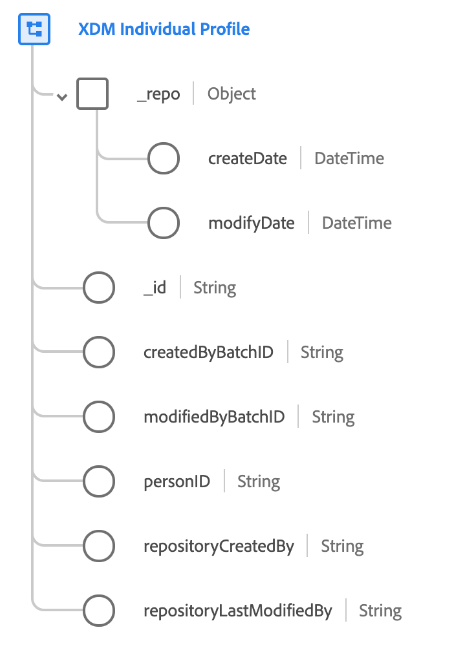

# [!DNL XDM Individual Profile] classe

[!DNL XDM Individual Profile] é uma classe padrão do Experience Data Model (XDM) que forma uma representação singular (ou &quot;perfil&quot;) de uma pessoa individual. Especificamente, a classe (e suas combinações compatíveis) captura os atributos e interesses de indivíduos identificados e parcialmente identificados que interagem com sua marca.

Os perfis podem variar de sinais comportamentais anônimos (como cookies do navegador) a perfis altamente identificados que contêm informações detalhadas, como nome, data de nascimento, local e endereço de email. À medida que um perfil cresce, ele se torna um repositório robusto de informações pessoais, identidades, detalhes de contato e preferências de comunicação para um indivíduo. Para obter mais informações de alto nível sobre o uso dessa classe no ecossistema da plataforma, consulte a [Visão geral do XDM](../home.md#data-behaviors).

A própria classe [!DNL XDM Individual Profile] fornece vários valores gerados pelo sistema que são automaticamente preenchidos quando os dados são assimilados, enquanto todos os outros campos devem ser adicionados por meio do uso de [grupos de campos de esquema compatíveis](#field-groups):

| Propriedade | Descrição |
| --- | --- |
| `_repo` | Um objeto que contém os seguintes campos [!UICONTROL DateTime]: <ul><li>`createDate`: A data e a hora em que o recurso foi criado no armazenamento de dados, como quando os dados foram assimilados pela primeira vez.</li><li>`modifyDate`: A data e a hora em que o recurso foi modificado pela última vez.</li></ul> |
| `_id` | Um identificador de string exclusivo para o registro. Este campo é usado para rastrear a exclusividade de um registro individual, evitar a duplicação de dados e buscar esse registro em serviços downstream. Em alguns casos, `_id` pode ser um [Identificador Universalmente Único (UUID)](https://tools.ietf.org/html/rfc4122) ou [Identificador Único Globalmente (GUID)](https://docs.microsoft.com/en-us/dotnet/api/system.guid?view=net-5.0).  Se você estiver fazendo streaming de dados de uma conexão de origem ou assimilando diretamente de um arquivo Parquet, deverá gerar esse valor concatenando uma determinada combinação de campos que tornam o registro exclusivo, como ID primária, carimbo de data e hora, tipo de registro e assim por diante. O valor concatenado deve ser uma string formatada `uri-reference`, o que significa que qualquer caractere de dois pontos deve ser removido. Depois disso, o valor concatenado deve ser colocado em hash usando SHA-256 ou outro algoritmo de sua escolha.  É importante distinguir que  **este campo não representa uma identidade relacionada a uma pessoa** individual, mas sim o registro dos dados propriamente dito. Os dados de identidade relacionados a uma pessoa devem ser relegados para [campos de identidade](../schema/composition.md#identity) fornecidos por grupos de campos compatíveis. |
| `createdByBatchID` | A ID do lote assimilado que fez com que o registro fosse criado. |
| `modifiedByBatchID` | A ID do último lote ingerido que fez com que o registro fosse atualizado. |
| `personID` | Um identificador exclusivo para a pessoa a que este registro se refere. Este campo não representa necessariamente uma identidade relacionada à pessoa, a menos que também seja designado como um [campo de identidade](../schema/composition.md#identity). |
| `repositoryCreatedBy` | A ID do usuário que criou o registro. |
| `repositoryLastModifiedBy` | A ID do usuário que modificou o registro pela última vez. |

{style=&quot;table-layout:auto&quot;}

## Grupos de campos compatíveis {#field-groups}

>[!NOTE]
>
>Os nomes de vários grupos de campos foram alterados. Consulte o documento em [atualizações do nome do grupo de campos](../field-groups/name-updates.md) para obter mais informações.

O Adobe fornece vários grupos de campos padrão para uso com a classe [!DNL XDM Individual Profile] . Esta é uma lista de alguns grupos de campos comumente usados para a classe :

* [[!UICONTROL Detalhes demográficos]](../field-groups/profile/demographic-details.md)
* [[!UICONTROL IdentityMap]](../field-groups/profile/identitymap.md)
* [[!UICONTROL Detalhes da Fidelidade]](../field-groups/profile/loyalty-details.md)
* [[!UICONTROL Detalhes de contato pessoal]](../field-groups/profile/personal-contact-details.md)
* [[!UICONTROL Privacidade/Personalização/Preferências de marketing (Consentimentos)]](../field-groups/profile/consents.md)
* [[!UICONTROL Detalhes da associação ao segmento]](../field-groups/profile/segmentation.md)
* [[!UICONTROL Detalhes do Contato do Trabalho]](../field-groups/profile/work-contact-details.md)

Para obter uma lista completa de todos os grupos de campos compatíveis para [!DNL XDM Individual Profile], consulte o [XDM GitHub repo](https://github.com/adobe/xdm/tree/master/components/mixins/profile).
