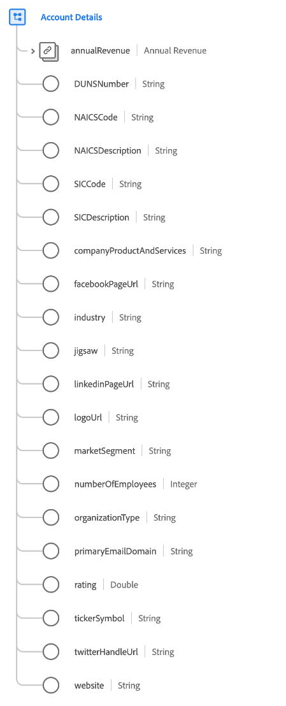

# [!UICONTROL Detalhes da conta] tipo de dados

[!UICONTROL Detalhes da conta] é um tipo de dados padrão do Experience Data Model (XDM) que descreve os detalhes relacionados a uma organização comercial.

| Propriedade | Tipo de dados | Descrição |
| --- | --- | --- |
| `annualRevenue` | [[!UICONTROL Moeda]](./currency.md) | O montante estimado das receitas anuais da organização. |
| `DUNSNumber` | String | O número D-U-N-S da organização, Dun &amp; Bradstreet. Este é um número não indicativo de nove dígitos atribuído a cada localização de negócio no banco de dados Dun &amp; Bradstreet com uma operação única, separada e distinta, e é mantido apenas pela Dun &amp; Bradstreet. |
| `NAICSCode` | String | A classificação da organização no Sistema de Classificação da Indústria Norte-Americano. |
| `NAICSDescription` | String | Breve descrição da linha de negócios de uma organização, com base em seu código NAICS. |
| `SICCode` | String | O código da Classificação Industrial Padrão (SIC) da organização. Este é um código de quatro dígitos que categoriza o setor ao qual as empresas pertencem com base em suas atividades comerciais. |
| `SICDescription` | String | Breve descrição da linha de negócios de uma organização, com base em seu código SIC. |
| `companyProductAndServices` | String | Os produtos e serviços nos quais a organização está lidando ou fazendo negócios. |
| `facebookPageUrl` | String | Um link de site para a conta da Facebook da organização. |
| `industry` | String | A indústria da qual essa organização faz parte. Este é um campo de forma livre, e é aconselhável usar um valor estruturado para consultas ou usar a variável `xdm:classifier` propriedade. |
| `jigsaw` | String | A chave Data.com para a organização. |
| `linkedinPageUrl` | String | Um link de site para a conta da LinkedIn da organização. |
| `logoUrl` | String | Um caminho a ser combinado com o URL de uma instância do Salesforce (por exemplo, `https://yourInstance.salesforce.com/`) para gerar um URL para solicitar a imagem de perfil da rede social associada à organização. O URL gerado retorna um redirecionamento HTTP (código 302) para a imagem de perfil da rede social da organização. |
| `marketSegment` | String | O segmento de mercado nomeado no qual a organização participa. Este é um campo de forma livre, e é aconselhável usar um valor estruturado para consultas ou usar a variável `xdm:identifier` propriedade. |
| `numberOfEmployees` | Número inteiro | O número de funcionários na organização. |
| `organizationType` | String | Um rótulo que descreve o tipo de organização. |
| `primaryEmailDomain` | String | O domínio de email principal que a organização usa para sua equipe. |
| `rating` | Duplo | A pontuação calculada ou a classificação de estrelas para esta organização. `1` indica a classificação máxima possível e `0` é a classificação mínima possível. |
| `tickerSymbol` | String | O símbolo do mercado de ações para esta conta. Máximo de 20 caracteres. |
| `twitterHandleUrl` | String | Um link de site para o identificador da twitter da organização. |
| `website` | String | O URL do site da organização. |

{style=&quot;table-layout:auto&quot;}

Para obter mais detalhes sobre o tipo de dados, consulte o repositório XDM público:

* [Exemplo preenchido](https://github.com/adobe/xdm/blob/master/components/datatypes/b2b/account-organization.example.1.json)
* [Schema completo](https://github.com/adobe/xdm/blob/master/components/datatypes/b2b/account-organization.schema.json)
