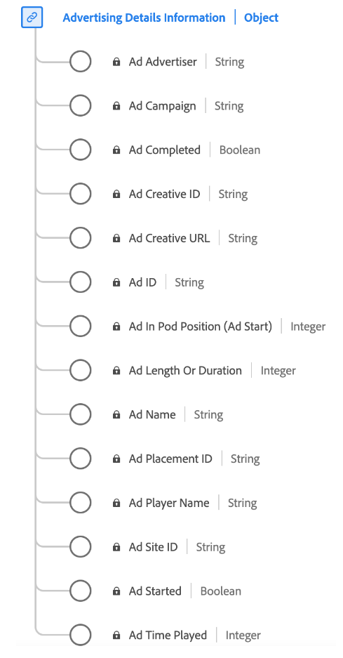

# [!UICONTROL Informações sobre detalhes de publicidade] tipo de dados

[!UICONTROL Informações sobre detalhes de publicidade] é um tipo de dados padrão do Experience Data Model (XDM) que captura os principais atributos relacionados aos anúncios. Inclui informações como ID do anúncio, IDs do anunciante e da campanha, duração, posição em uma sequência, detalhes sobre o reprodutor que renderiza o anúncio e assim por diante. Você pode usar esse tipo de dados para rastrear e analisar vários aspectos do desempenho e engajamento do anúncio, e fornecer insights sobre como os públicos-alvo interagem e respondem a diferentes anúncios.

+++Selecione para exibir um diagrama do tipo de dados Advertising Details Information.

+++

| Nome de exibição | Propriedade | Tipo de dados | Descrição |
|----------------------------|-----------------|-----------|-----------------------------------------------------------------------------------------------|
| [!UICONTROL Nome do anúncio] | `friendlyName` | string | **Obrigatório** O nome legível do anúncio. Nos relatórios, o “Ad Name” é a classificação e o “Ad Name (variable)” é a eVar. |
| [!UICONTROL ID do anúncio] | `name` | string | A ID do anúncio. Qualquer combinação de número inteiro e/ou letra. |
| [!UICONTROL Duração Ou Duração Do Anúncio] | `length` | inteiro | **Obrigatório** A duração do anúncio de vídeo em segundos. |
| [!UICONTROL Posição do pod de anúncio (início do anúncio)] | `podPosition` | inteiro | **Obrigatório** O índice do anúncio dentro do início do anúncio principal, por exemplo, o primeiro anúncio tem índice 0 e o segundo anúncio tem índice 1. |
| [!UICONTROL Nome do reprodutor do anúncio] | `playerName` | string | **Obrigatório** O nome do reprodutor responsável pela renderização do anúncio. |
| [!UICONTROL Anunciante de publicidade] | `advertiser` | string | A empresa ou marca cujo produto é apresentado no anúncio. |
| [!UICONTROL Campanha publicitária] | `campaignID` | string | A ID da campanha publicitária. |
| [!UICONTROL ID de criação do anúncio] | `creativeID` | string | A ID do criativo do anúncio. |
| [!UICONTROL ID do site de anúncio] | `siteID` | string | A ID do site do anúncio. |
| [!UICONTROL URL de criação do anúncio] | `creativeURL` | string | O URL da campanha criativa. |
| [!UICONTROL ID de posicionamento do anúncio] | `placementID` | string | A ID de posicionamento do anúncio. |
| [!UICONTROL Anúncio concluído] | `isCompleted` | booleano | Rastreia se o anúncio foi concluído. |
| [!UICONTROL Anúncio iniciado] | `isStarted` | booleano | Rastreia se o anúncio foi iniciado. |
| [!UICONTROL Tempo de reprodução do anúncio] | `timePlayed` | inteiro | O tempo total, em segundos, gasto com a exibição do anúncio (ou seja, o número de segundos reproduzidos). |

{style="table-layout:auto"}

Para obter mais informações sobre o grupo de campos, consulte o [repositório XDM público](https://github.com/adobe/xdm/blob/master/components/datatypes/advertisingdetails.schema.json)
