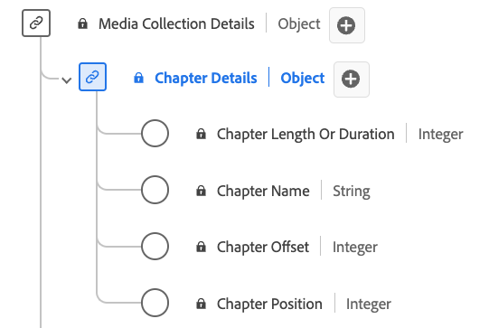

# [!UICONTROL Detalhes do capítulo] Tipo de dados de coleção

[!UICONTROL Detalhes do capítulo] Coleção é um tipo de dados padrão do Experience Data Model (XDM) que descreve vários atributos relacionados a capítulos ou segmentos no conteúdo de mídia. Use o [!UICONTROL Detalhes do capítulo] Tipo de dados de coleção para capturar detalhes como nome do capítulo, deslocamento, duração e índice do capítulo. Os campos de coleção de mídia capturam dados e os enviam para outros serviços da Adobe para processamento adicional.

>[!NOTE]
>
>Cada nome de exibição contém um link para informações adicionais sobre os parâmetros de áudio e vídeo. As páginas vinculadas contêm detalhes sobre os dados de anúncios de vídeo coletados pelo Adobe, valores de implementação, parâmetros de rede, relatórios e considerações importantes.

| Nome de exibição | Propriedade | Tipo de dados | Obrigatório | Descrição |
|-------------------------------------------------------------------------------------------------------------------------------------------------------------------------|---------------|-----------|----------|---------------------------------------------------|
| [[!UICONTROL Duração Ou Comprimento Do Capítulo]](https://experienceleague.adobe.com/docs/media-analytics/using/implementation/variables/chapter-parameters.html#chapter-length) | `length` | inteiro | Sim | A duração do capítulo, em segundos. |
| [[!UICONTROL Nome do capítulo]](https://experienceleague.adobe.com/docs/media-analytics/using/implementation/variables/chapter-parameters.html#chapter-name) | `friendlyName` | string | Não | O nome do capítulo e/ou segmento. |
| [[!UICONTROL Deslocamento de capítulo]](https://experienceleague.adobe.com/docs/media-analytics/using/implementation/variables/chapter-parameters.html#chapter-offset) | `offset` | inteiro | Sim | O deslocamento do capítulo dentro do conteúdo (em segundos) desde o início. |
| [[!UICONTROL Posição do capítulo]](https://experienceleague.adobe.com/docs/media-analytics/using/implementation/variables/chapter-parameters.html#chapter-position) | `index` | inteiro | Sim | A posição (índice, número inteiro) do capítulo dentro do conteúdo. |

{style="table-layout:auto"}
