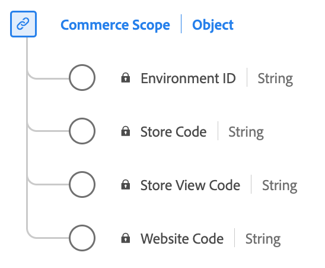

# [!UICONTROL Escopo do Commerce] tipo de dados

[!UICONTROL Escopo do Commerce] é um tipo de dados padrão do Experience Data Model (XDM) que define identificadores para onde um evento ocorreu em um ecossistema de comércio. Ele distingue ambientes, sites, lojas e visualizações de loja.

| Nome de exibição | Propriedade | Tipo de dados | Descrição |
|---------------------------------|-------------------|-----------|-------------------------------------------------------|
| [!UICONTROL ID do ambiente] | `environmentID` | string | A ID do ambiente. Uma ID alfanumérica de 32 dígitos. |
| [!UICONTROL Código do site] | `websiteCode` | string | O código exclusivo do site em um ambiente. |
| [!UICONTROL Armazenar código] | `storeCode` | string | O código de armazenamento exclusivo em um site. |
| [!UICONTROL Código de exibição da loja] | `storeViewCode` | string | O código de exibição de loja exclusivo em uma loja. |

{style="table-layout:auto"}

Para obter mais detalhes sobre o tipo de dados, consulte o repositório XDM público:

* [Exemplo preenchido](https://github.com/adobe/xdm/blob/master/components/datatypes/commercescope.example.1.json)
* [Esquema completo](https://github.com/adobe/xdm/blob/master/components/datatypes/commercescope.schema.json)
