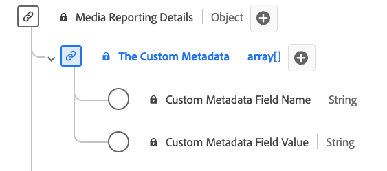

# [!UICONTROL Detalhes de metadados personalizados] Tipo de dados de relatório

[!UICONTROL Detalhes de metadados personalizados] Os relatórios são um tipo de dados padrão do Experience Data Model (XDM) que define uma estrutura para armazenar metadados personalizados. A variável [!UICONTROL Detalhes de metadados personalizados] O tipo de dados de relatório captura detalhes como o nome e o valor dos metadados personalizados associados ao conteúdo ou às interações. Os campos de relatórios de mídia são usados pelos serviços da Adobe para analisar os campos de coleção de mídia enviados pelos usuários. Esses dados, juntamente com outras métricas específicas do usuário, são calculados e relatados.

| Nome de exibição | Propriedade | Tipo de dados | Descrição |
|--------------------------------------------|------------------|-----------|-----------------------------------------|
| [!UICONTROL Nome do campo de metadados personalizado] | `name` | string | O nome do campo personalizado. |
| [!UICONTROL Valor do campo de metadados personalizado] | `value` | string | O valor do campo personalizado. |

{style="table-layout:auto"}
