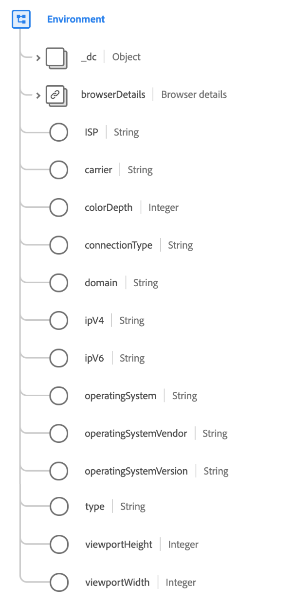

# [!UICONTROL Environment] tipo de dados

[!UICONTROL Environment] é um tipo de dados XDM padrão que descreve o ambiente circundante de um evento observado, detalhando especificamente informações transitórias, como versões de rede e de software.

>[!IMPORTANT]
>
>Todos os valores devem ser alinhados com o banco de dados [DeviceAtlas](https://deviceatlas.com), licenciado pelo Adobe.

 

| Propriedade | Tipo de dados | Descrição |
| --- | --- | --- |
| `_dc` | Objeto | Um objeto que contém um único campo, `language`, que indica o idioma do ambiente para representar as preferências linguísticas, geográficas ou culturais do usuário para a apresentação de dados. Os idiomas são especificados no código de idioma, conforme definido em [IETF RFC 3066](https://www.ietf.org/rfc/rfc3066.txt). |
| `browserDetails` | [Detalhes do navegador](./browser-details.md) | Descreve os detalhes específicos do navegador do ambiente, como nome do navegador, versão, versão do JavaScript, sequência de agente do usuário e linguagem de aceitação. |
| `ISP` | String | O nome do provedor de serviço de Internet do usuário. |
| `carrier` | String | O nome da operadora de rede móvel ou MNO (também conhecida como provedor de serviço sem fio, operadora de rede sem fio, empresa de celular ou operadora de rede móvel) que vende e fornece serviços de comunicação ao usuário. |
| `colorDepth` | Número inteiro | O número de bits usados para cada componente de cor de um único pixel. |
| `connectionType` | String | O tipo de conexão com a Internet. Os valores aceitos incluem: <ul><li>`dialup`</li><li>`isdn`</li><li>`bisdn`</li><li>`dsl`</li><li>`cable`</li><li>`wireless_wifi`</li><li>`mobile`</li><li>`mobile_edge`</li><li>`mobile_2g`</li><li>`mobile_3g`</li><li>`mobile_lte`</li><li>`t1`</li><li>`t3`</li><li>`oc3`</li><li>`lan`</li><li>`modem`</li></ul> |
| `domain` | String | O domínio do ISP do usuário. |
| `ipV4` | String | A etiqueta numérica atribuída a um dispositivo que participa de uma rede de computador que usa o Protocolo Internet para comunicação (32 bits). |
| `ipV6` | String | O rótulo numérico atribuído a um dispositivo que participa de uma rede de computadores que usa o Protocolo Internet para comunicação (128 bits). |
| `operatingSystem` | String | O nome do sistema operacional usado quando a observação foi feita. O atributo não deve conter informações de versão, como `10.5.3`, mas, em vez disso, conter designações &quot;Edition&quot;, como `Ultimate` ou `Professional`. |
| `operatingSystemVendor` | String | O nome do fornecedor do sistema operacional usado quando a observação foi feita. |
| `operatingSystemVersion` | String | Identificador da versão completa do sistema operacional utilizado aquando da observação. As versões geralmente são compostas numericamente, mas podem estar em um formato definido pelo fornecedor. |
| `type` | String | O tipo do ambiente do aplicativo. Consulte o [apêndice](#type) para obter os valores aceitos. |
| `viewportHeight` | Número inteiro | O tamanho vertical em pixels da janela em que a experiência foi exibida. Para um evento de exibição da Web, essa é a altura da janela de visualização do navegador. |
| `viewPortWidth` | Número inteiro | O tamanho horizontal em pixels da janela em que a experiência foi exibida. Para um evento de exibição da Web, essa é a largura da janela de visualização do navegador. |

Para obter mais detalhes sobre o tipo de dados, consulte o repositório XDM público:

* [Exemplo preenchido](https://github.com/adobe/xdm/blob/master/components/datatypes/environment.example.1.json)
* [Schema completo](https://github.com/adobe/xdm/blob/master/components/datatypes/environment.schema.json)

## Apêndice

A seção a seguir contém informações adicionais sobre o tipo de dados [!UICONTROL Device] .

## Valores aceitos para o tipo {#type}

A tabela a seguir descreve os valores aceitos para `type` e seus significados associados:

| Valor | Descrição |
| --- | --- |
| `browser` | Browser |
| `application` | aplicação |
| `iot` | Internet de coisas |
| `external` | Sistema externo |
| `widget` | Extensão do aplicativo |
