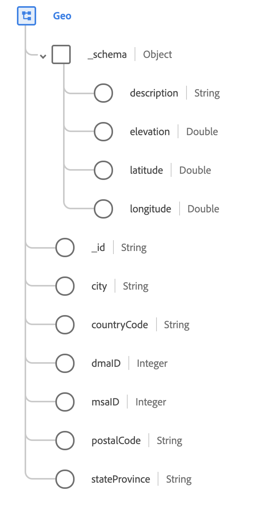

# [!UICONTROL Geo] tipo de dados

[!UICONTROL Geo] é um tipo de dados XDM padrão que descreve a área geográfica em que um evento foi observado.

 

| Propriedade | Tipo de dados | Descrição |
| --- | --- | --- |
| `_schema` | [[!UICONTROL Coordenadas geográficas]](./geo-coordinates.md) | Descreve as coordenadas geográficas de um local. |
| `_id` | String | Uma ID exclusiva gerada pelo sistema para as coordenadas. |
| `city` | String | O nome da cidade. |
| `countryCode` | String | Os dois caracteres <a href="https://datahub.io/core/country-list">ISO 3166-1 alfa-2</a> código do país. |
| `dmaID` | Número inteiro | A área de mercado designada de pesquisa de mídia da Nielsen. |
| `msaID` | Número inteiro | A área estatística metropolitana dos Estados Unidos onde ocorreu a observação. |
| `postalCode` | String | O código postal da localização. Os códigos postais não estão disponíveis para todos os países. Em alguns países, conterá apenas parte do código postal. |
| `stateProvince` | String | A parte do estado ou província da observação. O formato segue o [ISO 3166-2 (país e subdivisão)](https://www.unece.org/cefact/locode/subdivisions.html) padrão. |

{style="table-layout:auto"}

Para obter mais detalhes sobre o tipo de dados, consulte o repositório XDM público:

* [Exemplo preenchido](https://github.com/adobe/xdm/blob/master/components/datatypes/demographic/geo.example.1.json)
* [Esquema completo](https://github.com/adobe/xdm/blob/master/components/datatypes/demographic/geo.schema.json)
