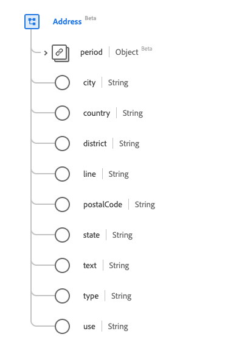

# Tipo de dados [!UICONTROL Endereço]

[!UICONTROL Endereço] é um tipo de dados padrão do Experience Data Model (XDM) que descreve um endereço expresso usando convenções postais (em vez de GPS ou outros formatos de definição de local). Esse tipo de dados é criado de acordo com as especificações do HL7 FHIR versão 5.

| Nome de exibição | Propriedade | Tipo de dados | Descrição |
| --- | --- | --- | --- |
| [!UICONTROL Período] | `period` | [[!UICONTROL Período]](../healthcare/period.md) | Período em que o endereço estava/está em uso. |
| [!UICONTROL Cidade] | `city` | String | Nome da cidade. |
| [!UICONTROL Country] | `country` | String | O código de país descrito no padrão internacional ISO 3166. O código pode ser alfa 2 ou alfa 3. |
| [!UICONTROL Distrito] | `district` | String | O nome do distrito. |
| [!UICONTROL Linha] | `line` | String | O nome da rua, número, direção, caixa postal ou similar. |
| [!UICONTROL CEP] | `postalCode` | String | O código postal. |
| [!UICONTROL Estado] | `state` | String | A subunidade de um país. Abreviações são aceitáveis. |
| [!UICONTROL Texto] | `text` | String | A representação de texto do endereço. |
| [!UICONTROL Tipo] | `type` | String | O tipo de endereço. O valor dessa propriedade deve ser igual a um dos seguintes valores de enumeração conhecidos. <li> `postal` </li> <li> `physical` </li> <li> `both` </li> |
| [!UICONTROL Uso] | `use` | String | A finalidade do endereço. O valor dessa propriedade deve ser igual a um dos seguintes valores de enumeração conhecidos. <li> `home` </li> <li> `work` </li> <li> `temp` </li> <li> `old`</li> <li> `billing`</li> |

Para obter mais detalhes sobre o tipo de dados, consulte o repositório XDM público:

* [Exemplo preenchido](https://github.com/adobe/xdm/blob/master/extensions/industry/healthcare/fhir/datatypes/address.example.1.json)
* [Esquema completo](https://github.com/adobe/xdm/blob/master/extensions/industry/healthcare/fhir/datatypes/address.schema.json)
