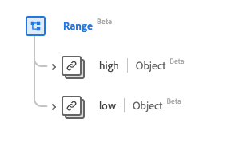

# Tipo de dados [!UICONTROL Intervalo]

[!UICONTROL Intervalo] é um tipo de dados padrão do Experience Data Model (XDM) que fornece um conjunto de valores associados por valores baixo e alto. Esse tipo de dados é criado de acordo com as especificações do HL7 FHIR versão 5.

| Nome de exibição | Propriedade | Tipo de dados | Descrição |
| --- | --- | --- | --- |
| [!UICONTROL Alta] | `high` | [[!UICONTROL Quantidade Simples]](../healthcare/simple-quantity.md) | O limite mais alto. |
| [!UICONTROL Baixo] | `low` | [[!UICONTROL Quantidade Simples]](../healthcare/simple-quantity.md) | O limite mais baixo. |

Para obter mais detalhes sobre o tipo de dados, consulte o repositório XDM público:

* [Exemplo preenchido](https://github.com/adobe/xdm/blob/master/extensions/industry/healthcare/fhir/datatypes/range.example.1.json)
* [Esquema completo](https://github.com/adobe/xdm/blob/master/extensions/industry/healthcare/fhir/datatypes/range.schema.json)
