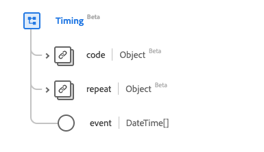

# [!UICONTROL Tempo] tipo de dados

[!UICONTROL Tempo] é um tipo de dados padrão do Experience Data Model (XDM) que descreve um cronograma de tempo que fornece informações sobre um evento que pode ocorrer várias vezes. Esse tipo de dados é criado de acordo com as especificações do HL7 FHIR versão 5.

| Nome de exibição | Propriedade | Tipo de dados | Descrição |
| --- | --- | --- | --- |
| [!UICONTROL Evento] | `event` | Matriz de DateTime | Quando o evento ocorre. |
| [!UICONTROL Repetir] | `repeat` | [[!UICONTROL Repetir]](../healthcare/repeat.md) | Informações sobre quando o evento ocorre. |
| [!UICONTROL Código] | `code` | [[!UICONTROL Conceito codificável]](../healthcare/codeable-concept.md) | O código relacionado ao evento. |

Para obter mais detalhes sobre o tipo de dados, consulte o repositório XDM público:

* [Exemplo preenchido](https://github.com/adobe/xdm/blob/master/extensions/industry/healthcare/fhir/datatypes/timing.example.1.json)
* [Esquema completo](https://github.com/adobe/xdm/blob/master/extensions/industry/healthcare/fhir/datatypes/timing.schema.json)
