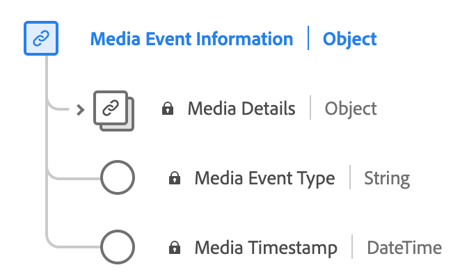

# [!UICONTROL Informações do evento de mídia] tipo de dados

[!UICONTROL Informações do evento de mídia] é um tipo de dados padrão do Experience Data Model (XDM) que descreve as informações de detalhes de mídia relacionadas ao evento de experiência.

| Propriedade | Tipo de dados | Descrição |
| --- | --- | --- |
| `mediaCollection` | [!UICONTROL mediaDetails] | Informações detalhadas da mídia relacionadas ao evento de experiência. Esse tipo de dados é usado para [coleção de dados de mídia](./media-collection-details.md) e [relatórios de dados de mídia](./media-reporting-details.md). |
| `mediaEventTimestamp` | [!UICONTROL String] | A hora em que um evento de mídia ocorreu. |
| `mediaEventType` | [!UICONTROL String] | O tipo de evento de mídia. |

{style="table-layout:auto"}

Para obter mais informações sobre o grupo de campos, consulte o [repositório XDM público](https://github.com/adobe/xdm/blob/master/components/datatypes/mediaevent.schema.json)
