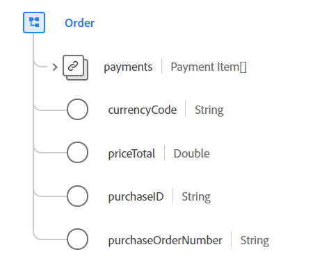

#  Tipo de dados do pedido

 O Orderis é um tipo de dados padrão do Experience Data Model (XDM) que descreve a ordem colocada para uma lista de produtos.

 

| Propriedade | Tipo de dados | Descrição |
| --- | --- | --- |
| `payments` | Matriz de [[!UICONTROL Itens de Pagamento]](./payment-item.md) | A lista de pagamentos para esta ordem. |
| `currencyCode` | String | O código monetário ISO 4217 usado para os totais de pedidos. Todas as instâncias devem estar em conformidade com a expressão regular `^[A-Z]{3}$`. Os exemplos incluem `USD` e `EUR`. |
| `priceTotal` | Duplo | O preço total deste pedido após a aplicação de todos os descontos e impostos. |
| `purchaseID` | String | Um identificador exclusivo atribuído pelo vendedor para esta compra ou contrato. Como isso é definido pelo vendedor, não há garantia de que a ID seja exclusiva. |
| `purchaseOrderNumber` | String | O identificador exclusivo atribuído pelo comprador para esta compra ou contrato. |

{style=&quot;table-layout:auto&quot;}

Para obter mais detalhes sobre o tipo de dados, consulte o repositório XDM público:

* [Exemplo preenchido](https://github.com/adobe/xdm/blob/master/components/datatypes/data/order.example.1.json)
* [Schema completo](https://github.com/adobe/xdm/blob/master/components/datatypes/data/order.schema.json)
