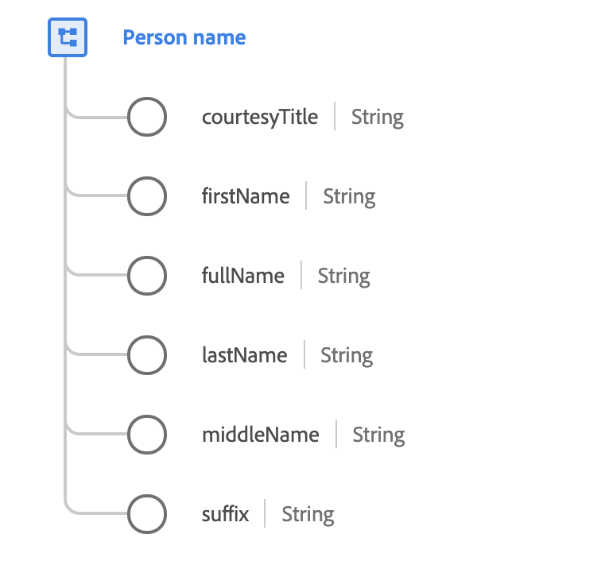

# [!UICONTROL Tipo ] de dados de nome da pessoa

[!UICONTROL O ] nome da pessoa é um tipo de dados XDM padrão que descreve o nome completo de uma pessoa. Como as convenções para as estruturas de nomes diferem muito entre as línguas e as culturas, os nomes devem ser sempre modelados utilizando este tipo de dados.

Além disso, o tipo de dados fornece várias propriedades opcionais que podem ser usadas em situações que exigem o uso de apenas um fragmento do nome completo, como a criação de uma saudação formal ou informal.

 

| Propriedade | Descrição |
| --- | --- |
| `courtesyTitle` | Uma abreviação do título, honraria ou saudação de uma pessoa (como `Mr.`, `Miss.` ou `Dr.`). |
| `firstName` | O primeiro segmento do nome na ordem de escrita mais comumente aceito no idioma do nome. |
| `fullName` | Nome completo da pessoa, por ordem escrita mais comumente aceite na língua do nome. |
| `lastName` | O último segmento do nome na ordem de escrita mais comumente aceito no idioma do nome. |
| `middleName` | Nomes do meio, alternativos ou adicionais fornecidos entre o nome e sobrenome. |
| `suffix` | Um grupo de cartas fornecido após o nome de uma pessoa para fornecer informações adicionais (como `Jr.`, `Sr.`, `M.D.`, `PhD`, `I`, `II`, `III` e assim por diante). |

{style=&quot;table-layout:auto&quot;}

Para obter mais detalhes sobre o tipo de dados do nome da pessoa, consulte o repositório XDM público:

* [Exemplo preenchido](https://github.com/adobe/xdm/blob/master/components/datatypes/person/person-name.example.1.json)
* [Schema completo](https://github.com/adobe/xdm/blob/master/components/datatypes/person/person-name.schema.json)
