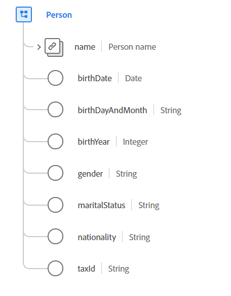

# [!UICONTROL Person] tipo de dados

[!UICONTROL Person] é um tipo de dados padrão do Experience Data Model (XDM) que descreve uma pessoa individual. Esse tipo de dados pode representar uma pessoa atuando em várias funções, como um cliente, contato ou proprietário.

 

| Propriedade | Tipo de dados | Descrição |
| --- | --- | --- |
| `name` | [[!UICONTROL Person name]](./person-name.md) | Descreve detalhes sobre o nome completo da pessoa. |
| `birthDate` | Data | A data completa em que uma pessoa nasceu. O formato de data (sem hora) deve seguir o padrão [RFC 3339, seção 5.6](https://tools.ietf.org/html/rfc3339#section-5.6). |
| `birthDayAndMonth` | String | O dia e o mês em que uma pessoa nasceu, no formato MM-DD. Este campo deve ser usado quando o dia e o mês de nascimento de uma pessoa forem conhecidos, mas não o ano. O formato dessa propriedade deve estar em conformidade com essa expressão regular `[0-1][0-9]-[0-9][0-9]`. |
| `birthYear` | Número inteiro | O ano em que uma pessoa nasceu incluindo o século (por exemplo, `1983`). Este campo deve ser usado quando somente a idade da pessoa é conhecida e não a data de nascimento completa. Esse valor deve estar entre 1 e 32767. |
| `gender` | String | A identidade de gênero da pessoa. O valor dessa propriedade deve ser igual a um dos valores de enum conhecidos a seguir. <li> `female` </li> <li> `male` </li> <li> `not_specified` </li> <li> `non_specific` </li> O padrão para esse valor é `not_specified`. |
| `maritalStatus` | String | Descreve a relação de uma pessoa com uma outra significativa. O valor dessa propriedade deve ser igual a um dos valores de enumeração a seguir. <li> `married` </li> <li> `single` </li> <li> `divorced` </li> <li> `widowed` </li> <li> `not_specified` </li> O padrão para esse valor é `not_specified`. |
| `nationality` | String | A relação jurídica entre uma pessoa e seu estado representado usando o código alfa-2 da ISO 3166-1. O formato dessa propriedade deve estar em conformidade com essa expressão regular `^[A-Z]{2}$`. |
| `taxId` | String | O ID fiscal ou fiscal da pessoa, como o Número de Identificação do Contribuinte (TIN) nos EUA ou o Certificado de Identiación Fiscal (CIF/NIF) em Espanha. |

Para obter mais detalhes sobre o tipo de dados, consulte o repositório XDM público:

* [Exemplo preenchido](https://github.com/adobe/xdm/blob/master/components/datatypes/person/person.example.1.json)
* [Schema completo](https://github.com/adobe/xdm/blob/master/components/datatypes/person/person.schema.json)
