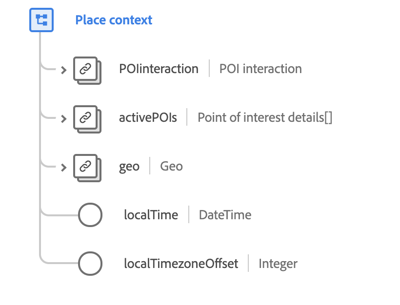

# Tipo de dados [!UICONTROL Inserir contexto]

[!UICONTROL Inserir contexto] é um tipo de dados XDM padrão que descreve o local de um evento observado, incluindo informações de ponto de interesse e coordenadas geográficas.

{width=500}

| Propriedade | Tipo de dados | Descrição |
| --- | --- | --- |
| `POIinteraction` | [[!UICONTROL Interação com o ponto de interesse]](./poi-interaction.md) | Descreve detalhes sobre a interação do ponto de interesse (POI). |
| `activePOIs` | Matriz de [[!UICONTROL detalhes do ponto de interesse]](./poi-details.md) | Descreve os POIs que causaram o evento. |
| `geo` | [[!UICONTROL Geografia]](./geo.md) | Descreve a localização geográfica onde a experiência foi entregue. |
| `localTime` | DateTime | Um carimbo de data/hora no formato [RFC 3339](https://tools.ietf.org/html/rfc3339), indicando a hora local usando com um deslocamento de fuso horário declarado. O padrão de formatação é `yyyy-MM-dd'T'HH:mm:ssXXX` (por exemplo, `2001-07-04T12:08:56-07:00`). |
| `localTimezoneOffset` | Número inteiro | O deslocamento do fuso horário local atual em minutos do UTC para o valor `localTime`. Isso deve incluir o deslocamento de horário de verão atual, se aplicável. |

{style="table-layout:auto"}

Para obter mais detalhes sobre o tipo de dados, consulte o repositório XDM público:

* [Exemplo preenchido](https://github.com/adobe/xdm/blob/master/components/datatypes/placecontext.example.1.json)
* [Esquema completo](https://github.com/adobe/xdm/blob/master/components/datatypes/placecontext.schema.json)
