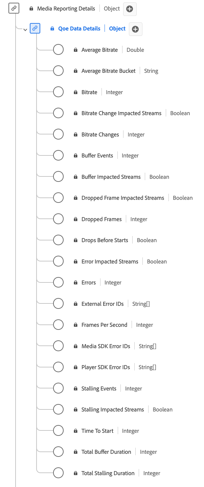

# Tipo de dados do relatório de detalhes de dados da QoE (Quality of Experience)

[!UICONTROL Detalhes de dados de QoE] Os relatórios são um tipo de dados padrão do Experience Data Model (XDM) que fornece métricas detalhadas relacionadas à qualidade da experiência (QoE) durante a reprodução da mídia. Use o [!UICONTROL Detalhes de dados de QoE] Tipo de dados do relatório para capturar detalhes como informações de taxa de bits, taxas de quadros, eventos de buffer, quadros ignorados e assim por diante. Os campos de relatórios de mídia são usados pelos serviços da Adobe para analisar os campos Coleção de mídia enviados pelos usuários. Esses dados, juntamente com outras métricas específicas do usuário, são calculados e relatados. Esse tipo de dados permite a análise da qualidade da reprodução, permitindo insights sobre o desempenho da transmissão, experiência do usuário e possíveis problemas encontrados durante as sessões de reprodução.

+++Selecione para exibir o tipo de dados do Relatório de detalhes de dados de QoE.

+++

>[!NOTE]
>
>Cada nome de exibição contém um link para informações adicionais sobre os parâmetros de áudio e vídeo. As páginas vinculadas contêm detalhes sobre os dados de anúncios de vídeo coletados pelo Adobe, valores de implementação, parâmetros de rede, relatórios e considerações importantes.

| Nome de exibição | Propriedade | Tipo de dados | Descrição |
|----------------------------------------------------------------------------------------------------------------------------------------------------------------------------------------------|--------------------------|-----------|---------------------------------------------------------------------------------------------------|
| [[!UICONTROL Taxa média de bits]](https://experienceleague.adobe.com/docs/media-analytics/using/implementation/variables/quality-parameters.html#average-bitrate-1) | `bitrateAverage` | number | A taxa média de bits (em kbps, número inteiro). Calculado como uma média ponderada de valores de taxa de bits. |
| [[!UICONTROL Classificação da taxa média de bits]](https://experienceleague.adobe.com/docs/media-analytics/using/implementation/variables/quality-parameters.html#average-bitrate) | `bitrateAverageBucket` | string | A taxa média de bits (em kbps) categorizada em intervalos predefinidos em intervalos de 100 kbps. |
| [[!UICONTROL Taxa de bits]](https://experienceleague.adobe.com/docs/media-analytics/using/implementation/variables/quality-parameters.html#average-bitrate) | `bitrate` | inteiro | O valor da taxa de bits (em kbps). |
| [[!UICONTROL Fluxos impactados pela alteração da taxa de bits]](https://experienceleague.adobe.com/docs/media-analytics/using/implementation/variables/quality-parameters.html#bitrate-change-impacted-streams) | `hasBitrateChangeImpactedStreams` | booleano | Indica se os fluxos foram afetados pelas alterações da taxa de bits durante a reprodução. |
| [[!UICONTROL Alterações na taxa de bits]](https://experienceleague.adobe.com/docs/media-analytics/using/implementation/variables/quality-parameters.html#bitrate-changes) | `bitrateChangeCount` | inteiro | A contagem total de alterações da taxa de bits durante a reprodução. |
| [[!UICONTROL Eventos de buffer]](https://experienceleague.adobe.com/docs/media-analytics/using/implementation/variables/quality-parameters.html#buffer-events) | `bufferCount` | inteiro | A contagem de estados de buffer diferentes durante a reprodução. |
| [[!UICONTROL Fluxos impactados pelo buffer]](https://experienceleague.adobe.com/docs/media-analytics/using/implementation/variables/quality-parameters.html#buffer-impacted-streams) | `hasBufferImpactedStreams` | booleano | Indica se os fluxos foram afetados pelo buffer durante a reprodução. |
| [[!UICONTROL Fluxos impactados por quedas de quadros]](https://experienceleague.adobe.com/docs/media-analytics/using/implementation/variables/quality-parameters.html#dropped-frame-impacted-streams) | `hasDroppedFrameImpactedStreams` | booleano | Indica se os fluxos foram afetados pelos quadros ignorados durante a reprodução. |
| [[!UICONTROL Queda de quadros]](https://experienceleague.adobe.com/docs/media-analytics/using/implementation/variables/quality-parameters.html#dropped-frames-1) | `droppedFrames` | inteiro | A contagem total de quadros perdidos durante a reprodução. |
| [[!UICONTROL Quedas antes de começar]](https://experienceleague.adobe.com/docs/media-analytics/using/implementation/variables/quality-parameters.html#drops-before-start) | `isDroppedBeforeStart` | booleano | Indica se os usuários saíram do vídeo antes de seu início, independentemente dos anúncios. |
| [[!UICONTROL Fluxos impactados por erros]](https://experienceleague.adobe.com/docs/media-analytics/using/implementation/variables/quality-parameters.html#error-impacted-streams) | `hasErrorImpactedStreams` | booleano | Indica se os fluxos apresentaram erros durante a reprodução. |
| [[!UICONTROL Erros]](https://experienceleague.adobe.com/docs/media-analytics/using/implementation/variables/quality-parameters.html#errors-%2F-error-events) | `errorCount` | inteiro | A contagem total de erros que ocorreram durante a reprodução. |
| [[!UICONTROL IDs de erro externo]](https://experienceleague.adobe.com/docs/media-analytics/using/implementation/variables/quality-parameters.html#external-error-ids) | `externalErrors` | matriz de strings | IDs de erro exclusivas de fontes externas, por exemplo, erros de CDN. |
| [[!UICONTROL Quadros por segundo]](https://experienceleague.adobe.com/docs/media-analytics/using/implementation/variables/quality-parameters.html#frames-per-second) | `framesPerSecond` | inteiro | A taxa de quadros do fluxo atual (em quadros por segundo). |
| [[!UICONTROL IDs de erro do SDK do Media]](https://experienceleague.adobe.com/docs/media-analytics/using/implementation/variables/quality-parameters.html#media-sdk-error-ids) | `mediaSdkErrors` | matriz de strings | IDs de erro exclusivas geradas pelo SDK do Media durante a reprodução. |
| [[!UICONTROL IDs de erro do Player SDK]](https://experienceleague.adobe.com/docs/media-analytics/using/implementation/variables/quality-parameters.html#player-sdk-error-ids) | `playerSdkErrors` | matriz de strings | IDs de erro exclusivas geradas pelo SDK do reprodutor durante a reprodução. |
| [[!UICONTROL Paralisação de eventos]](https://experienceleague.adobe.com/docs/media-analytics/using/implementation/variables/quality-parameters.html#stalling-events) | `stallCount` | inteiro | A contagem de eventos de paralisação durante a reprodução. |
| [[!UICONTROL Interrupção de fluxos afetados]](https://experienceleague.adobe.com/docs/media-analytics/using/implementation/variables/quality-parameters.html#stalling-impacted-streams) | `hasStallImpactedStreams` | booleano | Indica se os fluxos tiveram paralisação durante a reprodução. |
| [[!UICONTROL Hora de início]](https://experienceleague.adobe.com/docs/media-analytics/using/implementation/variables/quality-parameters.html#time-to-start-1) | `timeToStart` | inteiro | Duração (em segundos) entre o carregamento e o início do vídeo. |
| [[!UICONTROL Duração total do buffer]](https://experienceleague.adobe.com/docs/media-analytics/using/implementation/variables/quality-parameters.html#total-buffer-duration-1) | `bufferTime` | inteiro | Tempo total (em segundos) gasto com buffering durante a reprodução. |
| [[!UICONTROL Duração total da paralisação]](https://experienceleague.adobe.com/docs/media-analytics/using/implementation/variables/quality-parameters.html#total-stalling-duration) | `stallTime` | inteiro | O tempo total (em segundos) que a reprodução ficou paralisada durante a reprodução. |

{style="table-layout:auto"}
