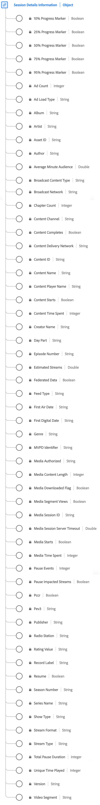

# [!UICONTROL Informações de Detalhes da Sessão] tipo de dados

[!UICONTROL Informações de Detalhes da Sessão] é um tipo de dados padrão do Experience Data Model (XDM) que rastreia dados relacionados às sessões de reprodução de mídia. O esquema abrange uma grande variedade de propriedades que fornecem insights sobre como o conteúdo de mídia é consumido. Use o [!UICONTROL Informações de Detalhes da Sessão] tipo de dados para capturar o engajamento do usuário registrando eventos de reprodução, interações de anúncios, marcadores de progresso, pausas e outras métricas. Isso oferece insights valiosos sobre o comportamento do usuário e os padrões de consumo de conteúdo.

+++Selecione para exibir um diagrama do tipo de dados Informações de Detalhes da Sessão.

+++

| Nome de exibição | Propriedade | Tipo de dados | Descrição |
| --- | --- | --- | --- |
| [!UICONTROL ID da sessão de mídia] | `ID` | string | A variável [!UICONTROL ID da sessão de mídia] O código identifica uma instância de um fluxo de conteúdo exclusivo para uma reprodução individual. |
| [!UICONTROL ID de conteúdo] | `name` | string | **Obrigatório** A variável [!UICONTROL ID de conteúdo] é um identificador exclusivo do conteúdo. Ela pode ser usada para vincular a outro setor ou IDs de CMS. |
| [!UICONTROL Nome do conteúdo] | `friendlyName` | String | A variável [!UICONTROL Nome do conteúdo] é o nome &quot;amigável&quot; (legível) do conteúdo. |
| [!UICONTROL Duração do conteúdo da mídia] | `length` | Número inteiro | **Obrigatório** A variável [!UICONTROL Duração do conteúdo da mídia] Contém o comprimento/tempo de execução do clipe - Esse é o comprimento máximo (ou duração) do conteúdo que está sendo consumido (em segundos). |
| [!UICONTROL Tipo de conteúdo da transmissão] | `contentType` | String | **Obrigatório** A variável [!UICONTROL Tipo de conteúdo da transmissão] da entrega do fluxo. Valores disponíveis por [!UICONTROL Tipo de fluxo] incluem: Áudio: &quot;song&quot;, &quot;podcast&quot;, &quot;audiobook&quot; e &quot;radio&quot;; Vídeo: &quot;VoD&quot;, &quot;Ao vivo&quot;, &quot;Linear&quot;, &quot;UGC&quot; e &quot;DVoD&quot;. Os clientes podem fornecer valores personalizados para esse parâmetro. |
| [!UICONTROL Nome do reprodutor de conteúdo] | `playerName` | String | **Obrigatório** O nome do reprodutor de conteúdo. |
| [!UICONTROL Canal de conteúdo] | `channel` | String | **Obrigatório** A variável [!UICONTROL Canal de conteúdo] é o canal de distribuição de onde o conteúdo foi reproduzido. |
| [!UICONTROL Versão] | `appVersion` | String | A versão do SDK usada pelo reprodutor. Isso pode ter qualquer valor personalizado que faça sentido para o reprodutor. |
| [!UICONTROL Nome da série] | `show` | String | O Nome Do Programa/Série. O Nome do programa é necessário somente se o programa for parte de uma série. |
| [!UICONTROL Número da temporada] | `season` | String | A variável [!UICONTROL Número da temporada] ao qual o programa pertence. Séries da temporada são necessárias somente se o programa for parte de uma série. |
| [!UICONTROL Número do episódio] | `episode` | String | O número do episódio. |
| [!UICONTROL ID do ativo] | `assetID` | String | A variável [!UICONTROL ID do ativo] é o identificador exclusivo de conteúdo do ativo de mídia, como o identificador de episódio da série de TV, o identificador de ativo do filme ou o identificador de evento em tempo real. Normalmente, essas IDs são derivadas de autoridades de metadados, como EIDR, TMS/Gracenote ou Rovi. Esses identificadores também podem ser de outros sistemas proprietários ou internos. |
| [!UICONTROL Gênero] | `genre` | String | O tipo ou agrupamento de conteúdo conforme definido pelo produtor do conteúdo. Os valores devem ser delimitados por vírgulas na implementação da variável. |
| [!UICONTROL Data da primeira exibição] | `firstAirDate` | String | A data em que o conteúdo foi exibido na televisão pela primeira vez. Qualquer formato de data é aceitável, mas o Adobe recomenda: DD/MM/AAAA. |
| [!UICONTROL Primeira data digital] | `firstDigitalDate` | String | A data quando o conteúdo foi exibido em qualquer canal ou plataforma digital pela primeira vez. Qualquer formato de data é aceitável, mas o Adobe recomenda: DD/MM/AAAA. |
| [!UICONTROL Valor de classificação] | `rating` | String | A classificação conforme definido pelas Diretrizes de controle parental da TV. |
| [!UICONTROL  Nome do criador] | `originator` | String | O nome do criador do conteúdo. |
| [!UICONTROL Rede de transmissão] | `network` | String | O nome da rede/canal. |
| [!UICONTROL Mostrar tipo] | `showType` | String | O tipo de conteúdo, por exemplo, trailer ou episódio completo. |
| [!UICONTROL Tipo de carregamento do anúncio] | `adLoad` | String | O tipo de anúncio carregado conforme definido pela representação interna de cada cliente. |
| [!UICONTROL Identificador MVPD] | `mvpd` | String | A variável [!UICONTROL Identificador MVPD] que foi fornecido por meio da autenticação Adobe. |
| [!UICONTROL Mídia autorizada] | `authorized` | String | Confirma se o usuário foi autorizado por meio da autenticação Adobe. |
| [!UICONTROL Parte do dia] | `dayPart` | String | Uma propriedade que define a hora do dia em que o conteúdo foi transmitido ou reproduzido. Isso pode ter qualquer valor definido, conforme necessário pelos clientes |
| [!UICONTROL Tipo de feed] | `feed` | String | O tipo de feed, que pode representar dados reais relacionados ao feed, como EAST HD ou SD, ou a fonte do feed, como um URL. |
| [!UICONTROL Formato de fluxo] | `streamFormat` | String | O formato do fluxo (HD, SD). |
| [!UICONTROL Retomar] | `hasResume` | Booleano | Marca cada reprodução que foi retomada após mais de 30 minutos de buffer, pausa ou período de paralisação. |
| [!UICONTROL Tipo de fluxo] | `streamType` | String | O tipo de fluxo de mídia. |
| [!UICONTROL Artista] | `artist` | String | O nome do artista do álbum ou grupo que grava a música ou o vídeo. |
| [!UICONTROL Álbum] | `album` | String | O nome do álbum ao qual pertence a gravação de música ou vídeo. |
| [!UICONTROL Gravadora] | `label` | String | O nome da gravadora. |
| [!UICONTROL Autor] | `author` | String | O nome do autor da mídia. |
| [!UICONTROL Estação de rádio] | `station` | String | O nome da estação de rádio na qual o áudio é reproduzido. |
| [!UICONTROL Publicador] | `publisher` | String | O nome do publicador do conteúdo de áudio. |
| [!UICONTROL Segmento de vídeo] | `segment` | String | O intervalo que descreve a parte do conteúdo que foi exibida em minutos. |
| [!UICONTROL Sinalizador de mídia baixada] | `isDownloaded` | Booleano | O fluxo foi reproduzido localmente no dispositivo após o download. |
| [!UICONTROL Dados federados] | `isFederated` | Booleano | [!UICONTROL Dados federados] é definido como verdadeiro quando a ocorrência é federada (ou seja, recebida pelo cliente como parte de um compartilhamento de dados federado, em vez de sua própria implementação). |
| [!UICONTROL Media Starts] | `isViewed` | Booleano | O evento de carregamento da mídia. Isso ocorre quando o visualizador seleciona o botão Reproduzir. Isso conta mesmo se houver anúncios antes da exibição, buffering, erros, etc. |
| [!UICONTROL Início do conteúdo] | `isPlayed` | Booleano | [!UICONTROL Início do conteúdo] torna-se verdadeiro quando o primeiro quadro da mídia é consumido. Se o usuário ignorar um anúncio, um buffering etc., não haverá [!UICONTROL Início do conteúdo] evento. |
| [!UICONTROL Conclusões de conteúdo] | `isCompleted` | Booleano | [!UICONTROL Conclusões de conteúdo] indica se um ativo de mídia cronometrado foi observado até o fim. Esse evento não significa necessariamente que o espectador assistiu ao vídeo inteiro; o espectador poderia ter pulado para frente. |
| [!UICONTROL Tempo gasto no conteúdo] | `timePlayed` | Número inteiro | [!UICONTROL Tempo gasto no conteúdo] soma a duração do evento (em segundos) para todos os eventos do tipo PLAY no conteúdo principal. |
| [!UICONTROL Tempo gasto com a mídia] | `totalTimePlayed` | Número inteiro | Descreve a quantidade total de tempo gasto por um usuário em um ativo de mídia temporizado específico, que inclui o tempo gasto assistindo a anúncios. |
| [!UICONTROL Tempo de reprodução exclusivo] | `uniqueTimePlayed` | Número inteiro | Descreve a soma dos intervalos únicos vistos por um usuário em um ativo de mídia cronometrado, ou seja, a duração dos intervalos de reprodução visualizados várias vezes são contados apenas uma vez. |
| [!UICONTROL Audiência média por minuto] | `averageMinuteAudience` | Número | Descreve o tempo médio de conteúdo gasto para um item de mídia específico, ou seja, o tempo total de conteúdo gasto dividido pela duração de todas as sessões de reprodução. |
| [!UICONTROL Contagem de anúncios] | `adCount` | Número inteiro | O número de anúncios iniciados durante a reprodução. |
| [!UICONTROL Contagem de capítulo] | `chapterCount` | Número inteiro | O número de capítulos iniciados durante a reprodução. |
| [!UICONTROL Marcador de progresso em 10%] | `hasProgress10` | Booleano | Indica se o indicador de reprodução passou o marcador de 10% da mídia com base na duração da transmissão. O marcador é contado apenas uma vez, mesmo se a busca for regressiva. Se a busca for para frente, os marcadores ignorados não serão contados.   |
| [!UICONTROL Marcador de progresso em 25%] | `hasProgress25` | Booleano | Indica se o indicador de reprodução passou o marcador de 25% da mídia com base na duração da transmissão. O marcador é contado apenas uma vez, mesmo se a busca for regressiva. Se a busca for para frente, os marcadores ignorados não serão contados.   |
| [!UICONTROL Marcador de progresso em 50%] | `hasProgress50` | Booleano | Indica se o indicador de reprodução passou o marcador de 50% da mídia com base na duração da transmissão. O marcador é contado apenas uma vez, mesmo se a busca for regressiva. Se a busca for para frente, os marcadores ignorados não serão contados.   |
| [!UICONTROL Marcador de progresso em 75%] | `hasProgress75` | Booleano | Indica se o indicador de reprodução passou o marcador de 75% da mídia com base na duração da transmissão. O marcador é contado apenas uma vez, mesmo se a busca for regressiva. Se a busca for para frente, os marcadores ignorados não serão contados.   |
| [!UICONTROL Marcador de progresso em 95%] | `hasProgress95` | Booleano | Indica se o indicador de reprodução passou o marcador de 95% da mídia com base na duração da transmissão. O marcador é contado apenas uma vez, mesmo se a busca for regressiva. Se a busca for para frente, os marcadores ignorados não serão contados.   |
| [!UICONTROL Fluxos estimados] | `estimatedStreams` | Número | O número estimado de fluxos de áudio ou vídeo para cada parte individual do conteúdo. |
| [!UICONTROL Fluxos impactados pela pausa] | `hasPauseImpactedStreams` | Booleano | Indica se uma ou mais pausas ocorreram durante a reprodução de um único item de mídia. |
| [!UICONTROL Pausar Eventos] | `pauseCount` | Número inteiro | [!UICONTROL Pausar Eventos] conta o número de períodos de pausa que ocorreram durante a reprodução. |
| [!UICONTROL Duração total da pausa] | `pauseTime` | Número inteiro | [!UICONTROL Duração total da pausa] descreve a duração em segundos em que a reprodução foi pausada pelo usuário. |
| [!UICONTROL Visualizações do segmento de mídia] | `hasSegmentView` | Booleano | [!UICONTROL Visualizações do segmento de mídia] indica quando pelo menos um quadro, não necessariamente o primeiro, foi visualizado. |
| [!UICONTROL Tempo limite do servidor de sessão de mídia] | `secondsSinceLastCall` | Número | A variável [!UICONTROL Tempo limite do servidor de sessão de mídia] indica o tempo, em segundos, decorrido entre a última interação conhecida do usuário e o momento em que a sessão foi encerrada. |
| [!UICONTROL Rede de entrega de conteúdo] | `cdn` | String | A variável [!UICONTROL Rede de entrega de conteúdo] do conteúdo reproduzido. |
| [!UICONTROL Pev3] | `pev3` | String | [!UICONTROL Pev3] é o tipo de fluxo de mídia usado para relatórios. |
| [!UICONTROL Pcr] | `pccr` | Booleano | [!UICONTROL Pcr] indica que um redirecionamento ocorreu. |

{style="table-layout:auto"}

Para obter mais informações sobre o grupo de campos, consulte o [repositório XDM público](https://github.com/adobe/xdm/blob/master/components/datatypes/sessiondetails.schema.json)
