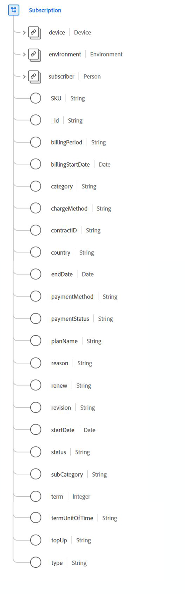

#  Tipo de dados da assinatura

 A assinatura é um tipo de dados padrão do Experience Data Model (XDM) que descreve direitos licenciados para software, serviços ou bens que são utilizados com base no tempo ou no uso.

 

| Propriedade | Tipo de dados | Descrição |
| --- | --- | --- |
| `device` | [[!UICONTROL Dispositivo]](./device.md) | Descreve detalhes sobre o dispositivo vinculado à assinatura. |
| `environment` | [[!UICONTROL Ambiente]](./environment.md) | Contém informações sobre a situação circundante em que ocorreu a observação do evento, detalhando especificamente informações transitórias, como a rede ou versões de software. |
| `subscriber` | [[!UICONTROL Pessoa]](./person.md) | Descreve uma pessoa individual. Isso também pode representar uma pessoa que age em várias funções, como um cliente, contato ou proprietário. |
| `SKU` | String | A unidade de manutenção de estoque (SKU), um identificador exclusivo para um produto. |
| `billingPeriod` | String | A duração entre os faturamentos. |
| `billingStartDate` | Data  | A data de vencimento da primeira fatura. O formato de data (sem hora) deve seguir o padrão [RFC 3339, seção 5.6](https://tools.ietf.org/html/rfc3339#section-5.6). |
| `category` | String | A principal categorização de nível superior desse tipo de assinatura. |
| `chargeMethod` | String | A forma como o faturamento é configurado para cobrar o cliente. |
| `contractID` | String | A ID exclusiva para o contrato que rege esta assinatura. |
| `country` | String | O país em que os termos do contrato e do contrato de assinatura estão enraizados. |
| `endDate` | Data  | A data em que o termo de assinatura atual termina. O formato de data (sem hora) deve seguir o padrão [RFC 3339, seção 5.6](https://tools.ietf.org/html/rfc3339#section-5.6). |
| `paymentMethod` | String | O método de pagamento para pagamentos recorrentes. |
| `paymentStatus` | String | A posição de pagamento da conta. |
| `planName` | String | O nome legível para a assinatura. |
| `reason` | String | A intenção geral do membro para o uso da assinatura. |
| `renew` | String | A forma acordada de a assinatura continuar após a data de término. |
| `revision` | String | A identificação entre assinaturas do mesmo nome e hierarquia de categoria. |
| `startDate` | Data  | A data em que a assinatura começa. O formato de data (sem hora) deve seguir o padrão [RFC 3339, seção 5.6](https://tools.ietf.org/html/rfc3339#section-5.6). |
| `status` | String | O status atual da assinatura. |
| `subCategory` | String | A subcategorização específica da assinatura. |
| `term` | Número inteiro | O valor numérico do termo de assinatura. |
| `termUnitOfTime` | String | A unidade de tempo para o período de termos. |
| `topUp` | String | Descreve os termos acordados para o consumo de aspectos de uma assinatura durante um período de faturamento. |
| `type` | String | O escopo do direito em relação ao número de pessoas abrangidas pela assinatura. |

{style=&quot;table-layout:auto&quot;}

Para obter mais detalhes sobre o tipo de dados, consulte o repositório XDM público:

* [Exemplo preenchido](https://github.com/adobe/xdm/blob/master/components/datatypes/industry-verticals/subscription.example.1.json)
* [Schema completo](https://github.com/adobe/xdm/blob/master/components/datatypes/industry-verticals/subscription.schema.json)
