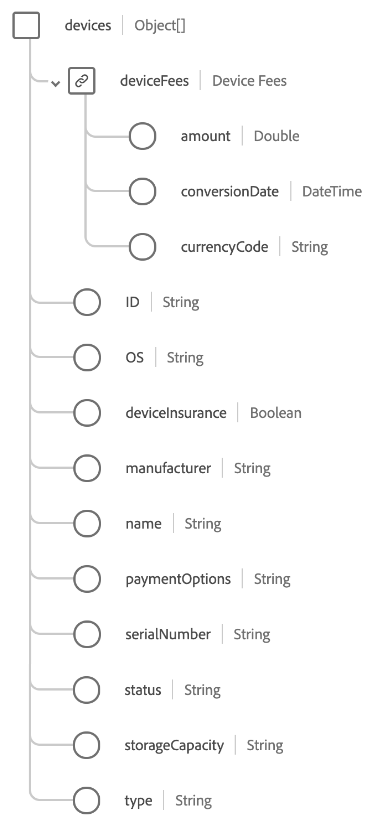

# [!UICONTROL Assinatura de serviço de telecomunicação] tipo de dados

[!UICONTROL Assinatura de serviço de telecomunicação] é um tipo de dados padrão do Experience Data Model (XDM) que descreve detalhes de tipos de assinatura de telecomunicações específicos, como internet, celular, mídia ou telefone fixo.

>[!NOTE]
>
>Este documento descreve o tipo de dados. Para o grupo de campos com o mesmo nome, consulte a variável [[!UICONTROL Assinatura de serviço de telecomunicação] guia de referência do grupo de campos](../field-groups/profile/telecom-subscription.md).
>
>Se você estiver descrevendo um tipo de assinatura que não esteja relacionado ao setor de telecomunicações, use o [[!UICONTROL Inscrição] tipo de dados](./subscription.md) em vez disso.

| Propriedade | Tipo de dados | Descrição |
| --- | --- | --- |
| `devices` | Matriz de objetos | Descreve uma lista de dispositivos e/ou acessórios associados ao plano. Consulte a [seção abaixo](#devices) para obter detalhes sobre a estrutura esperada de cada item da matriz. |
| `subscriber` | [[!UICONTROL Pessoa]](./person.md) | Descreve o proprietário da assinatura. |
| `ID` | String | Um identificador exclusivo para a instância de assinatura. |
| `billingPeriod` | String | A duração entre os faturamentos. |
| `billingStartDate` | Data | A data em que o período de faturamento começa. O formato de data (sem hora) deve seguir o [RFC 3339, seção 5.6](https://tools.ietf.org/html/rfc3339#section-5.6) padrão. |
| `chargeMethod` | String | A forma como o faturamento é configurado para cobrar do cliente. |
| `contractID` | String | O identificador exclusivo do contrato que rege esta assinatura. |
| `country` | String | O país em que os termos do contrato e do acordo de assinatura estão enraizados. |
| `endDate` | Data | A data em que termina o período de assinatura atual. O formato de data (sem hora) deve seguir o [RFC 3339, seção 5.6](https://tools.ietf.org/html/rfc3339#section-5.6) padrão. |
| `paymentDueDate` | Data | A data de vencimento do pagamento da assinatura. O formato de data (sem hora) deve seguir o [RFC 3339, seção 5.6](https://tools.ietf.org/html/rfc3339#section-5.6) padrão. |
| `paymentMethod` | String | O método de pagamento para pagamentos recorrentes. |
| `paymentStatus` | String | A posição de pagamento da conta. |
| `planName` | String | O nome legível da assinatura. |
| `reason` | String | A intenção geral que o membro tem para o uso da assinatura. |
| `renew` | String | A forma acordada para que a assinatura continue após a data de término. |
| `startDate` | Data | A data em que a assinatura começa. O formato de data (sem hora) deve seguir o [RFC 3339, seção 5.6](https://tools.ietf.org/html/rfc3339#section-5.6) padrão. |
| `status` | String | O status atual da assinatura. |
| `subscriptionCategory` | String | A categorização de nível superior principal desse tipo de assinatura. |
| `subscriptionSKU` | String | A unidade de manutenção de estoque (SKU) da assinatura. |
| `subscriptionSubCategory` | String | A subcategorização específica da assinatura. |
| `term` | Número inteiro | O valor numérico do termo de assinatura. |
| `termUnitOfTime` | String | A unidade de tempo para o período do prazo. |
| `topUp` | String | Descreve os termos acordados sobre como os aspectos consumíveis de uma assinatura são recomprados durante um período de faturamento. |
| `type` | String | O escopo do direito em relação a quantas pessoas estão cobertas pela assinatura. |

{style="table-layout:auto"}

Para obter mais detalhes sobre o tipo de dados, consulte o repositório XDM público:

* [Exemplo preenchido](https://github.com/adobe/xdm/blob/master/components/datatypes/industry-verticals/subscription.example.1.json)
* [Esquema completo](https://github.com/adobe/xdm/blob/master/components/datatypes/industry-verticals/subscription.schema.json)

## `devices` {#devices}

`devices` é uma matriz de objetos, com cada objeto descrevendo um dispositivo ou acessório associado à assinatura.

| Propriedade | Tipo de dados | Descrição |
| --- | --- | --- |
| `deviceFees` | Objeto | Um objeto que captura todas as taxas de dispositivo para itens como roteadores, modems e receptores. Espera as seguintes propriedades:<ul><li>`amount`: O valor monetário conforme representado pela variável `currencyCode`.</li><li>`conversionDate`: A data em que a conversão de moeda foi feita.</li><li>`currencyCode`: A variável [ISO 4217](https://www.iso.org/iso-4217-currency-codes.html) código de moeda para o `amount`.</li></ul> |
| `ID` | String | Um identificador exclusivo para o dispositivo. |
| `OS` | String | O sistema operacional do dispositivo. |
| `deviceInsurance` | String | Indica se um cliente optou pelo seguro para este dispositivo. |
| `manufacturer` | String | O fabricante do dispositivo. |
| `name` | String | Um nome para o dispositivo. |
| `paymentOptions` | String | Indica se o dispositivo será pago em prestações ou o preço total de varejo. |
| `serialNumber` | String | O número de série do dispositivo. |
| `status` | String | O status do dispositivo. |
| `storageCapacity` | String | A capacidade de armazenamento do dispositivo. |
| `type` | String | O tipo de dispositivo. |

{style="table-layout:auto"}
