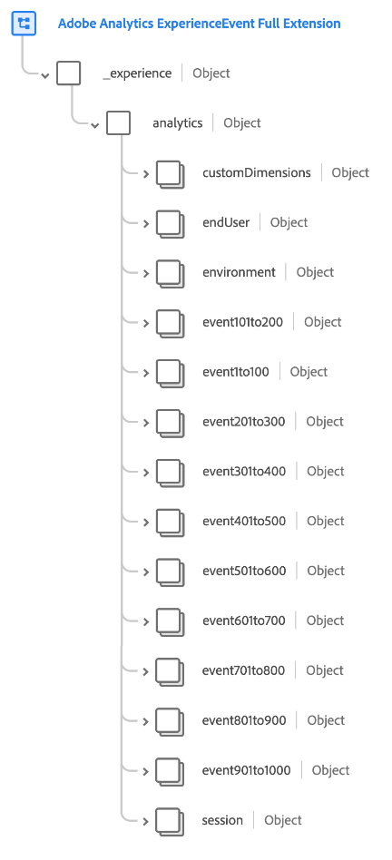

# [!UICONTROL Extensão completa do Adobe Analytics ExperienceEvent] grupo de campos de esquema

[!UICONTROL Extensão completa do Adobe Analytics ExperienceEvent] é um grupo de campos de esquema padrão para a variável [[!DNL XDM ExperienceEvent] classe](../../classes/experienceevent.md), que captura métricas comuns coletadas pelo Adobe Analytics.

Este documento descreve a estrutura e o caso de uso do grupo de campos de extensão do Analytics.

>[!NOTE]
>
>Devido ao tamanho e à quantidade de elementos repetidos neste grupo de campos, muitos dos campos mostrados neste guia foram recolhidos para economizar espaço. Para explorar toda a estrutura desse grupo de campos, você pode [procure na interface do usuário da plataforma ](../../ui/explore.md) ou exibir o schema completo no [repositório XDM público](https://github.com/adobe/xdm/blob/master/extensions/adobe/experience/analytics/experienceevent-all.schema.json).

## Estrutura do grupo de campos

O grupo de campos fornece um único `_experience` objeto para um schema, que contém um único `analytics` objeto.

| Propriedade | Tipo de dados | Descrição |
| --- | --- | --- |
| `customDimensions` | Objeto | Captura dimensões personalizadas que são rastreadas pelo Analytics. Consulte a [subseção abaixo](#custom-dimensions) para obter mais informações sobre o conteúdo desse objeto. |
| `endUser` | Objeto | Captura os detalhes de interação da Web para o usuário final que acionou o evento. Consulte a [subseção abaixo](#end-user) para obter mais informações sobre o conteúdo desse objeto. |
| `environment` | Objeto | Captura informações sobre o navegador e o sistema operacional que acionaram o evento. Consulte a [subseção abaixo](#environment) para obter mais informações sobre o conteúdo desse objeto. |
| `event1to100`  `event101to200`  `event201to300`  `event301to400`  `event401to500`  `event501to100`  `event601to700`  `event701to800`  `event801to900`  `event901to1000` | Objeto | O grupo de campos fornece campos de objetos para capturar até 1000 eventos personalizados. Consulte a [subseção abaixo](#events) para obter mais informações sobre esses campos. |
| `session` | Objeto | Captura informações sobre a sessão que acionou o evento. Consulte a [subseção abaixo](#session) para obter mais informações sobre o conteúdo desse objeto. |

{style=&quot;table-layout:auto&quot;}

## `customDimensions` {#custom-dimensions}

`customDimensions` captura personalizada [dimensões](https://experienceleague.adobe.com/docs/analytics/components/dimensions/overview.html?lang=pt-BR) que são rastreadas pelo Analytics.

| Propriedade | Tipo de dados | Descrição |
| --- | --- | --- |
| `eVars` | Objeto | Um objeto que captura até 250 variáveis de conversão ([eVars](https://experienceleague.adobe.com/docs/analytics/components/dimensions/evar.html?lang=pt-BR)). As propriedades desse objeto são destacadas `eVar1` para `eVar250` e aceitar somente sequências de caracteres para seu tipo de dados. |
| `hierarchies` | Objeto | Um objeto que captura até cinco variáveis de hierarquia personalizadas ([hiers](https://experienceleague.adobe.com/docs/analytics/implementation/vars/page-vars/hier.html?lang=pt-BR)). As propriedades desse objeto são destacadas `hier1` para `hier5`, que são objetos com as seguintes subpropriedades:<ul><li>`delimiter`: O delimitador original usado para gerar a lista fornecida em `values`.</li><li>`values`: Uma lista delimitada de nomes de nível de hierarquia, representada como uma string.</li></ul> |
| `listProps` | Objeto | Um objeto que captura até 75 [propriedades de lista](https://experienceleague.adobe.com/docs/analytics/implementation/vars/page-vars/prop.html#list-props). As propriedades desse objeto são destacadas `prop1` para `prop75`, que são objetos com as seguintes subpropriedades:<ul><li>`delimiter`: O delimitador original usado para gerar a lista fornecida em `values`.</li><li>`values`: Uma lista delimitada de valores para a prop, representada como uma string.</li></ul> |
| `lists` | Objeto | Um objeto que captura até três [listas](https://experienceleague.adobe.com/docs/analytics/implementation/vars/page-vars/list.html). As propriedades desse objeto são destacadas `list1` para `list3`. Cada uma dessas propriedades contém um único `list` matriz de [[!UICONTROL Par. Valor Chave]](../../data-types/key-value-pair.md) tipos de dados. |
| `props` | Objeto | Um objeto que captura até 75 [props](https://experienceleague.adobe.com/docs/analytics/implementation/vars/page-vars/prop.html). As propriedades desse objeto são destacadas `prop1` para `prop75` e aceitar somente sequências de caracteres para seu tipo de dados. |
| `postalCode` | String | Um CEP ou código postal fornecido pelo cliente. |
| `stateProvince` | String | Um estado fornecido pelo cliente ou um local de província. |

{style=&quot;table-layout:auto&quot;}

## `endUser` {#end-user}

`endUser` captura os detalhes de interação da Web para o usuário final que acionou o evento.

| Propriedade | Tipo de dados | Descrição |
| --- | --- | --- |
| `firstWeb` | [[!UICONTROL Informações da Web]](../../data-types/web-information.md) | As informações relacionadas à página da Web, link e referenciador do primeiro Evento de experiência para esse usuário final. |
| `firstTimestamp` | Número inteiro | Um carimbo de data e hora Unix para o primeiro ExperienceEvent para esse usuário final. |

## `environment` {#environment}

`environment` O captura informações sobre o navegador e o sistema operacional que acionaram o evento.

| Propriedade | Tipo de dados | Descrição |
| --- | --- | --- |
| `browserIDStr` | String | O identificador do Adobe Analytics para o navegador usado (caso contrário, é conhecido como [dimensão do tipo de navegador](https://experienceleague.adobe.com/docs/analytics/components/dimensions/browser-type.html)). |
| `operatingSystemIDStr` | String | O identificador Adobe Analytics do sistema operacional usado (caso contrário, é conhecido como [dimensão de tipo de sistema operacional](https://experienceleague.adobe.com/docs/analytics/components/dimensions/operating-system-types.html)). |

## Campos de evento personalizados {#events}

O grupo de campos da extensão do Analytics fornece dez campos de objeto que capturam até 100 [métricas de evento personalizadas](https://experienceleague.adobe.com/docs/analytics/components/metrics/custom-events.html) cada, para um total de 1000 para o grupo de campos.

Cada objeto de evento de nível superior contém os objetos de evento individuais para seu respectivo intervalo. Por exemplo, `event101to200` contém os eventos marcados de `event101` para `event200`.

Cada objeto par usa a variável [[!UICONTROL Medição]](../../data-types/measure.md) tipo de dados, fornecendo um identificador exclusivo e um valor quantificável.

## `session` {#session}

`session` captura informações sobre a sessão que acionou o evento.

| Propriedade | Tipo de dados | Descrição |
| --- | --- | --- |
| `search` | [[!UICONTROL Pesquisa]](../../data-types/search.md) | Captura informações relacionadas à pesquisa da Web ou móvel para a entrada da sessão. |
| `web` | [[!UICONTROL Informações da Web]](../../data-types/web-information.md) | Captura informações sobre cliques em links, detalhes da página da Web, informações do referenciador e detalhes do navegador para a entrada da sessão. |
| `depth` | Número inteiro | A profundidade da sessão atual (como o número da página) para o usuário final. |
| `num` | Número inteiro | O número da sessão atual para o usuário final. |
| `timestamp` | Número inteiro | Um carimbo de data e hora Unix para a entrada da sessão. |

## Próximas etapas

Este documento cobriu a estrutura e o caso de uso do grupo de campos de extensão do Analytics. Para obter mais detalhes sobre o próprio grupo de campos, consulte [repositório XDM público](https://github.com/adobe/xdm/blob/master/extensions/adobe/experience/analytics/experienceevent-all.schema.json).

Se você estiver usando esse grupo de campos para coletar dados do Analytics usando o SDK da Web da Adobe Experience Platform, consulte o guia em [configuração de um armazenamento de dados](../../../edge/datastreams/overview.md) para saber como mapear dados para XDM no lado do servidor.
