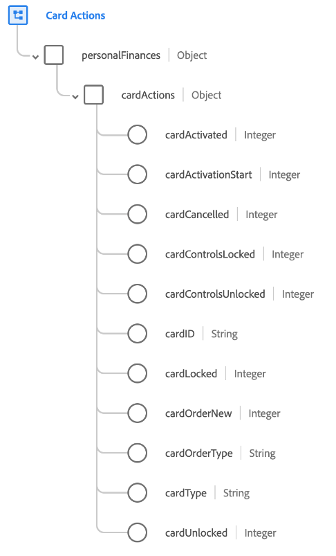

# [!UICONTROL Ações do cartão] grupo de campos de esquema

[!UICONTROL Ações de Cartão] é um grupo de campos de esquema padrão para a [[!DNL XDM ExperienceEvent] classe](../../classes/experienceevent.md). O grupo de campos fornece um único campo `personalFinances.cardActions` para um esquema, que captura detalhes sobre uma ação do cartão, como tipo de cartão, status de ativação e status de bloqueio.

| Propriedade | Tipo de dados | Descrição |
| --- | --- | --- |
| `cardActivated` | Número inteiro | Rastreia quando o cartão é ativado com sucesso. |
| `cardActivationStart` | Número inteiro | Rastreia quando o processo de ativação do cartão foi iniciado. |
| `cardCancelled` | Número inteiro | Rastreia quando um cartão é cancelado. |
| `cardControlsLocked` | Número inteiro | Rastreia quando os controles de um cartão foram bloqueados. |
| `cardControlsUnlocked` | Número inteiro | Rastreia quando os controles de um cartão foram desbloqueados. |
| `cardID` | String | O identificador do cartão que está sendo ativado. Esse valor pode ser diferente do número do cartão. |
| `cardLocked` | Número inteiro | Rastreia quando um cartão é bloqueado. |
| `cardOrderNew` | Número inteiro | Rastreia quando um cartão é solicitado. |
| `cardOrderType` | String | O tipo de ordem de cartão associado a um evento de ordem de cartão. |
| `cardType` | String | O tipo de cartão. |
| `cardUnlocked` | Número inteiro | Rastreia quando um cartão foi desbloqueado. |

{style="table-layout:auto"}

Para obter mais detalhes sobre o grupo de campos, consulte o [repositório XDM público](https://github.com/adobe/xdm/blob/master/docs/reference/fieldgroups/experience-event/experienceevent-card-actions.schema.json).
