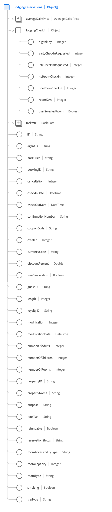

# [!UICONTROL Carregando grupo de campos ] Reservationschema

[!UICONTROL A ] Reserva de Carregamento é um grupo de campo de esquema padrão para a classe  [[!DNL XDM ExperienceEvent] ](../../classes/experienceevent.md) usada para capturar informações relacionadas a uma reserva de hospedagem.

O grupo de campos é uma extensão do grupo de campos [!UICONTROL Detalhes da Reserva] e contém todos os mesmos campos em um único campo do tipo de objeto, `reservations`. Além desses campos genéricos, [!UICONTROL Loading Reservation] também inclui a matriz `lodgingReservations`. Essa matriz de objetos é usada para descrever uma ou mais reservas com propriedades exclusivas para hospedagem.

>[!NOTE]
>
>Este documento aborda os detalhes da matriz `lodgingReservations`. Para obter informações sobre os outros campos fornecidos no objeto `reservations`, consulte a [[!UICONTROL Referência do grupo de campos Detalhes da Reserva]](./reservation-details.md).

## `lodgingReservations`

`lodgingReservations` é uma matriz de objetos que representa uma lista de reservas de hospedagem. Se um evento de reserva envolver reservas em vários hotéis diferentes ao longo da rota de uma viagem, por exemplo, essas reservas podem ser listadas como objetos individuais em `lodgingReservations` para um único evento.

A estrutura de cada objeto fornecido em `lodgingReservations` é fornecida abaixo.

| Propriedade | Tipo de dados | Descrição |
| --- | --- | --- |
| `averageDailyPrice` | [[!UICONTROL Moeda]](../../data-types/currency.md) | O preço médio diário do quarto de hotel. |
| `lodgingCheckIn` | Objeto | Um objeto que descreve os detalhes do check-in do depósito. Inclui os seguintes valores:<ul><li>`digitalKey`: (Número inteiro) Indica quando um convidado seleciona o uso de uma chave digital ao fazer o check-in.</li><li>`earlyCheckInRequested`: (Número inteiro) Indica quando um convidado solicita o check-in antes do horário normal de check-in.</li><li>`lateCheckInRequested`: (Número inteiro) Indica quando um convidado solicita o check-in mais tarde do que as horas normais de check-in.</li><li>`noRoomCheckIn`: (Número inteiro) Esse valor é capturado quando um convidado termina de fazer check-in quando não há salas disponíveis no momento.</li><li>`oneRoomCheckIn`: (Número inteiro) Esse valor é capturado quando um convidado termina de fazer check-in quando há apenas um quarto disponível no momento.</li><li>`roomKeys`: (Número inteiro) O número de chaves de sala padrão fornecidas no check-in.</li><li>`userSelectedRoom`: (Booleano) Indica se o convidado selecionou o quarto no check-in.</li></ul> |
| `rackrate` | [[!UICONTROL Moeda]](../../data-types/currency.md) | O custo de uma reserva de um mesmo dia sem acordos de reserva prévios. |
| `ID` | String | O número ou identificador da reserva. |
| `agentID` | String | A ID do agente associada à reserva do hotel. |
| `basePrice` | String | O preço de base antes da adição de quaisquer descontos. |
| `bookingID` | String | A ID de reserva associada à reserva do hotel. |
| `cancellation` | Número inteiro | Esse valor é capturado quando uma reserva é cancelada. |
| `checkInDate` | DateTime | A data de check-in da reserva de quarto. |
| `checkOutDate` | DateTime | A data de check-out da reserva de quarto. |
| `confirmationNumber` | String | O número ou identificador de confirmação da reserva. |
| `couponCode` | String | Um código de cupom associado à reserva do hotel. |
| `created` | Número inteiro | Esse valor é capturado quando uma reserva é criada. |
| `currencyCode` | String | O código monetário ISO 4217 usado para fazer a compra. |
| `discountPercent` | Duplo | A porcentagem de desconto associada à reserva. |
| `freeCancelation` | Booleano | Indica se a sala tem uma política de cancelamento gratuita. |
| `guestID` | String | A ID de convidado associada à reserva do hotel. |
| `length` | Número inteiro | O número total de dias para a reserva. |
| `loyaltyID` | String | A ID do programa de fidelidade para o convidado listado na reserva. |
| `modification` | Número inteiro | Esse valor é capturado quando uma reserva é modificada. |
| `modificationDate` | DateTime | A hora em que a reserva foi modificada pela última vez. |
| `numberOfAdults` | Número inteiro | O número de adultos associado à reserva. |
| `numberOfChildren` | Número inteiro | O número de filhos associados à reserva. |
| `numberOfRooms` | Número inteiro | O número de salas associadas à reserva. |
| `propertyID` | String | Um identificador do hotel ou recurso para a reserva. |
| `propertyName` | String | O nome do hotel ou resort para a reserva. |
| `purpose` | String | A finalidade da reserva, normalmente comercial ou pessoal. |
| `ratePlan` | String | O acordo de tarifas em que o quarto foi vendido. |
| `refundable` | Booleano | Indica se a sala é reembolsável. |
| `reservationStatus` | String | O status da reserva. |
| `roomAccessibilityType` | String | O tipo de acessibilidade da sala, como mobilidade, audição ou outro. |
| `roomCapacity` | Número inteiro | O número de pessoas que o quarto de hotel contém. |
| `roomType` | String | O tipo de espaço reservado. |
| `smoking` | Booleano | Indica se a sala permite fumar. |
| `tripType` | String | Indica se a reserva é para uma viagem unidirecional, uma viagem de ida e volta ou uma viagem multicidade. |

{style=&quot;table-layout:auto&quot;}

Para obter mais detalhes sobre o grupo de campos, consulte o repositório XDM público:

* [Exemplo preenchido](https://github.com/adobe/xdm/blob/master/components/fieldgroups/experience-event/industry-verticals/experienceevent-lodging-reservation.example.1.json)
* [Schema completo](https://github.com/adobe/xdm/blob/master/components/fieldgroups/experience-event/industry-verticals/experienceevent-lodging-reservation.schema.json)
