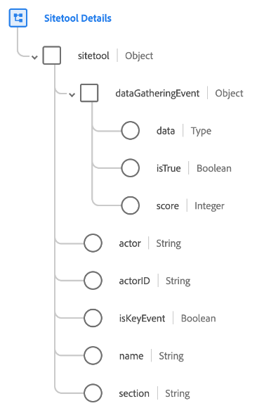

# [!UICONTROL Detalhes do sitetool] grupo de campos de esquema

[!UICONTROL Detalhes do sitetool] é um grupo de campos de esquema padrão para o [[!DNL XDM ExperienceEvent] classe](../../classes/experienceevent.md). O grupo de campos fornece um único `sitetool` para um esquema, que captura informações coletadas por uma ferramenta de site.

| Propriedade | Tipo de dados | Descrição |
| --- | --- | --- |
| `dataGatheringEvent` | Objeto | Indica se esse evento é um evento de coleta de dados juntamente com outros detalhes relacionados. Contém as seguintes propriedades:<ul><li>`data`: (Mapa) contém os dados JSON coletados e enviados como parte do questionário, pesquisa ou evento de envio de pesquisa.</li><li>`isTrue`: (booleano) indica se esse evento é um evento de coleta de dados, como um questionário, uma pesquisa ou uma pesquisa.</li><li>`score`: (número inteiro) a pontuação garantida pelo ator com base nas respostas do evento.</li></ul> |
| `actor` | String | Uma pessoa/membro que executou a ação. |
| `actorID` | String | Um identificador exclusivo da pessoa/membro que executou a ação. |
| `isKeyEvent` | Booleano | Indica se este evento é um evento chave. |
| `name` | String | O nome da ferramenta de site, como chatbot, pesquisa e assim por diante. |
| `section` | String | A seção relevante da ferramenta de site como main ou sub. |

{style="table-layout:auto"}

Para obter mais informações sobre o grupo de campos, consulte o [repositório XDM público](https://github.com/adobe/xdm/blob/master/components/fieldgroups/experience-event/industry-verticals/experienceevent-healthcare-sitetool.schema.json).
