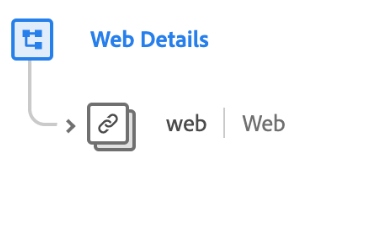

# [!UICONTROL Detalhes da Web] grupo de campos de esquema

>[!NOTE]
>
>Os nomes de vários grupos de campos de esquema foram alterados. Consulte o documento em [atualizações de nome do grupo de campos](../name-updates.md) para obter mais informações.

[!UICONTROL Detalhes da Web] é um grupo de campos de esquema padrão para a variável [[!DNL XDM ExperienceEvent] classe](../../classes/experienceevent.md), usado para descrever informações relacionadas a eventos de detalhes da Web, como interação, detalhes da página e referenciador.

| Propriedade | Tipo de dados | Descrição |
| --- | --- | --- |
| `web` | [Informações da Web](../../data-types/web-information.md) | Descreve cliques em links, detalhes da página da Web, informações do referenciador e detalhes do navegador. |

{style=&quot;table-layout:auto&quot;}

Para obter mais detalhes sobre o grupo de campos, consulte o repositório XDM público:

* [Exemplo preenchido](https://github.com/adobe/xdm/blob/master/components/fieldgroups/experience-event/experienceevent-web.example.1.json)
* [Schema completo](https://github.com/adobe/xdm/blob/master/components/fieldgroups/experience-event/experienceevent-web.schema.json)
