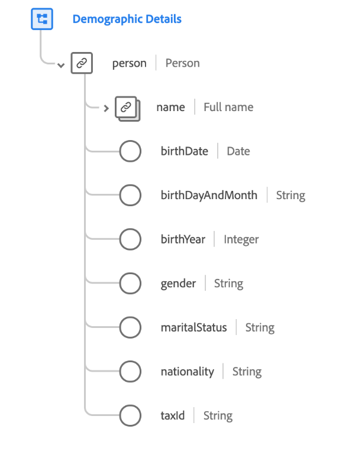

# [!UICONTROL Grupo de campos ] Detalhes demográficos

>[!NOTE]
>
>Os nomes de vários grupos de campos de esquema foram alterados. Consulte o documento em [atualizações do nome do grupo de campos](../name-updates.md) para obter mais informações.

[!UICONTROL Detalhes demográficos ] são um grupo de campo de esquema padrão para a  [[!DNL XDM Individual Profile] classe](../../classes/individual-profile.md). O grupo de campos fornece um objeto de nível raiz `person`, cujos subcampos descrevem informações sobre uma pessoa individual.

| Propriedade | Tipo de dados | Descrição |
| --- | --- | --- |
| `person.name` | [Nome da pessoa](../../data-types/person-name.md) | Um objeto cujos subcampos descrevem vários elementos do nome de uma pessoa. |
| `person.birthDate` | Data  | A data completa em que uma pessoa nasceu, na forma de um carimbo de data e hora ISO 8601. |
| `person.birthDayAndMonth` | String | O dia e o mês em que uma pessoa nasceu, no formato MM-DD. Este campo deve ser usado quando o dia e o mês de nascimento de uma pessoa forem conhecidos, mas não o ano. |
| `person.birthYear` | Número inteiro | O ano em que uma pessoa nasceu, incluindo o século (como 1989). Este campo deve ser usado quando somente a idade da pessoa é conhecida, não a data de nascimento completa. |
| `person.gender` | String | A identidade de gênero da pessoa. |
| `person.martialStatus` | String | Descreve a relação de uma pessoa com uma outra significativa. |
| `person.nationality` | String | A relação jurídica entre uma pessoa e seu estado representado usando o código alfa-2 da ISO 3166-1. |
| `person.taxId` | String | A ID fiscal/fiscal da pessoa, como a TIN nos EUA ou a CIF/NIF em Espanha. |

{style=&quot;table-layout:auto&quot;}

Para obter mais detalhes sobre o grupo de campos, consulte o repositório XDM público:

* [Exemplo preenchido](https://github.com/adobe/xdm/blob/master/components/fieldgroups/profile/profile-person-details.example.1.json)
* [Schema completo](https://github.com/adobe/xdm/blob/master/components/fieldgroups/profile/profile-person-details.schema.json)