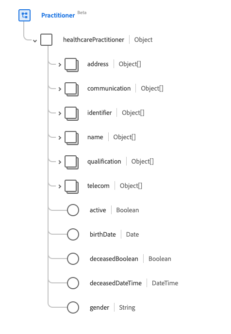

# Grupo de campos de esquema [!UICONTROL Profissional]

[!UICONTROL Profissional] é um grupo de campos de esquema padrão para [[!DNL XDM Individual Profile] classe](../../classes/individual-profile.md) e [[!DNL Provider class]](../../classes/provider.md). Ele fornece um único campo de tipo de objeto `healthcarePractioner` que contém informações sobre uma pessoa que está direta ou indiretamente envolvida no provisionamento de serviços de saúde ou relacionados.

| Nome de exibição | Propriedade | Tipo de dados | Descrição |
| --- | --- | --- | --- |
| [!UICONTROL Endereço] | `address` | Matriz de [[!UICONTROL Endereço]](../../data-types/healthcare/address.md) | Endereço(s) do profissional que se encontram fora do seu local de trabalho, tal como endereço residencial. |
| [!UICONTROL Comunicação] | `communication` | Matriz de objeto | Um idioma que pode ser usado para se comunicar com o profissional. Consulte a [seção abaixo](#communication) para obter mais informações |
| [!UICONTROL Identificador] | `identifier` | Matriz de [[!UICONTROL Identificador]](../../data-types/healthcare/identifier.md) | Um identificador que se aplica a esta pessoa nesta função. |
| [!UICONTROL Nome] | `name` | Matriz de [[!UICONTROL Nome Humano]](../../data-types/healthcare/human-name.md) | O(s) nome(s) associado(s) ao profissional. |
| [!UICONTROL Qualificação] | `qualification` | Matriz de objeto | As qualificações oficiais, certificações, acreditações, formação, licenças ou similares que autorizam ou de outra forma pertencem à prestação de cuidados pelo profissional. Consulte a [seção abaixo](#qualification) para obter mais informações. |
| [!UICONTROL Detalhes de contato] | `telecom` | Matriz de [[!UICONTROL Ponto de Contato]](../../data-types/healthcare/contact-point.md) | Os detalhes de contato do profissional. |
| [!UICONTROL Ativo] | `active` | Booleano | Indica se o registro de profissionais está em uso ativo. |
| [!UICONTROL Data de nascimento] | `birthDate` | Data | A data de nascimento do profissional. |
| [!UICONTROL Indicador de Falecimento] | `deceasedBoolean` | Booleano | Indica se o profissional faleceu. |
| [!UICONTROL Data e hora da morte] | `deceasedDateTime` | DateTime | A data e hora da morte do profissional. |
| [!UICONTROL Gênero] | `gender` | String | A identidade de gênero da pessoa. O valor dessa propriedade deve ser igual a um dos seguintes valores de enumeração conhecidos. <li> `female` </li> <li> `male` </li> <li> `other` </li> <li> `unknown`</li> |

{style="table-layout:auto"}

Para obter mais detalhes sobre o grupo de campos, consulte o repositório XDM público:

* [Exemplo preenchido](https://github.com/adobe/xdm/blob/master/extensions/industry/healthcare/fhir/fieldgroups/practitioner.example.1.json)
* [Esquema completo](https://github.com/adobe/xdm/blob/master/extensions/industry/healthcare/fhir/fieldgroups/practitioner.schema.json)

## `communication` {#communication}

`communication` é fornecido como uma matriz de objetos. A estrutura de cada objeto é descrita abaixo.

| Nome de exibição | Propriedade | Tipo de dados | Descrição |
| --- | --- | --- | --- |
| [!UICONTROL Idioma] | `language` | [[!UICONTROL Conceito codificável]](../../data-types/healthcare/codeable-concept.md) | Idioma que pode ser usado para comunicar com a pessoa sobre sua saúde. |
| [!UICONTROL É o Idioma Preferencial] | `preferred` | Booleano | Indica se o idioma é o idioma preferido ou não. |

{style="table-layout:auto"}

## `qualification` {#qualification}

`qualification` é fornecido como uma matriz de objetos. A estrutura de cada objeto é descrita abaixo.

| Nome de exibição | Propriedade | Tipo de dados | Descrição |
| --- | --- | --- | --- |
| [!UICONTROL Código] | `code` | [[!UICONTROL Conceito codificável]](../../data-types/healthcare/codeable-concept.md) | A representação codificada da qualificação. |
| [!UICONTROL Identificador] | `identifier` | Matriz de [[!UICONTROL Identificador]](../../data-types/healthcare/identifier.md) | Um identificador para a qualificação. |
| [!UICONTROL Emissor] | `issuer` | [[!UICONTROL Referência]](../../data-types/healthcare/reference.md) | A organização que regulamenta e emite a qualificação. |
| [!UICONTROL Período] | `period` | [[!UICONTROL Período]](../../data-types/healthcare/period.md) | O período durante o qual a qualificação é válida. |

{style="table-layout:auto"}
