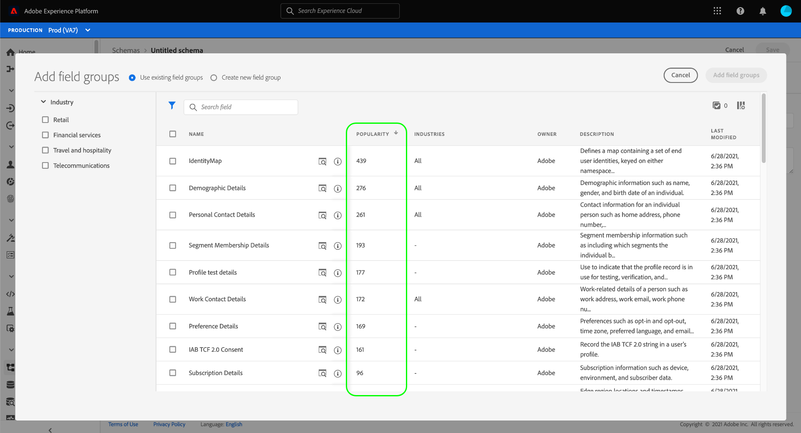

# Visão geral do sistema XDM

A padronização e a interoperabilidade são conceitos-chave por trás do Adobe Experience Platform. [!DNL Experience Data Model] O (XDM), impulsionado pelo Adobe, é um esforço para padronizar os dados de experiência do cliente e definir esquemas para o gerenciamento da experiência do cliente.

O XDM é uma especificação publicamente documentada projetada para melhorar o poder das experiências digitais. Ele fornece estruturas e definições comuns que permitem que qualquer aplicativo use para se comunicar com os serviços da plataforma. Ao seguir os padrões XDM, todos os dados de experiência do cliente podem ser incorporados a uma representação comum que pode fornecer insights de uma maneira mais rápida e integrada. Você pode obter informações valiosas das ações do cliente, definir públicos-alvo do cliente por meio de segmentos e expressar atributos do cliente para fins de personalização.

O XDM é a estrutura fundamental que permite ao Adobe Experience Cloud, viabilizado por Experience Platform, enviar a mensagem certa para a pessoa certa, no canal certo, no momento certo. A metodologia na qual o Experience Platform é construído, o Sistema XDM, opera [!DNL Experience Data Model] esquemas para uso pelos serviços da plataforma.

Este documento fornece uma visão geral da função do Sistema XDM no Experience Platform.

## Esquemas XDM

A Experience Platform utiliza esquemas para descrever a estrutura dos dados de forma consistente e reutilizável. Ao definir os dados de forma consistente em todos os sistemas, fica mais fácil manter o significado e, portanto, obter valor dos dados.

Para que os dados possam ser assimilados na Platform, um schema deve ser composto para descrever a estrutura dos dados e fornecer restrições ao tipo de dados que pode ser contido em cada campo. Os esquemas consistem em uma classe base e zero ou mais grupos de campos de esquema.

Para obter mais informações sobre o modelo de composição de schema, incluindo princípios de design e práticas recomendadas, consulte o [noções básicas da composição do schema](schema/composition.md).

### Componentes padrão do XDM

O XDM fornece uma coleção robusta de grupos de campo padrão e tipos de dados, que são destinados a capturar conceitos e casos de uso comuns em diferentes setores. O Experience Platform permite filtrar esses componentes por setor, permitindo que você construa de forma rápida e segura schemas que melhor atendam às suas necessidades comerciais específicas.

Ao construir schemas na interface do usuário do Experience Platform, os grupos de campos listados são mostrados com uma métrica de popularidade. Essa métrica é determinada pela frequência com que outros usuários da plataforma empregam o grupo de campos em seus esquemas. Quanto maior o número, mais popular será o grupo de campos. Por padrão, os resultados são exibidos do mais popular para o menos popular, mantendo você informado sobre as tendências de modelagem de dados em seu setor.

### [!DNL Schema Library]

O Experience Platform fornece uma interface de usuário e uma RESTful API a partir da qual você pode visualizar e gerenciar todos os recursos relacionados ao esquema no Experience Platform **[!DNL Schema Library]**. O [!DNL Schema Library] contém componentes XDM padrão disponibilizados para você pelo Adobe, bem como recursos de parceiros e fornecedores do Experience Platform cujos aplicativos você usa.

Usar o [!DNL Schema Registry API] ou [!UICONTROL Esquemas] na interface do usuário da plataforma, também é possível criar e gerenciar novos esquemas e recursos exclusivos de sua organização.

Para obter mais informações sobre como gerenciar e interagir com schemas no Platform, consulte a seguinte documentação:

* [Guia da interface do usuário do XDM](./ui/overview.md)
* [Guia da API do Registro de Schema](./api/overview.md)

## Comportamentos de dados no sistema XDM {#data-behaviors}

>[!CONTEXTUALHELP]
>id="platform_schemas_behavior"
>title="Comportamentos de dados"
>abstract="Os dados destinados ao uso no Experience Platform são agrupados em três tipos de comportamento: registro, série de tempo e ad hoc. Os esquemas de registro fornecem informações sobre os atributos de um assunto, enquanto os esquemas de séries de tempo capturam um instantâneo do sistema no momento em que uma ação foi tomada. Os esquemas ad hoc capturam campos que são namespaces para uso somente por um único conjunto de dados. Consulte a documentação para obter mais informações sobre comportamentos de dados no Platform."

Os dados destinados ao uso no Experience Platform são agrupados em três tipos de comportamento:

* **Registro**: Fornece informações sobre os atributos de um assunto. Um assunto pode ser uma organização ou um indivíduo.
* **Série cronológica**: Fornece um instantâneo do sistema no momento em que uma ação foi tomada direta ou indiretamente por um titular de registro.
* **Ad-hoc**: Captura campos com namespaces para uso somente por um único conjunto de dados. Esquemas ad-hoc são usados em vários workflows de assimilação de dados para o Experience Platform, incluindo a assimilação de arquivos CSV e a criação de determinados tipos de conexões de origem.

Todos os esquemas XDM descrevem dados que podem ser categorizados como registro ou série de tempo. O comportamento de dados de um schema é definido pela classe do schema, que é atribuída a um schema quando ele é criado pela primeira vez. As classes XDM descrevem o menor número de propriedades que um schema deve conter para representar um comportamento de dados específico.

Embora você possa definir suas próprias classes no [!DNL Schema Registry], é recomendável usar as classes padrão **[!UICONTROL Perfil individual XDM]** e **[!UICONTROL ExperiênciaEvento XDM]** para os dados relativos a registros e séries cronológicas, respectivamente. Essas classes são descritas com mais detalhes abaixo.

>[!NOTE]
>
>Não há classes padrão baseadas no comportamento ad-hoc. Esquemas ad-hoc são gerados automaticamente pelos processos da plataforma que os utilizam, mas também podem ser [criado manualmente usando a API do Registro de Esquema](./tutorials/ad-hoc.md).

### [!UICONTROL Perfil individual XDM] {#xdm-individual-profile}

[!UICONTROL Perfil individual XDM] é uma classe baseada em registros que forma uma representação singular dos atributos de indivíduos identificados e parcialmente identificados. Os perfis altamente identificados podem ser usados para comunicações pessoais ou participações direcionadas e podem conter informações pessoais detalhadas, como nome, gênero, data de nascimento, local e informações de contato, incluindo números de telefone e endereços de email.

Os perfis menos identificados podem consistir apenas de sinais comportamentais anônimos, como cookies do navegador. Nesse caso, os dados de perfil esparsos são usados para criar uma base de informações na qual os interesses e as preferências do perfil anônimo são coletados e armazenados. Esses identificadores podem se tornar mais detalhados ao longo do tempo, à medida que o assunto se inscreve para notificações, assinaturas, compras e assim por diante. Esse aumento nos atributos do perfil pode eventualmente resultar em um assunto identificado e permitir um grau mais alto de envolvimento direcionado.

À medida que um perfil continua crescendo, ele se torna um repositório robusto de informações pessoais, informações de identificação, detalhes de contato e preferências de comunicação de um indivíduo.

Consulte a [[!UICONTROL Perfil individual XDM] guia de referência](./classes/individual-profile.md) para obter mais informações sobre a estrutura e o caso de uso dos campos fornecidos pela classe .

### [!UICONTROL ExperiênciaEvento XDM] {#xdm-experience-event}

O XDM ExperienceEvent é uma classe baseada em séries de tempo usada para capturar o estado do sistema quando um evento (ou conjunto de eventos) ocorreu, incluindo o ponto no tempo e a identidade do assunto envolvido. Os Eventos de Experiência são registros imutáveis e fatuais do que aconteceu naquele momento, representando o que aconteceu sem agregação ou interpretação. Elas são essenciais para a análise de domínio de tempo, pois podem ser usadas para analisar alterações que ocorrem em uma determinada janela de tempo e para comparar entre várias janelas de tempo para rastrear tendências.

Os Eventos de experiência podem ser explícitos ou implícitos. Acontecimentos explícitos são ações humanas diretamente observáveis que ocorrem durante um ponto de uma jornada. Acontecimentos implícitos são acontecimentos que são levantados sem uma ação humana direta, mas que ainda estão relacionados com um indivíduo. Exemplos de eventos implícitos podem incluir o envio agendado de informativos por email ou voltagem da bateria atingindo um determinado limite.

Embora nem todos os eventos sejam facilmente categorizados em todas as fontes de dados, é extremamente valioso harmonizar eventos semelhantes em tipos semelhantes, sempre que possível, para processamento.

Consulte a [[!UICONTROL ExperiênciaEvento XDM] guia de referência](./classes/experienceevent.md) para obter mais informações sobre a estrutura e o caso de uso dos campos fornecidos pela classe .

## Schemas e serviços Experience Platform do XDM

O Experience Platform é independente de esquema, o que significa que qualquer esquema que esteja em conformidade com o padrão XDM é disponibilizado para os serviços da plataforma. As maneiras pelas quais diferentes serviços da plataforma usam esquemas são descritas mais detalhadamente abaixo.

### Serviço de catálogo, assimilação de dados e Data Lake

O Serviço de catálogo é o sistema de registro para ativos Experience Platform e seus esquemas relacionados. O Catálogo não contém os arquivos de dados ou diretórios reais, mas retém os metadados e as descrições desses arquivos e diretórios.

Os dados do catálogo são armazenados no Data Lake, um armazenamento de dados altamente granular que contém todos os dados gerenciados pela Platform, independentemente da origem ou do formato de arquivo.

Para começar a assimilar dados no Experience Platform, você pode usar o Serviço de catálogo para criar um conjunto de dados. O conjunto de dados faz referência a um esquema XDM que descreve a estrutura dos dados a serem assimilados. Se um conjunto de dados for criado sem um esquema, o Experience Platform derivará um &quot;schema observado&quot; inspecionando o tipo e o conteúdo dos campos de dados assimilados. Os conjuntos de dados são rastreados no Catálogo e armazenados no Data Lake junto aos esquemas e schemas observados em que se baseiam.

Para obter mais informações sobre o Catálogo, consulte o [Visão geral do serviço de catálogo](../catalog/home.md). Para obter mais informações sobre a Ingestão de dados do Adobe Experience Platform, consulte o [Visão geral da assimilação de dados](../ingestion/home.md).

### Serviço de query

O Adobe Experience Platform Query Service permite usar o SQL padrão para consultar dados de Experience Platform para suportar muitos casos de uso diferentes.

Depois que um esquema é composto e um conjunto de dados que faz referência a ele, os dados são assimilados e armazenados no Data Lake. Usando o Serviço de query, você pode unir qualquer conjunto de dados no Data Lake e capturar os resultados da consulta como um novo conjunto de dados para uso em relatórios, aprendizado de máquina ou para assimilação no Perfil do cliente em tempo real.

Consulte a [Visão geral do Serviço de query](../query-service/home.md) para obter mais informações sobre o serviço.

### Perfil do cliente em tempo real

O Perfil do cliente em tempo real oferece um perfil de consumidor centralizado para gerenciamento de experiência direcionado e personalizado. Cada perfil contém dados agregados em todos os sistemas, bem como contas acionáveis com carimbos de data e hora de eventos que envolvem o indivíduo e que ocorreram em qualquer um dos sistemas usados com o Experience Platform.

O Perfil do cliente em tempo real consome dados formatados no esquema com base na variável [!UICONTROL Perfil individual XDM] e [!UICONTROL ExperiênciaEvento XDM] , e responde a consultas com base nesses dados. O perfil não suporta o uso de esquemas com base em outras classes.

O sistema mantém uma instância de cada perfil de cliente, unindo dados para formar uma &quot;única fonte de verdade&quot; para o indivíduo. Esses dados unificados são representados usando o que é conhecido como &quot;schema de união&quot; (às vezes chamado de &quot;exibição de união&quot;). Um schema de união agrega os campos de todos os schemas que implementam a mesma classe em um único schema.  Ao compor um esquema usando a interface do usuário ou a API, você pode ativar o esquema para uso com o Perfil do cliente em tempo real e marcá-lo para inclusão na união. O schema marcado participará da definição do schema que está sendo alimentado ao Perfil.

As [!UICONTROL Perfil individual XDM] e [!UICONTROL ExperiênciaEvento XDM] Os dados são assimilados no Data Lake, o Perfil do cliente em tempo real assimila todos os dados que foram ativados para uso. Quanto mais interações e detalhes forem assimilados, mais robustos serão os perfis individuais.

[!UICONTROL Perfil individual XDM] Os dados do ajudam a informar e potencializar ações em qualquer integração de canal ou Adobe product. Quando emparelhados a um histórico avançado de dados comportamentais e de interação, esses dados podem ser usados para potencializar o aprendizado de máquina. A API do perfil do cliente em tempo real também pode ser usada para enriquecer a funcionalidade de soluções de terceiros, CRMs e soluções proprietárias.

Consulte a [Visão geral do perfil do cliente em tempo real](../profile/home.md) para obter mais informações.

### Data Science Workspace

O Adobe Experience Platform Data Science Workspace usa aprendizagem de máquina e inteligência artificial para obter insights dos dados armazenados no Experience Platform. O Data Science Workspace permite que cientistas de dados criem receitas com base em [!UICONTROL Perfil individual XDM] e [!UICONTROL ExperiênciaEvento XDM] dados sobre clientes e suas atividades, facilitando previsões como comprar propensão e ofertas recomendadas que o indivíduo provavelmente apreciará e usará.

Com o Data Science Workspace, os cientistas de dados podem criar facilmente APIs de serviço inteligentes capacitadas pelo aprendizado de máquina. Esses serviços trabalham com outras soluções Adobe, incluindo Adobe Target e Adobe Analytics Cloud, para ajudar você a automatizar experiências digitais personalizadas e direcionadas.

Para obter mais informações sobre o uso de dados do Experience Platform para potencializar insights, consulte o [Visão geral do Data Science Workspace](../data-science-workspace/home.md).

## Próximas etapas e recursos adicionais

Agora que você entende melhor o papel dos schemas em todo o Experience Platform, você está pronto para começar a compor o seu próprio.

Para saber mais sobre os princípios de design e as práticas recomendadas para compor schemas a serem usados com o Experience Platform, comece lendo o [noções básicas da composição do schema](schema/composition.md). Para obter instruções passo a passo sobre como criar um schema, consulte os tutoriais sobre como criar um schema [uso da API](tutorials/create-schema-api.md) ou [usando a interface do usuário](tutorials/create-schema-ui.md).

Para reforçar a compreensão de [!DNL XDM System] no Experience Platform, assista ao seguinte vídeo:

>[!VIDEO](https://video.tv.adobe.com/v/27105?quality=12&learn=on)
