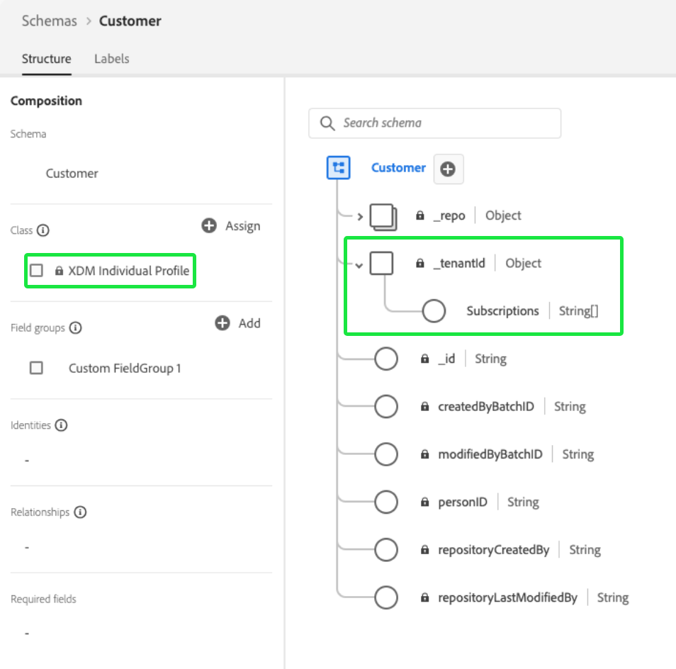

# Práticas recomendadas para modelagem de dados

[!DNL Experience Data Model] O (XDM) é a estrutura principal que padroniza os dados de experiência do cliente fornecendo estruturas e definições comuns para uso nos serviços downstream da Adobe Experience Platform. Seguindo os padrões XDM, todos os dados de experiência do cliente podem ser incorporados a uma representação comum que permite obter insights valiosos das ações do cliente, definir públicos-alvo por meio de segmentos e expressar atributos do cliente para fins de personalização.

Como o XDM é extremamente versátil e personalizável por design, é importante seguir as práticas recomendadas para a modelagem de dados ao projetar seus esquemas. Este documento aborda as principais decisões e considerações que você deve tomar ao mapear os dados de experiência do cliente para o XDM.

## Introdução

Antes de ler este guia, consulte o [Visão geral do sistema XDM](../home.md) para obter uma introdução de alto nível ao XDM e sua função no Experience Platform.

Além disso, este guia se concentra exclusivamente nas principais considerações relacionadas ao design do esquema. Portanto, é altamente recomendável que você consulte a [noções básicas da composição do esquema](./composition.md) para obter explicações detalhadas dos elementos individuais do schema mencionados neste guia.

## Resumo de práticas recomendadas

A abordagem recomendada para projetar seu modelo de dados para uso no Experience Platform pode ser resumida da seguinte maneira:

1. Entenda os casos de uso de negócios para seus dados.
1. Identificar as fontes de dados primárias que devem ser trazidas para [!DNL Platform] para lidar com esses casos de uso.
1. Identifique quaisquer fontes de dados secundárias que também possam ser de interesse. Por exemplo, se atualmente apenas uma unidade de negócios em sua organização estiver interessada em portar seus dados para o [!DNL Platform]No entanto, uma unidade de negócios semelhante também pode estar interessada em portar dados semelhantes no futuro. Considerar essas fontes secundárias ajuda a padronizar o modelo de dados em toda a organização.
1. Crie um diagrama de relacionamento de entidade de alto nível (ERD) para as fontes de dados que foram identificadas.
1. Converter o ERD de alto nível em um [!DNL Platform]ERD centrado em (incluindo perfis, eventos de experiência e entidades de pesquisa).

As etapas relacionadas à identificação das fontes de dados aplicáveis necessárias para realizar os casos de uso de negócios variam de uma organização para outra. Embora o restante das seções neste documento se concentre nas últimas etapas de organização e construção de um ERD após a identificação das fontes de dados, as explicações dos vários componentes do diagrama podem informar suas decisões sobre para quais fontes de dados devem ser migradas [!DNL Platform].

## Criar um ERD de alto nível

Depois de determinar as fontes de dados que deseja trazer para o [!DNL Platform], crie um ERD de alto nível para ajudar a orientar o processo de mapeamento de seus dados para esquemas XDM.

O exemplo abaixo representa um ERD simplificado para uma empresa que deseja trazer dados para o [!DNL Platform]. O diagrama destaca as entidades essenciais que devem ser classificadas em classes XDM, incluindo contas de clientes, hotéis, endereços e vários eventos comuns de comércio eletrônico.

## Classificar entidades em categorias de perfil, pesquisa e evento

Depois de criar um ERD para identificar as entidades essenciais que você gostaria de trazer para [!DNL Platform], essas entidades devem ser classificadas em categorias de perfil, pesquisa e evento:

| Categoria | Descrição |
| --- | --- |
| Entidades de perfil | As entidades de perfil representam atributos relacionados a uma pessoa individual, normalmente um cliente. As entidades que se enquadram nesta categoria devem ser representadas por esquemas baseados no **[!DNL XDM Individual Profile]classe**. |
| Pesquisar entidades | As entidades de pesquisa representam conceitos que podem estar relacionados a uma pessoa individual, mas não podem ser usados diretamente para identificá-la. As entidades que se enquadram nesta categoria devem ser representadas por esquemas baseados em **classes personalizadas**, e estão vinculados a perfis e eventos por meio de [relacionamentos de esquema](../tutorials/relationship-ui.md). |
| Entidades de evento | As entidades de evento representam conceitos relacionados a ações que um cliente pode realizar, eventos do sistema ou qualquer outro conceito em que você queira rastrear as alterações ao longo do tempo. As entidades que se enquadram nesta categoria devem ser representadas por esquemas baseados no **[!DNL XDM ExperienceEvent]classe**. |

{style="table-layout:auto"}

### Considerações para classificação de entidade

As seções abaixo fornecem mais orientação sobre como classificar as entidades nas categorias acima.

#### Dados mutáveis e imutáveis

Uma maneira primária de classificar entre categorias de entidade é se os dados capturados são mutáveis ou não.

Os atributos pertencentes a perfis ou entidades de pesquisa normalmente são mutáveis. Por exemplo, as preferências de um cliente podem mudar com o tempo e os parâmetros de um plano de assinatura podem ser atualizados, dependendo das tendências do mercado.

Por outro lado, os dados do evento normalmente são imutáveis. Como os eventos são anexados a um carimbo de data e hora específico, o &quot;instantâneo do sistema&quot; fornecido por um evento não é alterado. Por exemplo, um evento pode capturar as preferências de um cliente ao finalizar a compra de um carrinho e não é alterado mesmo que as preferências do cliente acabem sendo alteradas posteriormente. Os dados do evento não podem ser alterados após serem registrados.

Em resumo, perfis e entidades de pesquisa contêm atributos mutáveis e representam as informações mais atuais sobre os assuntos capturados, enquanto eventos são registros imutáveis do sistema em um momento específico.

#### Atributos do cliente

Se uma entidade contiver atributos relacionados a um cliente individual, ela provavelmente será uma entidade de perfil. Exemplos de atributos do cliente incluem:

* Detalhes pessoais, como nome, data de nascimento, sexo e ID(s) da conta.
* Informações de localização, como endereços e informações de GPS.
* Informações de contato, como números de telefone e endereços de email.

#### Rastreamento de dados ao longo do tempo

Se você quiser analisar como determinados atributos em uma entidade mudam ao longo do tempo, ela provavelmente será uma entidade de evento. Por exemplo, a adição de itens de produto a um carrinho pode ser rastreada como eventos de adição ao carrinho em [!DNL Platform]:

| Customer ID | Tipo | Identificação do produto | Quantidade | Carimbo de data e hora |
| --- | --- | --- | --- | --- |
| 1234567 | Add | 275098 | 2 | 1 de outubro, 10:32 |
| 1234567 | Remover | 275098 | 1 | 1 de outubro, 10:33 |
| 1234567 | Add | 486502 | 1 | 1 de outubro, 10:41 |
| 1234567 | Add | 910482 | 5 | 3 de outubro, 14:15 |

{style="table-layout:auto"}

#### Casos de uso de segmentação

Ao categorizar suas entidades, é importante pensar nos segmentos de público-alvo que você pode querer criar para abordar seus casos de uso de negócios específicos.

Por exemplo, uma empresa quer conhecer todos os membros &quot;Ouro&quot; ou &quot;Platina&quot; de seu programa de fidelidade que fizeram mais de cinco compras no ano passado. Com base nesta lógica de segmento, podem ser tiradas as seguintes conclusões sobre a forma como as entidades relevantes devem ser representadas:

* &quot;Ouro&quot; e &quot;Platina&quot; representam status de fidelidade aplicáveis a um cliente individual. Como a lógica do segmento só se preocupa com o status atual de fidelidade dos clientes, esses dados podem ser modelados como parte de um esquema de perfil. Se você quiser rastrear as alterações no status de fidelidade ao longo do tempo, também poderá criar um esquema de evento adicional para as alterações no status de fidelidade.
* Compras são eventos que ocorrem em um momento específico e a lógica de segmento se refere a eventos de compra em uma janela de tempo especificada. Portanto, esses dados devem ser modelados como um schema de evento.

#### Casos de uso de ativação

Além das considerações relacionadas aos casos de uso de segmentação, você também deve revisar os casos de uso de ativação desses segmentos para identificar atributos relevantes adicionais.

Por exemplo, uma empresa criou um segmento de público-alvo com base na regra que `country = US`. Em seguida, ao ativar esse segmento para determinados destinos downstream, a empresa deseja filtrar todos os perfis exportados com base no estado inicial. Por conseguinte, uma `state` O atributo também deve ser capturado na entidade de perfil aplicável.

#### Valores agregados

Com base no caso de uso e na granularidade dos dados, você deve decidir se determinados valores precisam ser pré-agregados antes de serem incluídos em um perfil ou entidade de evento.

Por exemplo, uma empresa deseja criar um segmento com base no número de compras de carrinho. Você pode optar por incorporar esses dados na menor granularidade ao incluir cada evento de compra com carimbo de data e hora como sua própria entidade. No entanto, às vezes isso pode aumentar o número de eventos registrados exponencialmente. Para reduzir o número de eventos assimilados, é possível optar por criar um valor agregado `numberOfPurchases` durante um período de uma semana ou de um mês. Outras funções agregadas, como MIN e MAX, também podem ser aplicadas a essas situações.

>[!CAUTION]
>
>No momento, o Experience Platform não executa agregação automática de valor, embora isso esteja planejado para versões futuras. Se você optar por usar valores agregados, deverá realizar os cálculos externamente antes de enviar os dados para o [!DNL Platform].

#### Cardinalidade

As cardinalidades estabelecidas no seu ERD também podem fornecer algumas pistas sobre como categorizar suas entidades. Se houver uma relação um para muitos entre duas entidades, a entidade que representa o &quot;muitos&quot; provavelmente será uma entidade de evento. No entanto, também há casos em que &quot;muitos&quot; é um conjunto de entidades de pesquisa que são fornecidas como uma matriz em uma entidade de perfil.

>[!NOTE]
>
>Como não há uma abordagem universal para todos os casos de uso, é importante considerar os prós e os contras de cada situação ao categorizar entidades com base na cardinalidade. Consulte a [próxima seção](#pros-and-cons) para obter mais informações.

A tabela a seguir descreve alguns relacionamentos de entidade comuns e as categorias que podem ser derivadas deles:

| Relação | Cardinalidade | Categorias de entidade |
| --- | --- | --- |
| Clientes e check-outs do carrinho | De um para muitos | Um único cliente pode ter muitos check-outs do carrinho, que são eventos que podem ser rastreados ao longo do tempo. Os clientes seriam, portanto, uma entidade de perfil, enquanto os Check-outs do carrinho seriam uma entidade de evento. |
| Clientes e contas de fidelidade | Um para um | Um único cliente pode ter apenas uma conta de fidelidade e vice-versa. Como o relacionamento é individualizado, tanto os Clientes quanto as Contas de fidelidade representam entidades de perfil. |
| Clientes e assinaturas | De um para muitos | Um único cliente pode ter muitas assinaturas. Como a empresa se preocupa somente com as assinaturas atuais de um cliente, Clientes é uma entidade de perfil, enquanto Assinaturas é uma entidade de pesquisa. |

{style="table-layout:auto"}

### Vantagens e desvantagens de diferentes classes de entidade {#pros-and-cons}

Embora a seção anterior tenha fornecido algumas diretrizes gerais para decidir como categorizar suas entidades, é importante entender que geralmente pode haver vantagens e desvantagens em escolher uma categoria de entidade em vez de outra. O estudo de caso a seguir ilustra como você pode considerar suas opções nessas situações.

Uma empresa rastreia assinaturas ativas para seus clientes, onde um cliente pode ter muitas assinaturas. A empresa também deseja incluir assinaturas para casos de uso de segmentação, como encontrar todos os usuários com assinaturas ativas.

Nesse cenário, a empresa tem duas opções possíveis para representar as assinaturas de um cliente em seu modelo de dados:

1. [Usar atributos de perfil](#profile-approach)
1. [Usar entidades de evento](#event-approach)

#### Abordagem 1: usar atributos de perfil {#profile-approach}

A primeira abordagem seria incluir uma matriz de assinaturas como atributos na entidade de perfil para Clientes. Os objetos nesta matriz conteriam campos para `category`, `status`, `planName`, `startDate`, e `endDate`.

 

**Pontos positivos**

* A segmentação é viável para o caso de uso pretendido.
* O esquema só preservará os registros de assinatura mais recentes de um cliente.

**Pontos negativos**

* A matriz inteira deve ser reiterada sempre que ocorrerem alterações em qualquer campo na matriz.
* Se diferentes fontes de dados ou unidades de negócios estiverem alimentando dados no storage, será desafiador manter o storage atualizado mais recente sincronizado em todos os canais.

#### Abordagem 2: usar entidades de evento {#event-approach}

A segunda abordagem seria usar schemas de evento para representar assinaturas. Isso envolve a assimilação dos mesmos campos de subscrição que a primeira abordagem, com a adição de uma ID de subscrição, uma ID de cliente e um carimbo de data e hora de quando o evento de subscrição ocorreu.

 

**Pontos positivos**

* As regras de segmentação podem ser mais flexíveis (como encontrar todos os clientes que alteraram suas assinaturas nos últimos 30 dias).
* Quando o status da assinatura de um cliente muda, você não precisa mais atualizar um array longo e potencialmente complexo nos atributos do perfil do cliente. Isso é especialmente útil se ocorrerem alterações simultâneas na lista de assinaturas do cliente a partir de várias fontes.

**Pontos negativos**

* A segmentação se torna mais complexa para o caso de uso pretendido original (identificando o status das assinaturas mais recentes dos clientes). O segmento agora precisa de lógica adicional para sinalizar o último evento de assinatura para um cliente para verificar seu status.
* Os eventos têm um risco maior de expiração automática e de serem removidos da loja de perfis. Consulte o guia sobre [Expirações do evento de experiência](../../profile/event-expirations.md) para obter mais informações.

## Criar esquemas com base nas entidades categorizadas

Depois de classificar as entidades em perfis, pesquisas e categorias de eventos, você pode começar a converter o modelo de dados em esquemas XDM. Para fins de demonstração, o modelo de dados de exemplo mostrado anteriormente foi classificado em categorias apropriadas no diagrama a seguir:

 

A categoria em que uma entidade foi classificada deve determinar a classe XDM na qual você baseia seu esquema. Para reiterar:

* As entidades de perfil devem usar o [!DNL XDM Individual Profile] classe.
* As entidades de evento devem usar o [!DNL XDM ExperienceEvent] classe.
* As entidades de pesquisa devem usar classes XDM personalizadas definidas por sua organização. As entidades de perfil e evento podem fazer referência a essas entidades de pesquisa por meio de relacionamentos de esquema.

>[!NOTE]
>
>Embora as entidades do evento quase sempre sejam representadas por esquemas separados, as entidades no perfil ou nas categorias de pesquisa podem ser combinadas em um único esquema XDM, dependendo de sua cardinalidade.
>
>Por exemplo, como a entidade Customers tem um relacionamento um para um com a entidade LoyaltyAccounts, o schema da entidade Customers também pode incluir um `LoyaltyAccount` objeto para conter os campos de fidelidade apropriados para cada cliente. Se a relação for um para muitos, no entanto, a entidade que representa o &quot;muitos&quot; pode ser representada por um schema separado ou uma matriz de atributos de perfil, dependendo de sua complexidade.

As seções abaixo fornecem orientações gerais sobre a construção de esquemas com base no seu ERD.

### Adotar uma abordagem de modelagem iterativa

A variável [regras de evolução do schema](./composition.md#evolution) determinam que somente as alterações não destrutivas possam ser feitas nos schemas depois de implementadas. Em outras palavras, depois que você adiciona um campo a um esquema e os dados são assimilados nesse campo, o campo não pode mais ser removido. Portanto, é essencial adotar uma abordagem de modelagem iterativa ao criar seus esquemas pela primeira vez, começando com uma implementação simplificada que ganha progressivamente complexidade ao longo do tempo.

Se você não tiver certeza se um campo específico é necessário incluir em um esquema, a prática recomendada é deixá-lo de fora. Se posteriormente for determinado que o campo é necessário, ele sempre poderá ser adicionado na próxima iteração do schema.

### Campos de identidade

No Experience Platform, os campos XDM marcados como identidades são usados para unir informações sobre clientes individuais provenientes de várias fontes de dados. Embora um esquema possa ter vários campos marcados como identidades, uma única identidade principal deve ser definida para que o esquema seja ativado para uso no [!DNL Real-Time Customer Profile]. Consulte a seção sobre [campos de identidade](./composition.md#identity) em basics of schema composition para obter informações mais detalhadas sobre o caso de uso desses campos.

Ao criar seus esquemas, todas as chaves primárias nas tabelas do banco de dados relacional provavelmente serão candidatas a identidades primárias. Outros exemplos de campos de identidade aplicáveis são endereços de email de clientes, números de telefone, IDs de conta e [ECID](../../identity-service/ecid.md).

### Grupos de campos de esquema do aplicativo Adobe

O Experience Platform fornece vários grupos de campos de esquema XDM prontos para uso para capturar dados relacionados aos seguintes aplicativos Adobe:

* Adobe Analytics
* Adobe Audience Manager
* Adobe Campaign
* Adobe Target

Por exemplo, a variável [[!UICONTROL Modelo de evento de experiência do Adobe Analytics] grupo de campos](https://github.com/adobe/xdm/blob/master/extensions/adobe/experience/analytics/experienceevent-all.schema.json) permite mapear [!DNL Analytics]Campos específicos do para seus esquemas XDM. Dependendo dos aplicativos de Adobe com os quais você está trabalhando, você deve usar esses grupos de campos fornecidos por Adobe em seus esquemas.

 

Os grupos de campos de aplicativos Adobe atribuem automaticamente uma identidade principal padrão por meio do uso do `identityMap` campo, que é um objeto somente leitura gerado pelo sistema que mapeia valores de identidade padrão para um cliente individual.

Para o Adobe Analytics, a ECID é a identidade principal padrão. Se um valor de ECID não for fornecido por um cliente, a identidade principal assumirá AAID como padrão.

>[!IMPORTANT]
>
>Ao usar grupos de campos de aplicativo Adobe, nenhum outro campo deve ser marcado como a identidade principal. Se houver propriedades adicionais que precisam ser marcadas como identidades, esses campos precisam ser atribuídos como identidades secundárias.

## Próximas etapas

Esse documento abordou as diretrizes gerais e as práticas recomendadas para a criação do modelo de dados para o Experience Platform. Para resumir:

* Use uma abordagem de cima para baixo classificando suas tabelas de dados em categorias de perfil, pesquisa e evento antes de construir seus esquemas.
* Geralmente, há várias abordagens e opções quando se trata de projetar esquemas para diferentes propósitos.
* Seu modelo de dados deve oferecer suporte aos casos de uso da empresa, como segmentação ou análise de jornada do cliente.
* Torne seus esquemas o mais simples possível e adicione novos campos somente quando absolutamente necessário.

Quando estiver pronto, consulte o tutorial em [criação de um esquema na interface](../tutorials/create-schema-ui.md) para obter instruções passo a passo sobre como criar um esquema, atribua a classe apropriada à entidade e adicione campos para mapear seus dados.
