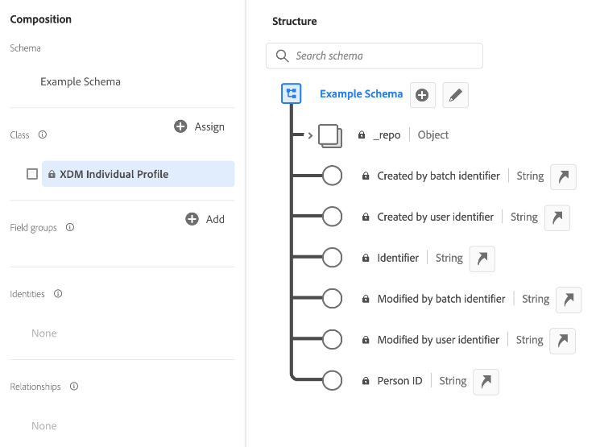
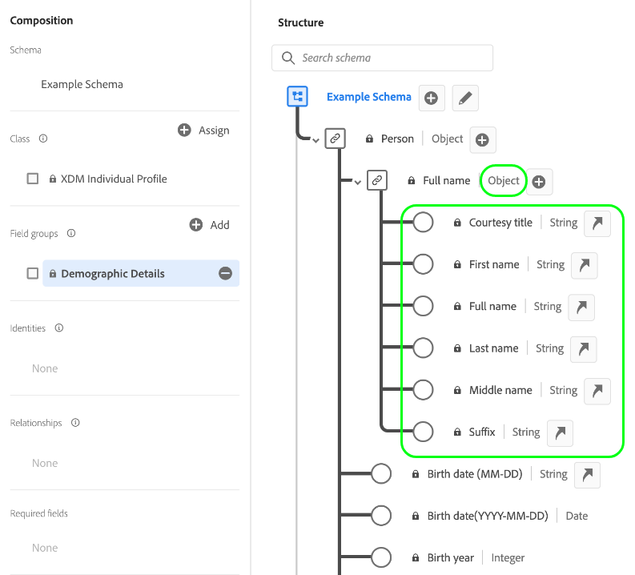

# Noções básicas da composição do schema

Este documento fornece uma introdução ao [!DNL Experience Data Model] Esquemas (XDM) e os blocos de construção, princípios e práticas recomendadas para a composição de schemas a serem usados no Adobe Experience Platform. Para obter informações gerais sobre o XDM e como ele é usado no [!DNL Platform], consulte o [Visão geral do sistema XDM](../home.md).

## Noções básicas sobre schemas

Um esquema é um conjunto de regras que representam e validam a estrutura e o formato dos dados. Em um alto nível, os esquemas fornecem uma definição abstrata de um objeto do mundo real (como uma pessoa) e destacam quais dados devem ser incluídos em cada instância desse objeto (como nome, sobrenome, aniversário e assim por diante).

Além de descrever a estrutura dos dados, os schemas aplicam restrições e expectativas aos dados para que possam ser validados conforme se movem entre os sistemas. Essas definições padrão permitem que os dados sejam interpretados de forma consistente, independentemente da origem, e removem a necessidade de tradução entre aplicativos.

[!DNL Experience Platform] O mantém essa normalização semântica usando esquemas. Os esquemas são a maneira padrão de descrever dados em [!DNL Experience Platform], permitindo que todos os dados em conformidade com esquemas sejam reutilizados em uma organização sem conflitos ou até mesmo compartilhados entre várias organizações.

Os esquemas XDM são ideais para armazenar grandes quantidades de dados complexos em um formato autocontido. Veja as seções em [objetos incorporados](#embedded) e [big data](#big-data) no apêndice deste documento para obter mais informações sobre como o XDM consegue isso.

### Fluxos de trabalho baseados em esquema no [!DNL Experience Platform]

A normalização é um conceito fundamental subjacente [!DNL Experience Platform]. O XDM, impulsionado pelo Adobe, é um esforço para padronizar os dados de experiência do cliente e definir esquemas padrão para o gerenciamento da experiência do cliente.

A infraestrutura em que [!DNL Experience Platform] é criado, conhecido como [!DNL XDM System], facilita workflows baseados em esquema e inclui a variável [!DNL Schema Registry], [!DNL Schema Editor], metadados de esquema e padrões de consumo de serviço. Consulte a [Visão geral do sistema XDM](../home.md) para obter mais informações.

Há vários benefícios principais para o aproveitamento de esquemas no [!DNL Experience Platform]. Primeiro, os esquemas permitem uma melhor governança de dados e minimização de dados, o que é especialmente importante com as regras de privacidade. Em segundo lugar, a criação de esquemas com componentes padrão do Adobe permite insights prontos e o uso de serviços de AI/ML com personalizações mínimas. Por último, os schemas fornecem infraestrutura para insights de compartilhamento de dados e orquestração eficiente.

## Planejamento do esquema

A primeira etapa na criação de um esquema é determinar o conceito, ou objeto real, que você está tentando capturar dentro do esquema. Depois de identificar o conceito que você está tentando descrever, você pode começar a planejar seu esquema pensando em coisas como o tipo de dados, campos de identidade em potencial e como o esquema pode evoluir no futuro.

### Comportamentos de dados em [!DNL Experience Platform]

Dados destinados a serem utilizados no [!DNL Experience Platform] é agrupado em dois tipos de comportamento:

* **Registrar dados**: Fornece informações sobre os atributos de um assunto. Um assunto pode ser uma organização ou um indivíduo.
* **Dados das séries cronológicas**: Fornece um instantâneo do sistema no momento em que uma ação foi tomada direta ou indiretamente por um titular de registro.

Todos os esquemas XDM descrevem dados que podem ser categorizados como registro ou série de tempo. O comportamento de dados de um schema é definido pela classe do schema, que é atribuída a um schema quando ele é criado pela primeira vez. As classes XDM são descritas mais detalhadamente posteriormente neste documento.

Os esquemas de registro e de série de tempo contêm um mapa de identidades (`xdm:identityMap`). Este campo contém a representação de identidade de um assunto, extraída de campos marcados como &quot;Identidade&quot;, conforme descrito na próxima seção.

### [!UICONTROL Identidade] {#identity}

>[!CONTEXTUALHELP]
>id="platform_schemas_identities"
>title="Identidades em schemas"
>abstract="Identidades são campos principais em um esquema que podem ser usados para identificar um assunto, como um endereço de email ou uma ID de marketing. Esses campos são usados para criar o gráfico de identidade de cada indivíduo e criar perfis de cliente. Consulte a documentação para obter mais informações sobre identidades em schemas."

Os esquemas são usados para assimilar dados em [!DNL Experience Platform]. Esses dados podem ser usados em vários serviços para criar uma única visualização unificada de uma entidade individual. Portanto, é importante pensar em schemas pensar nas identidades do cliente e quais campos podem ser usados para identificar um assunto, independentemente de onde os dados possam vir.

Para ajudar nesse processo, os campos principais em seus esquemas podem ser marcados como identidades. Após a assimilação de dados, os dados nesses campos são inseridos no &quot;[!UICONTROL Gráfico de identidade]&quot; para esse indivíduo. Os dados do gráfico podem ser acessados em [[!DNL Real-time Customer Profile]](../../profile/home.md) e outros [!DNL Experience Platform] serviços para fornecer uma visão unificada de cada cliente individual.

Campos comumente marcados como &quot;[!UICONTROL Identidade]&quot; inclui: endereço de e-mail, número de telefone, [[!DNL Experience Cloud ID (ECID)]](https://experienceleague.adobe.com/docs/id-service/using/home.html?lang=pt-BR), ID do CRM ou outros campos de ID exclusivos. Você também deve considerar todos os identificadores exclusivos específicos de sua organização, pois podem ser bons &quot;[!UICONTROL Identidade]&quot; também.

É importante pensar nas identidades do cliente durante a fase de planejamento do schema para ajudar a garantir que os dados estejam sendo reunidos para criar o perfil mais robusto possível. Consulte a visão geral em [Serviço de identidade da Adobe Experience Platform](../../identity-service/home.md) para saber mais sobre como as informações de identidade podem ajudá-lo a entregar experiências digitais para seus clientes.

Há duas maneiras de enviar dados de identidade para a Platform:

1. Adicionar descritores de identidade a campos individuais, por meio da variável [Interface do usuário do Editor de esquemas](../ui/fields/identity.md) ou usando a [API do Registro de Schema](../api/descriptors.md#create)
1. Uso de um [`identityMap` campo](#identityMap)

#### `identityMap` {#identityMap}

`identityMap` é um campo do tipo mapa que descreve os vários valores de identidade de um indivíduo, juntamente com seus namespaces associados. Este campo pode ser usado para fornecer informações de identidade para seus esquemas, em vez de definir valores de identidade dentro da estrutura do próprio schema.

A principal desvantagem de utilizar `identityMap` é que as identidades se tornam incorporadas aos dados e, como resultado, menos visíveis. Se você estiver assimilando dados brutos, deverá definir campos de identidade individuais dentro da estrutura do schema real.

>[!NOTE]
>
>Um esquema que usa `identityMap` pode ser usado como um schema de origem em um relacionamento, mas não pode ser usado como um schema de destino. Isso ocorre porque todos os esquemas de destino devem ter uma identidade visível que pode ser mapeada em um campo de referência dentro do schema de origem. Consulte o guia da interface do usuário em [relações](../tutorials/relationship-ui.md) para obter mais informações sobre os requisitos dos esquemas de origem e de destino.

No entanto, mapas de identidade podem ser particularmente úteis se você estiver trazendo dados de fontes que armazenam identidades juntas (como [!DNL Airship] ou Adobe Audience Manager), ou quando houver um número variável de identidades para um esquema. Além disso, mapas de identidade são necessários se você estiver usando o [Adobe Experience Platform Mobile SDK](https://aep-sdks.gitbook.io/docs/).

Um exemplo de um mapa de identidade simples seria semelhante ao seguinte:

```json
"identityMap": {
  "email": [
    {
      "id": "jsmith@example.com",
      "primary": false
    }
  ],
  "ECID": [
    {
      "id": "87098882279810196101440938110216748923",
      "primary": false
    },
    {
      "id": "55019962992006103186215643814973128178",
      "primary": false
    }
  ],
  "loyaltyId": [
    {
      "id": "2e33192000007456-0365c00000000000",
      "primary": true
    }
  ]
}
```

Como mostra o exemplo acima, cada chave no `identityMap` representa um namespace de identidade. O valor de cada chave é uma matriz de objetos, representando os valores de identidade (`id`) para o namespace respectivo. Consulte a [!DNL Identity Service] documentação de um [lista de namespaces de identidade padrão](../../identity-service/troubleshooting-guide.md#standard-namespaces) reconhecido pelos aplicativos Adobe.

>[!NOTE]
>
>Um valor booleano para determinar se o valor é uma identidade primária (`primary`) também pode ser fornecido para cada valor de identidade. Só é necessário definir identidades primárias para esquemas destinados a serem utilizados em [!DNL Real-time Customer Profile]. Consulte a seção sobre [schemas de união](#union) para obter mais informações.

### Princípios de evolução do schema {#evolution}

Como a natureza das experiências digitais continua a evoluir, também os esquemas usados para representá-las. Um schema bem projetado é, portanto, capaz de se adaptar e evoluir conforme necessário, sem causar alterações destrutivas nas versões anteriores do schema.

Como manter a compatibilidade com versões anteriores é fundamental para a evolução do schema, [!DNL Experience Platform] aplica um princípio de controle de versão meramente aditivo. Esse princípio garante que qualquer revisão do schema resulte apenas em atualizações e alterações não destrutivas. Por outras palavras, **alterações de quebra não são suportadas.**

>[!NOTE]
>
>Se um schema ainda não tiver sido usado para assimilar dados em [!DNL Experience Platform] e ainda não tiver sido ativado para uso no Perfil do cliente em tempo real, você pode introduzir uma alteração de quebra nesse esquema. No entanto, uma vez que o schema tenha sido usado em [!DNL Platform], deve aderir à política de controle de versão aditiva.

A tabela a seguir detalha quais alterações são compatíveis ao editar esquemas, grupos de campos e tipos de dados:

| Alterações suportadas | Quebrando alterações (Não suportado) |
| --- | --- |
| <ul><li>Adicionar novos campos ao recurso</li><li>Como tornar um campo obrigatório opcional</li><li>Introdução de novos campos obrigatórios*</li><li>Alteração do nome de exibição e da descrição do recurso</li><li>Ativar o esquema para participar do perfil</li></ul> | <ul><li>Remoção de campos definidos anteriormente</li><li>Renomeação ou redefinição de campos existentes</li><li>Remoção ou restrição de valores de campo anteriormente suportados</li><li>Mover campos existentes para um local diferente na árvore</li><li>Exclusão do schema</li><li>Desabilitação do esquema de participar do Perfil</li></ul> |

\**Consulte a seção abaixo para obter considerações importantes sobre [definição de novos campos obrigatórios](#post-ingestion-required-fields).*

### Campos obrigatórios

Campos de esquema individuais podem ser [marcado conforme necessário](../ui/fields/required.md), o que significa que todos os registros assimilados devem conter dados nesses campos para passarem na validação. Por exemplo, definir o campo de identidade principal de um esquema, conforme necessário, pode ajudar a garantir que todos os registros assimilados participarão do Perfil do cliente em tempo real, enquanto define um campo de carimbo de data e hora, conforme necessário, garante que todos os eventos de séries de tempo sejam cronologicamente preservados.

>[!IMPORTANT]
>
>Independentemente de um campo de esquema ser obrigatório ou não, a Platform não aceita `null` ou valores vazios para qualquer campo assimilado. Se não houver valor para um campo específico em um registro ou evento, a chave desse campo deverá ser excluída do payload de assimilação.

#### Definição de campos conforme necessário após a assimilação {#post-ingestion-required-fields}

Se um campo tiver sido usado para assimilar dados e não tiver sido originalmente definido conforme necessário, esse campo poderá ter um valor nulo para alguns registros. Se esse campo for definido como obrigatório após a assimilação, todos os registros futuros deverão conter um valor para esse campo, mesmo que os registros históricos possam ser nulos.

Ao definir um campo opcional anteriormente, conforme necessário, lembre-se do seguinte:

1. Se você consultar dados históricos e gravar os resultados em um novo conjunto de dados, algumas linhas falharão porque contêm valores nulos para o campo necessário.
1. Se o campo participar de [Perfil do cliente em tempo real](../../profile/home.md) e se exportar dados antes de configurá-los conforme necessário, eles poderão ser nulos para alguns perfis.
1. Você pode usar a API do Registro de esquema para exibir um registro de alteração com carimbo de data e hora para todos os recursos XDM na Platform, incluindo novos campos obrigatórios. Consulte o guia sobre [ponto de extremidade de log de auditoria](../api/audit-log.md) para obter mais informações.

### Esquemas e assimilação de dados

Para assimilar dados no [!DNL Experience Platform], um conjunto de dados deve ser criado primeiro. Os conjuntos de dados são os blocos fundamentais para a transformação e o rastreamento de dados para [[!DNL Catalog Service]](../../catalog/home.md)e geralmente representam tabelas ou arquivos que contêm dados assimilados. Todos os conjuntos de dados são baseados em esquemas XDM existentes, que fornecem restrições para o que os dados assimilados devem conter e como devem ser estruturados. Consulte a visão geral em [Ingestão de dados do Adobe Experience Platform](../../ingestion/home.md) para obter mais informações.

## Blocos de construção de um schema

[!DNL Experience Platform] O usa uma abordagem de composição na qual os blocos de construção padrão são combinados para criar schemas. Essa abordagem promove a reutilização de componentes existentes e orienta a padronização em todo o setor para oferecer suporte a esquemas e componentes de fornecedores no [!DNL Platform].

Os esquemas são compostos usando a seguinte fórmula:

**Classe + Grupo de Campos de Esquema &amp;ast; = Esquema XDM**

&amp;Último;Um esquema é composto por uma classe e zero ou mais grupos de campos de esquema. Isso significa que é possível compor um esquema de conjunto de dados sem usar grupos de campos.

### Classe {#class}

>[!CONTEXTUALHELP]
>id="platform_schemas_class"
>title="Classe"
>abstract="Cada schema é baseado em uma única classe. A classe define o comportamento do schema e as propriedades comuns que todos os schemas baseados nessa classe devem conter. Consulte a documentação para saber mais sobre como as classes estão envolvidas na composição do schema."

A composição de um schema começa pela atribuição de uma classe. As classes definem os aspectos comportamentais dos dados que o schema conterá (registro ou série de tempo). Além disso, as classes descrevem o menor número de propriedades comuns que todos os esquemas baseados nessa classe precisariam incluir e fornecer uma maneira de vários conjuntos de dados compatíveis serem mesclados.

A classe de um esquema determina quais grupos de campos serão qualificados para uso nesse esquema. Isso é discutido com mais detalhes na seção [próxima seção](#field-group).

O Adobe fornece várias classes XDM padrão (&quot;core&quot;). Duas dessas classes, [!DNL XDM Individual Profile] e [!DNL XDM ExperienceEvent], são necessárias para quase todos os processos downstream da plataforma. Além dessas classes principais, você também pode criar suas próprias classes personalizadas para descrever casos de uso mais específicos da sua organização. As classes personalizadas são definidas por uma organização quando não há classes principais definidas por Adobe disponíveis para descrever um caso de uso exclusivo.

A captura de tela a seguir demonstra como as classes são representadas na interface do usuário da plataforma. Como o schema de exemplo mostrado não contém nenhum grupo de campos, todos os campos exibidos são fornecidos pela classe do schema ([!UICONTROL Perfil individual XDM]).



Para obter a lista mais atualizada das classes XDM padrão disponíveis, consulte [repositório XDM oficial](https://github.com/adobe/xdm/tree/master/components/classes). Como alternativa, consulte o guia em [exploração de componentes XDM](../ui/explore.md) se preferir exibir recursos na interface do usuário.

### Grupo de campos {#field-group}

>[!CONTEXTUALHELP]
>id="platform_schemas_fieldgroup"
>title="Grupo de campos"
>abstract="Os grupos de campos são componentes reutilizáveis que permitem estender esquemas com atributos adicionais. A maioria dos grupos de campos é compatível somente com determinadas classes. Você pode usar grupos de campos padrão definidos pelo Adobe ou pode definir manualmente seus próprios grupos de campos personalizados. Consulte a documentação para saber mais sobre como os grupos de campos estão envolvidos na composição do schema."

Um grupo de campos é um componente reutilizável que define um ou mais campos que implementam determinadas funções, como detalhes pessoais, preferências de hotel ou endereço. Os grupos de campos devem ser incluídos como parte de um schema que implementa uma classe compatível.

Os grupos de campos definem a(s) classe(s) com a qual são compatíveis, com base no comportamento dos dados que representam (registro ou série de tempo). Isso significa que nem todos os grupos de campos estão disponíveis para uso com todas as classes.

[!DNL Experience Platform] O inclui muitos grupos de campos Adobe padrão, além de permitir que os fornecedores definam grupos de campos para seus usuários e usuários individuais definam grupos de campos para seus próprios conceitos específicos.

Por exemplo, para capturar detalhes como &quot;[!UICONTROL Nome]&quot; e &quot;[!UICONTROL Endereço residencial]&quot; para seu &quot;[!UICONTROL Membros de Fidelidade]&quot;, você poderá usar grupos de campos padrão que definem esses conceitos comuns. No entanto, os conceitos específicos para casos de uso menos comuns (como &quot;[!UICONTROL Nível do Programa de Fidelidade]&quot;) muitas vezes não têm um grupo de campos predefinido. Nesse caso, você deve definir seu próprio grupo de campos para capturar essas informações.

>[!NOTE]
>
>É altamente recomendável usar grupos de campos padrão sempre que possível em seus esquemas, já que esses campos são entendidos implicitamente por [!DNL Experience Platform] e fornecem maior consistência quando usados em [!DNL Platform] componentes.
>
>Os campos fornecidos pelos componentes padrão (como &quot;Nome&quot; e &quot;Endereço de email&quot;) contêm conotações adicionais além dos tipos básicos de campos escalares, informando [!DNL Platform] que todos os campos que compartilham o mesmo tipo de dados se comportarão da mesma maneira. Esse comportamento pode ser confiável para ser consistente, independentemente de onde os dados vêm ou em que [!DNL Platform] os dados estão sendo usados.

Lembre-se de que os esquemas são compostos de grupos de campos &quot;zero ou mais&quot;, portanto, isso significa que você pode compor um schema válido sem usar nenhum grupo de campos.

A captura de tela a seguir demonstra como os grupos de campo são representados na interface do usuário da plataforma. Um único grupo de campos ([!UICONTROL Detalhes demográficos]) é adicionado a um schema neste exemplo, que fornece um agrupamento de campos para a estrutura do schema.


Para obter a lista mais atualizada de grupos de campos XDM padrão disponíveis, consulte [repositório XDM oficial](https://github.com/adobe/xdm/tree/master/components/fieldgroups). Como alternativa, consulte o guia em [exploração de componentes XDM](../ui/explore.md) se preferir exibir recursos na interface do usuário.

### Tipo de dados {#data-type}

Os tipos de dados são usados como tipos de campo de referência em classes ou esquemas, da mesma forma que os campos literais básicos. A principal diferença é que os tipos de dados podem definir vários subcampos. Semelhante a um grupo de campos, um tipo de dados permite o uso consistente de uma estrutura de vários campos, mas tem mais flexibilidade do que um grupo de campos, pois um tipo de dados pode ser incluído em qualquer lugar de um esquema ao adicioná-lo como o &quot;tipo de dados&quot; de um campo.

[!DNL Experience Platform] O fornece vários tipos de dados comuns como parte da [!DNL Schema Registry] apoiar a utilização de padrões normalizados para a descrição de estruturas de dados comuns. Isso é explicado com mais detalhes na seção [!DNL Schema Registry] tutoriais, onde ficará mais claro à medida que você percorre as etapas para definir tipos de dados.

A captura de tela a seguir demonstra como os tipos de dados são representados na interface do usuário da plataforma. Um dos campos fornecidos pelo [!UICONTROL Detalhes demográficos] o grupo de campos usa o[!UICONTROL Nome da pessoa]&quot; tipo de dados, conforme indicado pelo texto após o caractere de barra vertical (`|`) ao lado do nome do campo. Esse tipo de dados específico fornece vários subcampos relacionados ao nome de uma pessoa individual, uma construção que pode ser reutilizada para outros campos onde o nome de uma pessoa precisa ser capturado.



Para obter a lista mais atualizada dos tipos de dados XDM padrão disponíveis, consulte [repositório XDM oficial](https://github.com/adobe/xdm/tree/master/components/datatypes). Como alternativa, consulte o guia em [exploração de componentes XDM](../ui/explore.md) se preferir exibir recursos na interface do usuário.

### Campo

Um campo é o bloco de construção mais básico de um schema. Os campos fornecem restrições sobre o tipo de dados que podem conter, definindo um tipo de dados específico. Esses tipos de dados básicos definem um único campo, enquanto que a variável [tipos de dados](#data-type) mencionado anteriormente, permitem definir vários subcampos e reutilizar a mesma estrutura de vários campos em vários schemas. Assim, além de definir um &quot;tipo de dados&quot; de campo como um dos tipos de dados definidos no Registro, [!DNL Experience Platform] suporta tipos escalares básicos como:

* String
* Número inteiro
* Duplo
* Booleano
* Matriz
* Objeto

>[!TIP]
>
>Consulte a [apêndice](#objects-v-freeform) para obter informações sobre os prós e contras do uso de campos de forma livre em campos de tipo de objeto.

Os intervalos válidos desses tipos escalares podem ser restritos ainda mais a determinados padrões, formatos, mínimos/máximos ou valores predefinidos. Com essas restrições, uma grande variedade de tipos de campos mais específicos pode ser representada, incluindo:

* Enum
* Longo
* Curto
* Byte
* Data
* Data e hora
* Mapa

>[!NOTE]
>
>O tipo de campo &quot;mapear&quot; permite dados de pares de valores chave, incluindo vários valores para uma única chave. Mapas podem ser encontrados em classes XDM padrão e grupos de campos, mas você também pode definir mapas personalizados usando a API do Registro de Esquema. Veja o tutorial em [definição de campos personalizados](../tutorials/custom-fields-api.md#maps) para obter mais informações.

## Exemplo de composição

Os esquemas representam o formato e a estrutura dos dados que serão assimilados em [!DNL Platform]e são construídos usando um modelo de composição. Como mencionado anteriormente, esses esquemas são compostos de uma classe e zero ou mais grupos de campos compatíveis com essa classe.

Por exemplo, um schema que descreve compras feitas em uma loja de varejo pode ser chamado de &quot;[!UICONTROL Armazenar Transações]&quot;. O esquema implementa o [!DNL XDM ExperienceEvent] classe combinada com o padrão [!UICONTROL Comércio] grupo de campos e um grupo definido pelo usuário [!UICONTROL Informações do produto] grupo de campos.

Outro esquema que rastreia o tráfego do site pode ser chamado de &quot;[!UICONTROL Visitas da Web]&quot;. Também implementa o [!DNL XDM ExperienceEvent] , mas desta vez combina o padrão [!UICONTROL Web] grupo de campos.

O diagrama abaixo mostra esses esquemas e os campos contribuídos por cada grupo de campos. Também contém dois schemas com base no [!DNL XDM Individual Profile] classe , incluindo o &quot;[!UICONTROL Membros de Fidelidade]&quot; mencionado anteriormente neste guia.


### União {#union}

Ao [!DNL Experience Platform] permite compor schemas para casos de uso específicos, também permite ver uma &quot;união&quot; de schemas para um tipo de classe específico. O diagrama anterior mostra dois esquemas com base na classe XDM ExperienceEvent e dois esquemas com base em [!DNL XDM Individual Profile] classe . A união, mostrada abaixo, agrega os campos de todos os esquemas que compartilham a mesma classe ([!DNL XDM ExperienceEvent] e [!DNL XDM Individual Profile], respectivamente).


Ao ativar um schema para uso com [!DNL Real-time Customer Profile], ele será incluído na união para esse tipo de classe. [!DNL Profile] O oferece perfis robustos e centralizados de atributos do cliente, bem como uma conta com carimbos de data e hora de cada evento que o cliente teve em qualquer sistema integrado com o [!DNL Platform]. [!DNL Profile] O usa a exibição de união para representar esses dados e fornecer uma visão holística de cada cliente individual.

Para obter mais informações sobre como trabalhar com a [!DNL Profile], consulte o [Visão geral do perfil do cliente em tempo real](../../profile/home.md).

## Mapeamento de arquivos de dados para esquemas XDM

Todos os arquivos de dados assimilados em [!DNL Experience Platform] deve estar em conformidade com a estrutura de um esquema XDM. Para obter mais informações sobre como formatar arquivos de dados para estar em conformidade com hierarquias XDM (incluindo arquivos de amostra), consulte o documento em [amostras de transformações de ETL](../../etl/transformations.md). Para obter informações gerais sobre como assimilar arquivos de dados no [!DNL Experience Platform], consulte o [visão geral da ingestão em lote](../../ingestion/batch-ingestion/overview.md).

## Esquemas para segmentos externos

Se você estiver trazendo segmentos de sistemas externos para o Platform, deverá usar os seguintes componentes para capturá-los em seus esquemas:

* [[!UICONTROL Definição de segmento] classe](../classes/segment-definition.md): Use essa classe padrão para capturar atributos-chave de uma definição de segmento externo.
* [[!UICONTROL Detalhes da associação ao segmento] grupo de campos](../field-groups/profile/segmentation.md): Adicione este grupo de campos a [!UICONTROL Perfil individual XDM] para associar perfis de clientes a segmentos específicos.

## Próximas etapas

Agora que você entende as noções básicas da composição do schema, está pronto para começar a explorar e criar schemas usando o [!DNL Schema Registry].

Para analisar a estrutura das duas classes principais XDM e seus grupos de campos compatíveis comumente usados, consulte a seguinte documentação de referência:

* [[!DNL XDM Individual Profile]](../classes/individual-profile.md)
* [[!DNL XDM ExperienceEvent]](../classes/experienceevent.md)

O [!DNL Schema Registry] é usada para acessar o [!DNL Schema Library] no Adobe Experience Platform, e fornece uma interface de usuário e uma RESTful API a partir da qual todos os recursos de biblioteca disponíveis são acessíveis. O [!DNL Schema Library] contém recursos do setor definidos pelo Adobe, recursos do fornecedor definidos por [!DNL Experience Platform] parceiros e classes, grupos de campos, tipos de dados e esquemas que foram compostos por membros de sua organização.

Para começar a compor o esquema usando a interface do usuário, siga com o [Tutorial do Editor de esquemas](../tutorials/create-schema-ui.md) para criar o schema &quot;Membros de Fidelidade&quot; mencionado em todo este documento.

Para começar a usar o [!DNL Schema Registry] Comece lendo a API [Guia do desenvolvedor da API da API do Registro de Schema](../api/getting-started.md). Após ler o guia do desenvolvedor, siga as etapas descritas no tutorial em [criação de um esquema usando a API do Registro de esquema](../tutorials/create-schema-api.md).

## Apêndice

As seções a seguir contêm informações adicionais sobre os princípios da composição do schema.

### Tabelas relacionais versus objetos incorporados {#embedded}

Ao trabalhar com bancos de dados relacionais, as práticas recomendadas envolvem a normalização de dados ou a divisão de uma entidade em partes discretas que são exibidas em várias tabelas. Para ler os dados como um todo ou atualizar a entidade, as operações de leitura e gravação devem ser realizadas em várias tabelas individuais usando JOIN.

Por meio do uso de objetos incorporados, os esquemas XDM podem representar diretamente dados complexos e armazená-los em documentos autônomos com uma estrutura hierárquica. Um dos principais benefícios dessa estrutura é que ela permite consultar os dados sem precisar reconstruir a entidade por associações caras a várias tabelas desnormalizadas. Não há restrições rígidas para quantos níveis sua hierarquia de esquema pode ter.

### Esquemas e grandes dados {#big-data}

Sistemas digitais modernos geram grandes quantidades de sinais comportamentais (dados de transação, logs da Web, internet de coisas, exibição e assim por diante). Esses grandes dados oferecem oportunidades extraordinárias para otimizar experiências, mas são desafiadores a usá-las devido à escala e variedade dos dados. Para obter valor dos dados, a sua estrutura, formato e definições devem ser padronizados de modo a que possam ser processados de forma consistente e eficiente.

Os esquemas solucionam esse problema ao permitir que os dados sejam integrados de várias fontes, padronizados por meio de estruturas e definições comuns e compartilhados entre soluções. Isso permite que processos e serviços subsequentes respondam a qualquer tipo de pergunta que esteja sendo feita sobre os dados, afastando-se da abordagem tradicional à modelagem de dados, onde todas as perguntas que serão feitas sobre os dados são conhecidas antecipadamente e os dados são modelados de forma a estarem em conformidade com essas expectativas.

### Objetos versus campos de forma livre {#objects-v-freeform}

Há alguns fatores principais a serem considerados ao escolher objetos em vez de campos de forma livre ao projetar seus esquemas:

| Objetos | Campos de forma livre |
| --- | --- |
| Aumenta o aninhamento | Menos ou sem aninhamento |
| Cria agrupamentos de campos lógicos | Os campos são colocados em locais ad hoc |

{style=&quot;table-layout:auto&quot;}

#### Objetos

Os prós e contras do uso de objetos em campos de forma livre estão listados abaixo.

**Prós**:

* Os objetos são melhor usados quando você deseja criar um agrupamento lógico de determinados campos.
* Os objetos organizam o schema de maneira mais estruturada.
* Os objetos ajudam indiretamente na criação de uma boa estrutura de menu na interface do usuário do Construtor de segmentos. Os campos agrupados no schema são refletidos diretamente na estrutura de pastas fornecida na interface do usuário do Construtor de segmentos.

**Desvantagens**:

* Os campos ficam mais aninhados.
* Ao usar [Serviço de query Adobe Experience Platform](../../query-service/home.md), strings de referência mais longas devem ser fornecidas para campos de consulta que estão aninhados em objetos.

#### Campos de forma livre

Os prós e contras do uso de campos de forma livre em objetos estão listados abaixo.

**Prós**:

* Campos de forma livre são criados diretamente no objeto raiz do esquema (`_tenantId`), aumentando a visibilidade.
* As sequências de referência para campos de forma livre tendem a ser mais curtas ao usar o Serviço de query.

**Desvantagens**:

* O local dos campos de forma livre no esquema é ad hoc, o que significa que eles aparecem em ordem alfabética no Editor de esquemas. Isso pode tornar os esquemas menos estruturados e campos de forma livre semelhantes podem acabar sendo muito separados, dependendo de seus nomes.
