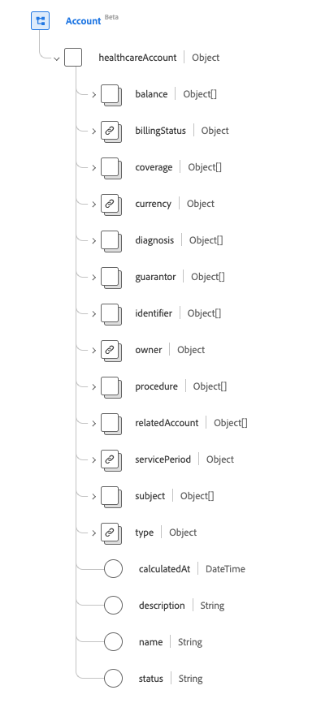

# Grupo de campos de esquema [!UICONTROL Conta]

[!UICONTROL Conta] é um grupo de campos de esquema padrão para [[!DNL XDM Individual Profile] classe](../../../classes/individual-profile.md) e [[!DNL Provider class]](../../../classes/provider.md). Ele fornece um único campo de tipo de objeto `healthcareAccount` que é usado para registrar transações, serviços e outras informações financeiras relacionadas a serviços de assistência médica fornecidos a um paciente ou a um grupo de pessoas físicas (como para fins de apólice de seguro ou cobrança).

| Nome de exibição | Propriedade | Tipo de dados | Descrição |
| --- | --- | --- | --- |
| [!UICONTROL Saldo] | `balance` | Matriz de objetos | Os saldos de conta que são calculados e processados pelo sistema financeiro. Consulte a [seção-abaixo](#balances) para obter mais informações. |
| [!UICONTROL Status de Cobrança] | `billingStatus` | [[!UICONTROL Conceito codificável]](../data-types/codeable-concept.md) | Isso rastreia o ciclo de vida da conta por meio do processo de faturamento. Indica como as transações são tratadas quando são alocadas na conta. |
| [!UICONTROL Cobertura] | `coverage` | Matriz de objetos | A(s) parte(s) responsável(eis) pela cobertura dos custos desta conta e por que ordem devem ser aplicados. Consulte a [seção abaixo](#coverage) para obter mais informações. |
| [!UICONTROL Moeda] | `currency` | [[!UICONTROL Conceito codificável]](../data-types/codeable-concept.md) | A moeda padrão da conta. |
| [!UICONTROL Diagnóstico] | `diagnosis` | Matriz de objetos | O conjunto de diagnósticos que são relevantes para faturamento é armazenado aqui na conta onde eles podem ser sequenciados adequadamente antes do processamento para produzir reivindicação(ões). Consulte a [seção abaixo](#diagnosis) para obter mais informações. |
| [!UICONTROL Garante] | `guarantor` | Matriz de objetos | As partes responsáveis pelo equilíbrio da conta se outras opções de pagamento não forem suficientes. Consulte a [seção abaixo](#guarantor) para obter mais informações. |
| [!UICONTROL Identificador] | `identifier` | Matriz de [[!UICONTROL Identificador]](../data-types/identifier.md) | Um identificador exclusivo usado para fazer referência à conta. Ele pode ou não ser destinado ao uso humano (por exemplo, número de cartão de crédito). |
| [!UICONTROL Proprietário] | `owner` | [[!UICONTROL Referência]](../data-types/reference.md) | Indica a área de serviço, hospital, departamento etc. com responsabilidade pela gestão da conta. |
| [!UICONTROL Procedimento] | `procedure` | Matriz de objetos | O conjunto de procedimentos relevantes para faturamento é armazenado aqui na conta onde eles podem ser sequenciados adequadamente antes do processamento para produzir reivindicação(ões). Consulte a [seção abaixo](#procedure) para obter mais informações. |
| [!UICONTROL Conta relacionada] | `relatedAccount` | Matriz de objetos | Outras contas associadas relacionadas a esta conta. Consulte a [seção abaixo](#related-account) para obter mais informações. |
| [!UICONTROL Período de Serviço] | `servicePeriod` | [[!UICONTROL Período]](../data-types/period.md) | O intervalo de datas dos serviços associados a esta conta. |
| [!UICONTROL Assunto] | `subject` | Matriz de [[!UICONTROL Referência]](../data-types/reference.md) | Identifica a entidade que incorre nas despesas. Embora os destinatários imediatos de serviços ou bens possam ser entidades relacionadas com o objeto, as despesas foram, em última análise, incorridas pelo objeto da conta. |
| [!UICONTROL Tipo] | `type` | [[!UICONTROL Conceito codificável]](../data-types/codeable-concept.md) | Categoriza a conta para fins de relatório e pesquisa. |
| [!UICONTROL Calculado Em] | `calculatedAt` | DateTime | A hora em que o saldo foi calculado. |
| [!UICONTROL Descrição] | `description` | String | Fornece informações adicionais sobre o que a conta rastreia e como é usada. |
| [!UICONTROL Nome] | `name` | String | O nome da conta. |
| [!UICONTROL Status] | `status` | String | O status da conta. O valor dessa propriedade deve ser igual a um dos seguintes valores de enumeração conhecidos. <li> `active` </li> <li> `inactive` </li> <li> `entered-in-error` </li> <li> `on-hold` </li> <li> `unknown`</li> |

Para obter mais detalhes sobre o grupo de campos, consulte o repositório XDM público:

* [Exemplo preenchido](https://github.com/adobe/xdm/blob/master/extensions/industry/healthcare/fhir/fieldgroups/account.example.1.json)
* [Esquema completo](https://github.com/adobe/xdm/blob/master/extensions/industry/healthcare/fhir/fieldgroups/account.schema.json)

## `balances` {#balances}

`balances` é fornecido como uma matriz de objetos. A estrutura de cada objeto é descrita abaixo.

| Nome de exibição | Propriedade | Tipo de dados | Descrição |
| --- | --- | --- | --- |
| [!UICONTROL Agregado] | `aggregate` | [[!UICONTROL Conceito codificável]](../data-types/codeable-concept.md) | Quem deve pagar essa parte do saldo? |
| [!UICONTROL Valor] | `amount` | [[!UICONTROL Dinheiro]](../data-types/money.md) | O saldo real calculado para a idade definida na propriedade do termo. |
| [!UICONTROL Termo] | `term` | [[!UICONTROL Conceito codificável]](../data-types/codeable-concept.md) | O prazo da conta. |
| [!UICONTROL Estimativa] | `estimate` | Booleano | Se a quantia for um valor estimado. |

## `coverage` {#coverage}

`coverage` é fornecido como uma matriz de objetos. A estrutura de cada objeto é descrita abaixo.

| Nome de exibição | Propriedade | Tipo de dados | Descrição |
| --- | --- | --- | --- |
| [!UICONTROL Cobertura] | `coverage` | [[!UICONTROL Referência]](../data-types/reference.md) | A(s) parte(s) responsável(eis) pela cobertura dos custos desta conta e por que ordem devem ser aplicados. |
| [!UICONTROL Prioridade] | `priority` | Número inteiro | A prioridade da cobertura no contexto desta conta, com um valor mínimo de `0`. |

## `diagnosis` {#diagnosis}

`diagnosis` é fornecido como uma matriz de objetos. A estrutura de cada objeto é descrita abaixo.

| Nome de exibição | Propriedade | Tipo de dados | Descrição |
| --- | --- | --- | --- |
| [!UICONTROL Condição] | `condition` | [[!UICONTROL Referência codificável]](../data-types/codeable-reference.md) | O diagnóstico relevante para a conta. |
| [!UICONTROL Código do pacote] | `packageCode` | Matriz de [[!UICONTROL Conceito Codificável]](../data-types/codeable-concept.md) | O código da embalagem pode ser usado para agrupar diagnósticos que podem ser precificados ou entregues como um único produto (como DRGs). |
| [!UICONTROL Tipo] | `type` | Matriz de [[!UICONTROL Conceito Codificável]](../data-types/codeable-concept.md) | Tipo que este diagnóstico tem relevante para a conta (por exemplo, admissão, faturamento, quitação ...). |
| [!UICONTROL Data Do Diagnóstico] | `dateOfDiagnosis` | DateTime | Data do diagnóstico (quando codificado). |
| [!UICONTROL Na admissão] | `onAdmission` | Booleano | Se o diagnóstico estava presente na admissão. |
| [!UICONTROL Sequência] | `sequence` | Número inteiro | Classificação do diagnóstico (para cada tipo), com um valor mínimo de `0`. |

## `guarantor` {#guarantor}

`guarantor` é fornecido como uma matriz de objetos. A estrutura de cada objeto é descrita abaixo.

| Nome de exibição | Propriedade | Tipo de dados | Descrição |
| --- | --- | --- | --- |
| [!UICONTROL Festa] | `party` | [[!UICONTROL Referência]](../data-types/reference.md) | A entidade responsável. |
| [!UICONTROL Período] | `period` | [[!UICONTROL Período]](../data-types/period.md) | O período durante o qual o garante aceita a responsabilidade pela conta. |
| [!UICONTROL Em Espera] | `onHold` | Booleano | O garante pode ser colocado numa suspensão de crédito ou ter a sua função temporariamente suspensa de qualquer outra forma. |

## `procedure` {#procedure}

`procedure` é fornecido como uma matriz de objetos. A estrutura de cada objeto é descrita abaixo.

| Nome de exibição | Propriedade | Tipo de dados | Descrição |
| --- | --- | --- | --- |
| [!UICONTROL Código] | `code` | [[!UICONTROL Referência codificável]](../data-types/codeable-reference.md) | O procedimento relevante para a conta. |
| [!UICONTROL Dispositivo] | `device` | Matriz de [[!UICONTROL Referência]](../data-types/reference.md) | Quaisquer dispositivos associados ao procedimento relevante para a conta. |
| [!UICONTROL Tipo] | `type` | Matriz de [[!UICONTROL Conceito Codificável]](../data-types/codeable-concept.md) | Como o valor do procedimento deve ser usado no débito da conta. |
| [!UICONTROL Código do pacote] | `packageCode` | Matriz de [[!UICONTROL Conceito Codificável]](../data-types/codeable-concept.md) | O código do pacote pode ser usado para agrupar procedimentos que podem ser precificados ou entregues como um único produto (como DRGs). |
| [!UICONTROL Data Do Serviço] | `dateOfService` | DateTime | A data ao usar um procedimento codificado. Se for utilizada uma referência a um procedimento, deve ser utilizada a data do procedimento. |
| [!UICONTROL Sequência] | `sequence` | Número inteiro | Classificação do procedimento (para cada tipo), com um valor mínimo de `0`. |

## `relatedAccount` {#related-account}

`relatedAccount` é fornecido como uma matriz de objetos. A estrutura de cada objeto é descrita abaixo.

| Nome de exibição | Propriedade | Tipo de dados | Descrição |
| --- | --- | --- | --- |
| [!UICONTROL Conta] | `account` | [[!UICONTROL Referência]](../data-types/reference.md) | Referência a uma conta associada. |
| [!UICONTROL Relação] | `relationship` | [[!UICONTROL Conceito codificável]](../data-types/codeable-concept.md) | Relacionamento da conta associada. |
