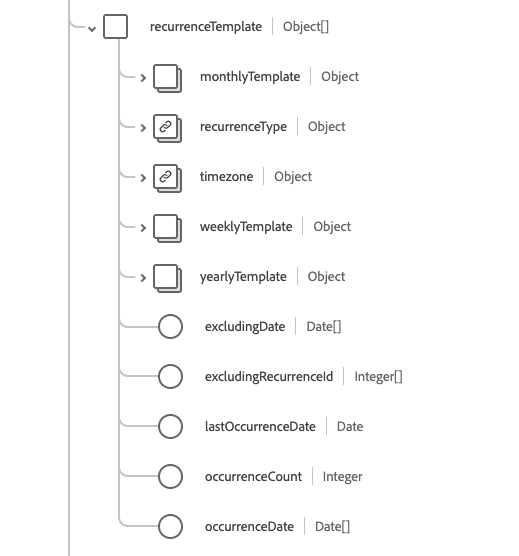

# Grupo de campos de esquema [!UICONTROL Compromisso]

[!UICONTROL Compromisso] é um grupo de campos de esquema padrão para [[!DNL XDM Individual Profile] classe](../../../classes/individual-profile.md) e [[!DNL Provider class]](../../../classes/provider.md). Ele fornece um único campo de tipo de objeto `healthcareAppointment` que contém informações sobre a reserva de um evento de saúde entre pacientes, profissionais, pessoas relacionadas e/ou dispositivos para uma data e hora específicas.

| Nome de exibição | Propriedade | Tipo de dados | Descrição |
| --- | --- | --- | --- |
| [!UICONTROL Conta] | `account` | Matriz de [[!UICONTROL Referência]](../data-types/reference.md) | O conjunto de contas que deve ser usado para faturamento. |
| [!UICONTROL Tipo de Compromisso] | `appointmentType` | [[!UICONTROL Conceito codificável]](../data-types/codeable-concept.md) | O estilo de compromisso ou paciente que foi reservado no slot (não o tipo de serviço). |
| [!UICONTROL Com Base Em] | `basedOn` | Matriz de [[!UICONTROL Referência]](../data-types/reference.md) | A solicitação para a qual o compromisso é alocado para avaliação, como uma solicitação de procedimento. |
| [!UICONTROL Motivo do cancelamento] | `cancellationReason` | Matriz de [[!UICONTROL Conceito Codificável]](../data-types/codeable-concept.md) | O motivo codificado para o compromisso ser cancelado. Geralmente, isso é usado em relatórios, faturamento ou processamento para determinar se outras ações são necessárias ou se taxas específicas se aplicam. |
| [!UICONTROL Classe] | `class` | Matriz de [[!UICONTROL Conceito Codificável]](../data-types/codeable-concept.md) | Conceitos que representam a classificação de um encontro do paciente, como ambulatório, ambulatorial, internado ou emergência. |
| [!UICONTROL Identificador] | `identifier` | Matriz de [[!UICONTROL Identificador]](../data-types/identifier.md) | Uma lista de identificadores exclusivos vinculados ao compromisso. Esses identificadores são atribuídos com base nas regras de negócios ou quando um link de URL direto para o compromisso não é adequado. |
| [!UICONTROL Nota] | `note` | Matriz de [[!UICONTROL Anotação]](../data-types/annotation.md) | Observações ou comentários adicionais sobre o compromisso. |
| [!UICONTROL Compromisso de Origem] | `originatingAppointment` | [[!UICONTROL Referência]](../data-types/reference.md) | O compromisso originador em um conjunto recorrente de compromissos relacionados. |
| [!UICONTROL Participante] | `participant` | Matriz de objetos | Uma lista de participantes envolvidos no compromisso. Consulte a [seção abaixo](#participant) para obter mais informações. |
| [!UICONTROL Instrução do paciente] | `patientInstruction` | Matriz de [[!UICONTROL Referência codificável]](../data-types/reference.md) | O diagnóstico relevante para a nomeação. |
| [!UICONTROL Compromisso Anterior] | `previousAppointment` | [[!UICONTROL Referência]](../data-types/reference.md) | O compromisso anterior em uma série de compromissos relacionados. |
| [!UICONTROL Prioridade] | `priority` | [[!UICONTROL Conceito codificável]](../data-types/codeable-concept.md) | A prioridade do compromisso que pode ser usada para tomar decisões informadas se for necessário repriorizar compromissos. O padrão iCal especifica `0` como indefinido, `1` como prioridade mais alta e `9` como prioridade mais baixa. |
| [!UICONTROL Motivo] | `reason` | Matriz de [[!UICONTROL Conceito Codificável]](../data-types/codeable-concept.md) | O motivo pelo qual o compromisso está sendo agendado, que normalmente é uma condição ou um procedimento. |
| [!UICONTROL Modelo de recorrência] | `recurrenceTemplate` | Matriz de objetos | Contém os detalhes do padrão ou modelo de recorrência usado para criar compromissos recorrentes.  Consulte a [seção abaixo](#recurrence) para obter mais informações. |
| [!UICONTROL Substitui] | `replaces` | Matriz de [[!UICONTROL Referência]](../data-types/reference.md) | O compromisso que está sendo substituído por este compromisso. Nos casos em que há um cancelamento, os detalhes do cancelamento podem ser encontrados na propriedade `cancellationReason` no recurso referenciado. |
| [!UICONTROL Período solicitado] | `requestedPeriod` | Matriz de [[!UICONTROL Período]](../data-types/period.md) | Um conjunto de intervalos de datas (possivelmente incluindo horas) durante os quais o compromisso é preferido para ser agendado. |
| [!UICONTROL Categoria de Serviço] | `serviceCategory` | Matriz de [[!UICONTROL Conceito Codificável]](../data-types/codeable-concept.md) | Uma categorização ampla do serviço a ser executado durante o compromisso. |
| [!UICONTROL Tipo de serviço] | `serviceType` | Matriz de [[!UICONTROL Referência codificável]](../data-types/codeable-reference.md) | O serviço específico a ser executado durante o compromisso. |
| [!UICONTROL Slot] | `slot` | Matriz de [[!UICONTROL Referência]](../data-types/reference.md) | Os intervalos de tempo das agendas dos participantes que serão preenchidos pelo compromisso. |
| [!UICONTROL Especialidade] | `speciality` | Matriz de [[!UICONTROL Conceito Codificável]](../data-types/codeable-concept.md) | A especialidade de um profissional necessário para executar o serviço solicitado neste compromisso. |
| [!UICONTROL Assunto] | `subject` | Matriz de [[!UICONTROL Referência]](../data-types/reference.md) | O paciente ou grupo associado à consulta. |
| [!UICONTROL Informações de suporte] | `supportingInformation` | Matriz de [[!UICONTROL Referência]](../data-types/reference.md) | Informações adicionais fornecidas ao marcar a nomeação para apoiá-la. |
| [!UICONTROL Serviço Virtual] | `virtualService` | Matriz de [[!UICONTROL Detalhes de Serviço Virtual]](../data-types/virtual-service-detail.md) | Detalhes de conexão de um serviço virtual, como uma chamada em conferência. |
| [!UICONTROL Data de cancelamento] | `cancellationDate` | DateTime | A data e a hora em que o compromisso foi cancelado. |
| [!UICONTROL Criado] | `created` | DateTime | A data e a hora em que o compromisso foi criado. |
| [!UICONTROL Descrição] | `description` | String | Uma breve descrição do compromisso. Informações detalhadas ou expandidas devem ser colocadas no campo `note`. |
| [!UICONTROL End] | `end` | DateTime | A data e a hora em que o compromisso termina. |
| [!UICONTROL Duração de Minutos] | `minutesDuration` | Número inteiro | O número de minutos que o compromisso levará. Pode ser menor que a duração entre as horas de início e término. O valor mínimo aceito é `0`. |
| [!UICONTROL Ocorrência Alterada] | `occurenceChanged` | Booleano | Um sinalizador que indica se este compromisso é diferente do padrão recorrente. |
| [!UICONTROL IdDeRecorrência] | `RecurrenceId` | Número inteiro | O número de sequência que identifica um compromisso específico em um padrão recorrente. O valor mínimo é `0`. |
| [!UICONTROL Start] | `start` | DateTime | A data e a hora em que o compromisso ocorrerá. |
| [!UICONTROL Status] | `status` | String | O status do compromisso. O valor dessa propriedade deve ser igual a um dos seguintes valores de enumeração conhecidos: <li> `proposed` </li> <li> `pending` </li> <li> `booked` </li> <li> `arrived` </li> <li> `fulfilled` </li> <li> `cancelled` </li> <li> `noshow` </li> <li> `entered-in-error` </li> <li> `checked-in` </li> <li> `waitlist` </li> |

Para obter mais detalhes sobre o grupo de campos, consulte o repositório XDM público:

* [Exemplo preenchido](https://github.com/adobe/xdm/blob/master/extensions/industry/healthcare/fhir/fieldgroups/appointment.example.1.json)
* [Esquema completo](https://github.com/adobe/xdm/blob/master/extensions/industry/healthcare/fhir/fieldgroups/appointment.schema.json)

## `participant` {#participant}

`participant` é fornecido como uma matriz de objetos. A estrutura de cada objeto é descrita abaixo.

| Nome de exibição | Propriedade | Tipo de dados | Descrição |
| --- | --- | --- | --- |
| [!UICONTROL Ator] | `actor` | [[!UICONTROL Referência]](../data-types/reference.md) | O indivíduo, dispositivo, local ou serviço que participa do compromisso. |
| [!UICONTROL Período] | `period` | [[!UICONTROL Período]](../data-types/period.md) | O período durante o qual o participante (ator) está envolvido no compromisso. |
| [!UICONTROL Tipo] | `type` | Matriz de [[!UICONTROL Conceito Codificável]](../data-types/codeable-concept.md) | A função do participante (ator) no compromisso. |
| [!UICONTROL Obrigatório] | `required` | Booleano | Se é necessário que este participante esteja presente. |
| [!UICONTROL status] | `status` | String | O status de aceitação do participante. O valor dessa propriedade deve ser igual a um dos seguintes valores de enumeração conhecidos: <li> `accepted` </li> <li> `declined` </li> <li> `tentative` </li> <li> `needs-action` </li> |

## `recurrenceTemplate` {#recurrence}

`recurrenceTemplate` é fornecido como uma matriz de objetos. A estrutura de cada objeto é descrita abaixo.

| Nome de exibição | Propriedade | Tipo de dados | Descrição |
| --- | --- | --- | --- |
| [!UICONTROL Modelo Mensal] | `monthlyTemplate` | Matriz de objetos | Informações sobre compromissos recorrentes mensais. Consulte a [seção abaixo](#monthly-template) para obter mais informações. |
| [!UICONTROL Tipo de Recorrência] | `recurrenceType` | [[!UICONTROL Conceito codificável]](../data-types/codeable-concept.md) | Com que frequência a série de compromissos deve recorrer, como semanalmente, mensalmente ou anualmente. |
| [!UICONTROL Fuso horário] | `timezone` | [[!UICONTROL Conceito codificável]](../data-types/codeable-concept.md) | O fuso horário do compromisso recorrente. |
| [!UICONTROL Modelo Semanal] | `weeklyTemplate` | Matriz de objetos | Informações sobre compromissos recorrentes semanais. Consulte a [seção abaixo](#weekly-template) para obter mais informações. |
| [!UICONTROL Modelo Anual] | `yearlyTemplate` | Objeto | Informações sobre compromissos recorrentes anuais. Contém uma propriedade, `yearInterval`, que contém um valor inteiro indicando a cada n ano que o compromisso ocorre. |
| [!UICONTROL Excluindo Data] | `excludingDate` | Matriz de datas | Quaisquer datas, como feriados, que devem ser excluídas da recorrência. |
| [!UICONTROL Excluindo Id De Recorrência] | `excludingRecurrenceId` | Matriz de números inteiros | Quaisquer IDs de recorrência que devem ser excluídas da recorrência. Esta é uma alternativa para `excludingDate` onde você indica o `reccurenceID` do compromisso a ser excluído. |
| [!UICONTROL Data da última ocorrência] | `lastOccurenceDate` | Data | A data após a qual nenhum outro compromisso recorrente será agendado. |
| [!UICONTROL Contagem de Ocorrências] | `occurenceCount` | Número inteiro | Quantos compromissos estão planejados na recorrência. O valor mínimo é `0`. |
| [!UICONTROL Data de ocorrência] | `occurenceDate` | Matriz de datas | Uma lista de datas específicas em que os compromissos são agendados. |

## `weeklyTemplate` {#weekly-template}

`weeklyTemplate` é fornecido como uma matriz de objetos. A estrutura de cada objeto é descrita abaixo.

| Nome de exibição | Propriedade | Tipo de dados | Descrição |
| --- | --- | --- | --- |
| [!UICONTROL Sexta-feira] | `friday` | Booleano | Indica que os compromissos recorrentes devem ocorrer às sextas-feiras. |
| [!UICONTROL Segunda-feira] | `monday` | Booleano | Indica que os compromissos recorrentes devem ocorrer às segundas-feiras. |
| [!UICONTROL Sábado] | `saturday` | Booleano | Indica que os compromissos recorrentes devem ocorrer aos sábados. |
| [!UICONTROL Domingo] | `sunday` | Booleano | Indica que os compromissos recorrentes devem ocorrer aos domingos. |
| [!UICONTROL Quinta-feira] | `thursday` | Booleano | Indica que os compromissos recorrentes devem ocorrer às quintas-feiras. |
| [!UICONTROL Terça-feira] | `tuesday` | Booleano | Indica que os compromissos recorrentes devem ocorrer às terças-feiras. |
| [!UICONTROL Quarta-feira] | `wednesday` | Booleano | Indica que os compromissos recorrentes devem ocorrer às quartas-feiras. |
| [!UICONTROL Intervalo de Semana] | `weekInterval` | Número inteiro | Especifica a frequência de recorrência dos compromissos, em termos de cada nona semana. O padrão é toda semana, portanto, o valor típico é 2 ou superior. |

## `monthlyTemplate` {#monthly-template}

`monthlyTemplate` é fornecido como uma matriz de objetos. A estrutura de cada objeto é descrita abaixo.

| Nome de exibição | Propriedade | Tipo de dados | Descrição |
| --- | --- | --- | --- |
| [!UICONTROL Dia Da Semana] | `dayOfWeek` | [[!UICONTROL Codificação]] | Indica que os compromissos devem ocorrer neste dia da semana específico. |
| [!UICONTROL nona Semana Do Mês] | `nthWeekOfMonth` | [[!UICONTROL Codificação]](../data-types/coding.md) | Indica a nona semana do mês em que o compromisso deve ocorrer. |
| [!UICONTROL Dia Do Mês] | `dayOfMonth` | Número inteiro | Indica que os compromissos devem ocorrer neste dia específico do mês. |
| [!UICONTROL Intervalo de Mês] | `monthInterval` | Número inteiro | Indica que os compromissos recorrentes devem ocorrer todos os meses. |
