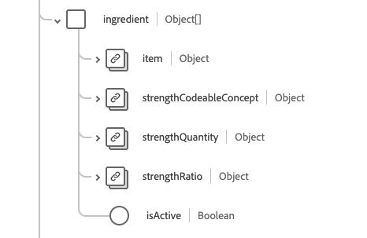

# Grupo de campos de esquema [!UICONTROL Medicação]

[!UICONTROL Medicação] é um grupo de campos de esquema padrão para a [[!DNL Medication] classe](../../../classes/medication.md). Ele fornece um único campo de tipo de objeto `healthcareMedication` que captura as informações de um medicamento.

| Nome de exibição | Propriedade | Tipo de dados | Descrição |
| ---|  --- | --- | --- |
| [!UICONTROL Lote] | `batch` | Objeto | Detalhes sobre um medicamento empacotado. Contém duas propriedades: <li>`lotNumber`: um valor de cadeia de caracteres para o identificador atribuído ao lote.</li> <li>`expirationDate`: um valor DateTime para quando o lote expirará.</li> |
| [!UICONTROL Código] | `code` | [[!UICONTROL Conceito codificável]](../data-types/codeable-concept.md) | O código que identifica este medicamento. |
| [!UICONTROL Definição] | `definition` | [[!UICONTROL Referência]](../data-types/reference.md) | A definição do medicamento. |
| [!UICONTROL Formulário de dose] | `doseForm` | [[!UICONTROL Conceito codificável]](../data-types/codeable-concept.md) | Descreve a forma de dose do medicamento, como comprimidos ou cápsulas. |
| [!UICONTROL Identificador] | `identifier` | Matriz de [[!UICONTROL Identificador]](../data-types/identifier.md) | Um identificador para o medicamento. |
| [!UICONTROL Ingrediente] | `ingredient` | Matriz de objetos | Descreve as informações do ingrediente para o medicamento. Consulte a [seção abaixo](#ingredient) para obter mais informações. |
| [!UICONTROL Titular da Autorização de Introdução no Mercado] | `marketingAuthorizationHolder` | [[!UICONTROL Referência]](../data-types/reference.md) | A organização que tem autorização para comercializar o medicamento. |
| [!UICONTROL Volume Total] | `totalVolume` | [[!UICONTROL Quantidade]](../data-types/quantity.md) | A quantidade de produto fornecida no medicamento quando o código do produto não inferir o tamanho da embalagem. |
| [!UICONTROL Status] | `status` | String | O status da medicação. O valor dessa propriedade deve ser igual a um dos seguintes valores de enumeração conhecidos. <li> `active` </li> <li> `inactive` </li> <li> `entered-in-error` </li> |

Para obter mais detalhes sobre o grupo de campos, consulte o repositório XDM público:

* [Exemplo preenchido](https://github.com/adobe/xdm/blob/master/extensions/industry/healthcare/fhir/fieldgroups/medication.example.1.json)
* [Esquema completo](https://github.com/adobe/xdm/blob/master/extensions/industry/healthcare/fhir/fieldgroups/medication.schema.json)

## `ingredient` {#ingredient}

`ingredient` é fornecido como uma matriz de objetos. A estrutura de cada objeto é descrita abaixo.

| Nome de exibição | Propriedade | Tipo de dados | Descrição |
| --- | --- | --- | --- |
| [!UICONTROL Item] | `item` | [[!UICONTROL Referência codificável]](../data-types/codeable-reference.md) | O ingrediente sendo descrito. |
| [!UICONTROL Conceito codificável de força] | `strengthCodeableConcept` | [[!UICONTROL Conceito codificável]](../data-types/codeable-concept.md) | A quantidade do ingrediente presente, expressa em uma terminologia definida pelo sistema. |
| [!UICONTROL Quantidade de Força] | `strengthQuantity` | [[!UICONTROL Quantidade]](../data-types/quantity.md) | A quantidade do ingrediente presente. |
| [!UICONTROL Taxa de Intensidade] | `strengthRatio` | [[!UICONTROL Taxa]](../data-types/ratio.md) | A proporção do ingrediente presente. |
| [!UICONTROL Está Ativo] | `isActive` | Booleano | Indica se o ingrediente está ativo. |
