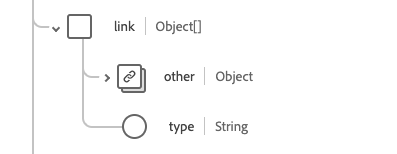

# Grupo de campos de esquema [!UICONTROL Paciente]

[!UICONTROL Paciente] é um grupo de campos de esquema padrão para a [[!DNL XDM Individual Profile] classe](../../../classes/individual-profile.md). Ele fornece um único campo de tipo de objeto `healthcarePatient` que captura a demografia e outros detalhes administrativos sobre um indivíduo ou animal que recebe cuidados ou outros serviços relacionados à saúde.

| Nome de exibição | Propriedade | Tipo de dados | Descrição |
| --- | --- | --- | --- |
| [!UICONTROL Endereço] | `address` | Matriz de [[!UICONTROL Endereço]](../data-types/address.md) | As informações de endereço do paciente. |
| [!UICONTROL Comunicação] | `communication` | Matriz de objetos | Um idioma que pode ser usado para se comunicar com o paciente sobre sua saúde. Consulte a [seção abaixo](#communication) para obter mais informações. |
| [!UICONTROL Contatos com os pacientes] | `contact` | Matriz de objetos | Um contato de um paciente, como um guardião, parceiro ou amigo. Consulte a [seção abaixo](#contact) para obter mais informações. |
| [!UICONTROL Profissional geral] | `generalPractioner` | Matriz de [[!UICONTROL Referência]](../data-types/reference.md) | O prestador de cuidados primários do paciente. |
| [!UICONTROL Identificador] | `identifier` | Matriz de [[!UICONTROL Identificador]](../data-types/identifier.md) | Um identificador para o paciente. |
| [!UICONTROL Detalhes do link do paciente] | `link` | Matriz de objetos | Um link para um paciente ou recurso de pessoa relacionada que diz respeito ao mesmo indivíduo. Consulte a [seção abaixo](#link) para obter mais informações. |
| [!UICONTROL Gerenciando a Organização] | `managingOrganization` | [[!UICONTROL Referência]](../data-types/reference.md) | A organização de custódia do registro do paciente. |
| [!UICONTROL Estado civil] | `maritalStatus` | [[!UICONTROL Conceito codificável]](../data-types/codeable-concept.md) | O estado civil do paciente. |
| [!UICONTROL Nome] | `name` | Matriz de [[!UICONTROL Nome humano]](../data-types/human-name.md) | O nome associado ao paciente. |
| [!UICONTROL Detalhes de contato] | `telecom` | Matriz de [[!UICONTROL Ponto de Contato]](../data-types/contact-point.md) | Um detalhe de contato, como número de telefone ou endereço de e-mail, pelo qual o paciente pode ser contatado. |
| [!UICONTROL Está Ativo] | `active` | Booleano | Indica se o registro do paciente está em uso ativo. |
| [!UICONTROL Data de nascimento] | `birthDate` | Data | A data de nascimento do paciente. |
| [!UICONTROL Indicador de Falecimento] | `deceasedBoolean` | Booleano | Indica se o paciente morreu ou não. |
| [!UICONTROL Data e hora da morte] | `deceasedDateTime` | DateTime | A data e hora da morte do paciente. |
| [!UICONTROL Gênero] | `gender` | String | A identidade de gênero da pessoa. O valor dessa propriedade deve ser igual a um dos seguintes valores de enumeração conhecidos. <li> `female` </li> <li> `male` </li> <li> `other` </li> <li> `unknown`</li> |
| [!UICONTROL Faz Parte Do Múltiplo Nascimento] | `multipleBirthBoolean` | Booleano | Indica se o paciente faz parte de um nascimento múltiplo. |
| [!UICONTROL Número de Nascimento] | `multipleBirthInteger` | Número inteiro | O número de nascimento na sequência. |

Para obter mais detalhes sobre o grupo de campos, consulte o repositório XDM público:

* [Exemplo preenchido](https://github.com/adobe/xdm/blob/master/extensions/industry/healthcare/fhir/fieldgroups/patient.example.1.json)
* [Esquema completo](https://github.com/adobe/xdm/blob/master/extensions/industry/healthcare/fhir/fieldgroups/patient.schema.json)

## `communication` {#communication}

`communication` é fornecido como uma matriz de objetos. A estrutura de cada objeto é descrita abaixo.

| Nome de exibição | Propriedade | Tipo de dados | Descrição |
| --- | --- | --- | --- |
| [!UICONTROL Idioma] | `language` | [[!UICONTROL Conceito codificável]](../data-types/codeable-concept.md) | Idioma que pode ser usado para comunicar com a pessoa sobre sua saúde. |
| [!UICONTROL É o Idioma Preferencial] | `preferred` | Booleano | Indica se o idioma é o idioma preferido ou não. |

## `contact` {#contact}

`contact` é fornecido como uma matriz de objetos. A estrutura de cada objeto é descrita abaixo.

| Nome de exibição | Propriedade | Tipo de dados | Descrição |
| --- | --- | --- | --- |
| [!UICONTROL Endereço de contato] | `address` | [[!UICONTROL Endereço]](../data-types/address.md) | O endereço da pessoa de contato. |
| [!UICONTROL Nome do Contato] | `name` | [[!UICONTROL Nome Humano]](../data-types/human-name.md) | O nome da pessoa de contato. |
| [!UICONTROL Contatar Organização] | `organization` | [[!UICONTROL Referência]](../data-types/reference.md) | A organização associada à pessoa de contato. |
| [!UICONTROL Período do Contato] | `period` | [[!UICONTROL Período]](../data-types/period.md) | O período em que o contato estava ou está em uso. |
| [!UICONTROL Relacionamento&#39;] | `relationship` | [[!UICONTROL Conceito codificável]](../data-types/codeable-concept.md) | A relação entre o paciente e a pessoa de contato. |
| [!UICONTROL Detalhes de contato] | `telecom` | Matriz de objetos | Os detalhes de contato da pessoa de contato. Consulte a [seção abaixo](#telecom) para obter mais informações. |
| [!UICONTROL Gênero] | `gender` | String | A identidade de gênero da pessoa. O valor dessa propriedade deve ser igual a um dos seguintes valores de enumeração conhecidos. <li> `female` </li> <li> `male` </li> <li> `other` </li> <li> `unknown`</li> |

### `telecom` {#telecom}

`telecom` é fornecido como uma matriz de objetos. A estrutura de cada objeto é descrita abaixo.

| Nome de exibição | Propriedade | Tipo de dados | Descrição |
| --- | --- | --- | --- |
| [!UICONTROL Ponto de contato] | `contactPoint` | [[!UICONTROL Ponto de contato]](../data-types/contact-point.md) | Os detalhes de contato da pessoa. |

## `link` {#link}

`link` é fornecido como uma matriz de objetos. A estrutura de cada objeto é descrita abaixo.

| Nome de exibição | Propriedade | Tipo de dados | Descrição |
| --- | --- | --- | --- |
| [!UICONTROL Outras] | `other` | [[!UICONTROL Referência]](../data-types/reference.md) | Um link para um paciente ou recurso de pessoa relacionada que diz respeito ao mesmo indivíduo. |
| [!UICONTROL Tipo] | `type` | String | O tipo de vínculo entre os dois recursos do paciente. |
