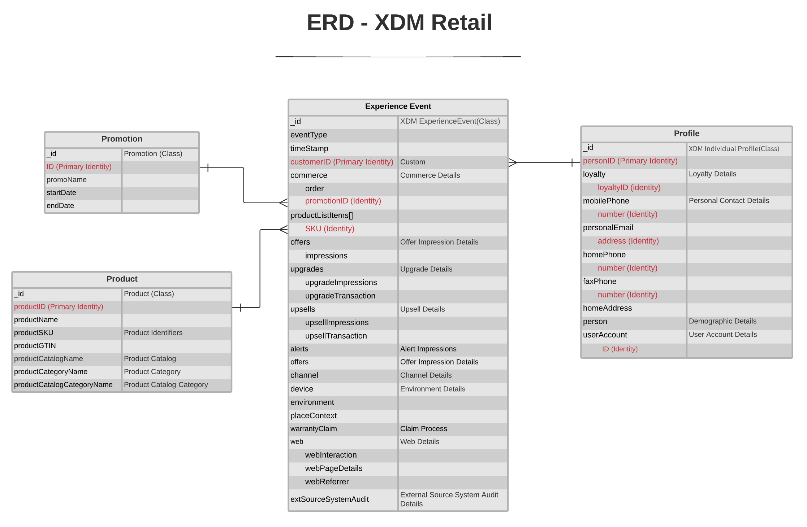

# [!UICONTROL Retail] ERD do modelo de dados do setor

O diagrama de relacionamento de entidade (ERD) a seguir representa um modelo de dados padronizado para o setor de varejo.

>[!NOTE]
>
>Para obter mais informações sobre modelos de dados do setor e como interpretar esse ERD, consulte a [visão geral do modelo de dados do setor](./overview.md).

