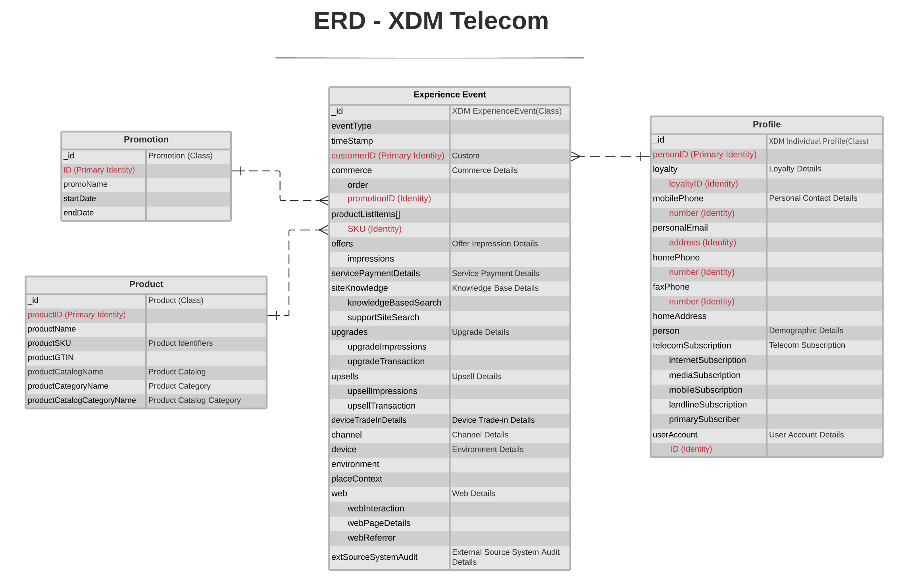

#  Telecomunicações — ERD do modelo de dados da indústria

O diagrama de relacionamento de entidade (ERD) a seguir representa um modelo de dados padronizado para o setor de telecomunicações. O ERD é intencionalmente apresentado de forma desnormalizada e considerando como os dados são armazenados no Adobe Experience Platform.

>[!NOTE]
>
>O ERD conforme descrito é uma recomendação sobre como você deve modelar seus dados para este caso de uso do setor. Para usar esse modelo de dados no Platform, você deve construir os esquemas recomendados e seus relacionamentos sozinho. Consulte os guias sobre como gerenciar [schemas](../../ui/resources/schemas.md) e [relações](../../tutorials/relationship-ui.md) na interface do usuário para obter mais informações.

Use a seguinte legenda para interpretar este ERD:

* Cada entidade mostrada no é baseada em uma classe [Experience Data Model (XDM) subjacente](../composition.md#class).
* Para uma determinada entidade, cada linha marcada em **bold** representa um grupo de campos ou um tipo de dados, com os campos relevantes que ela fornece listados abaixo em texto sem negrito.
* Os campos mais importantes para uma determinada entidade são destacados em vermelho.
* Todas as propriedades que podem ser usadas para identificar clientes individuais são marcadas como &quot;identidade&quot;, com uma dessas propriedades marcadas como &quot;identidade primária&quot;.
* Os relacionamentos de entidade são marcados como não dependentes, já que os eventos baseados em cookies geralmente não podem determinar a pessoa ou o indivíduo que fez a transação.

>[!NOTE]
>
>A entidade Evento de experiência inclui um campo &quot;_ID&quot;, que representa o atributo identificador exclusivo (`_id`) fornecido pela classe XDM ExperienceEvent. Consulte o documento de referência em [XDM ExperienceEvent](../../classes/experienceevent.md) para obter mais detalhes sobre o que é esperado para esse valor.