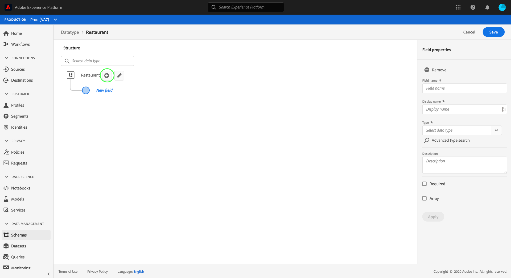

# Criar e editar tipos de dados usando a interface do usuário do Experience Platform

No Experience Data Model (XDM), os tipos de dados são usados como campos do tipo de referência em classes ou combinações da mesma forma que os campos literais básicos, com a principal diferença de que os tipos de dados podem definir vários subcampos. Embora semelhantes às misturas, na medida em que permitem o uso consistente de uma estrutura de vários campos, os tipos de dados são mais flexíveis porque podem ser incluídos em qualquer lugar na estrutura do schema, enquanto as combinações só podem ser adicionadas no nível raiz.

A Adobe Experience Platform fornece vários tipos de dados padrão que podem ser usados para abranger uma grande variedade de casos de uso comuns do gerenciamento de experiências. No entanto, você também pode definir seus próprios tipos de dados personalizados para atender às suas necessidades comerciais exclusivas.

Este tutorial aborda as etapas para criar e editar tipos de dados personalizados na interface do usuário da plataforma.

## Pré-requisitos

Este tutorial requer uma compreensão funcional do Sistema XDM. Consulte a visão geral [do](../home.md) XDM para obter uma introdução à função do XDM dentro do ecossistema do Experience Platform e as [noções básicas da composição](../schema/composition.md) do schema para saber como os tipos de dados contribuem para os schemas XDM.

Embora não seja necessário para este tutorial, é recomendável que você também siga o tutorial sobre a [composição de um schema na interface do usuário](./-schema-ui.md) para se familiarizar com os vários recursos do [!DNL Schema Editor].

## Abrir o [!DNL Schema Editor] para um tipo de dados

Na interface do usuário da plataforma, selecione **[!UICONTROL Schemas]** na navegação à esquerda para abrir a área de trabalho de [!UICONTROL Schemas] e, em seguida, selecione a guia Tipos **** de dados. Uma lista de tipos de dados disponíveis é exibida, incluindo aqueles definidos pelo Adobe, bem como aqueles criados pela sua organização.

Aqui, você tem duas opções:

* [Criar um novo tipo de dados](#create)
* [Selecione um tipo de dados existente para editar](#edit)

### Criar um novo tipo de dados {#create}

Na guia Tipos **[!UICONTROL de]** dados, selecione **[!UICONTROL Criar tipo]** de dados.

O [!DNL Schema Editor] é exibido, mostrando a estrutura atual do novo tipo de dados na tela. No lado direito do editor, é possível fornecer um nome de exibição e uma descrição opcional para o tipo de dados. Certifique-se de fornecer um nome exclusivo e conciso para o seu tipo de dados, já que é assim que ele será identificado ao adicioná-lo a um schema.

Este tutorial cria um tipo de dados que descreve uma propriedade de restaurante, de modo que o tipo de dados recebe um nome de exibição de &quot;Restaurante&quot;.

Pule para a [próxima seção](#add-fields) para adicionar campos ao start.

### Editar um tipo de dados existente

Somente os tipos de dados personalizados definidos pela sua organização podem ser editados. Para restringir a lista exibida, selecione o ícone de filtro (Íconefiltro) para revelar os controles de filtragem com base no [!UICONTROL Proprietário]. Selecione **[!UICONTROL Cliente]** para mostrar somente os tipos de dados personalizados pertencentes à sua organização.

Selecione o tipo de dados que deseja editar na lista para abrir o painel direito, mostrando os detalhes do tipo de dados. Selecione o nome do tipo de dados no painel direito para abrir sua estrutura no [!DNL Schema Editor].

## Adicionar campos ao tipo de dados {#add-fields}

Para adicionar campos ao tipo de dados ao start, selecione o ícone de **adição (+)** ao lado do campo de nível raiz na tela. Um novo campo é exibido abaixo e o painel direito é atualizado para exibir controles para o novo campo.

Use os controles do painel direito para fornecer um nome **[!UICONTROL de]** campo, nome **[!UICONTROL de]** exibição e **[!UICONTROL Tipo]** para o campo. Observe que o tipo de campo pode ser um tipo escalar básico (como uma string, um inteiro ou um booleano) ou pode representar outro tipo de dados de vários campos definido pelo Adobe ou pela sua organização.

O tipo de dados Restaurant requer um campo de string para representar o nome do restaurante. Dessa forma, o nome [!UICONTROL do] campo é definido como &quot;nome&quot; e o [!UICONTROL Tipo] é definido como [!UICONTROL String]. Selecione **[!UICONTROL Aplicar]** para aplicar as alterações ao campo.

Continue seguindo o mesmo processo para adicionar campos adicionais, começando por selecionar o ícone de **adição (+)** ao lado do campo de nível raiz e fornecendo os detalhes de configuração no painel direito.

O tipo de dados Restaurant agora tem campos adicionais para marca, capacidade de assentos e espaço.

Além dos campos básicos, você também pode aninhar outros tipos de dados dentro do seu tipo de dados personalizado. Por exemplo, o tipo de dados Restaurante requer um campo que represente o endereço físico da propriedade. Nesse cenário, é possível adicionar um novo campo &quot;endereço&quot;, ao qual é atribuído o tipo de dados padrão &quot;Endereçopostal&quot;.

Isso demonstra como os tipos de dados podem ser flexíveis em termos de descrição dos dados: os tipos de dados podem empregar campos que também são tipos de dados, que podem conter outros tipos de dados, e assim por diante. Isso permite abstrair e reutilizar padrões de dados comuns em todos os schemas XDM, facilitando a representação de estruturas de dados complexas.

Depois que terminar de adicionar campos ao tipo de dados, selecione **[!UICONTROL Salvar]** para salvar suas alterações e adicionar o tipo de dados ao [!DNL Schema Library].

## Adicionar o tipo de dados a uma mistura

Depois de criar um tipo de dados, você pode start usando-o em seus schemas. Como os schemas XDM são compostos de uma classe e zero ou mais combinações, os campos fornecidos por um tipo de dados não podem ser adicionados diretamente a um schema. Em vez disso, eles devem ser incluídos em uma classe ou mistura.

>[!NOTE]
>
>Esta seção foca na adição de um tipo de dados a uma combinação, já que este é o padrão mais comum para tipos de dados personalizados. No entanto, você também pode aplicar as mesmas etapas para adicionar seu tipo de dados a uma classe.

Você pode adicionar o tipo de dados a uma combinação existente ou criar uma nova combinação totalmente. Em ambos os casos, você deve abrir o formulário [!DNL Schema Editor] para um schema ao qual planeja adicionar o novo tipo de dados, selecionando um schema existente na guia **[!UICONTROL Procurar]** ou criando um novo schema totalmente.

Depois que o schema for aberto no painel [!DNL Schema Editor], selecione a combinação à qual deseja adicionar o tipo de dados no painel esquerdo. Se o schema não tiver uma combinação apropriada, siga as etapas para [criar uma nova mistura](./create-schema-ui.md#define-mixin) para adicionar ao schema, em vez disso, e certifique-se de que a mistura esteja selecionada no painel esquerdo.

Selecione o ícone de **adição (+)** ao lado do nome do schema para adicionar um novo campo ao mixin selecionado. Ao selecionar a propriedade **[!UICONTROL Type]** para o campo, o nome do tipo de dados criado anteriormente está disponível na lista suspensa. Você pode start digitando o nome do tipo de dados para ajudar a localizá-lo mais facilmente.

Selecione o tipo de dados na lista e, em seguida, selecione **[!UICONTROL Aplicar]**. O campo schema é atualizado na tela para mostrar os subcampos estruturados fornecidos pelo tipo de dados. Se você salvar o schema selecionando **[!UICONTROL Salvar]**, a combinação também será salva, permitindo que você reutilize a mistura em schemas adicionais pertencentes à mesma classe.

>[!NOTE]
>
>As misturas são compatíveis apenas com uma classe. Se você quiser usar seu tipo de dados em schemas adicionais com base em classes diferentes, siga as etapas acima para adicionar o tipo de dados a combinações adicionais destinadas a estender essas classes.

## Próximas etapas

Este tutorial aborda como criar e editar tipos de dados e como adicioná-los a mixins usando o [!DNL Schema Editor]. Para saber mais sobre como trabalhar com tipos de dados na interface do usuário, incluindo como converter um objeto de vários campos em um tipo de dados, consulte o tutorial [de criação de](./create-schema-ui.md#datatype)schemas.

Para saber como criar um tipo de dados usando a API de registro do Schema, consulte o guia [de ponto de extremidade de tipos de](../api/data-types.md#create)dados.